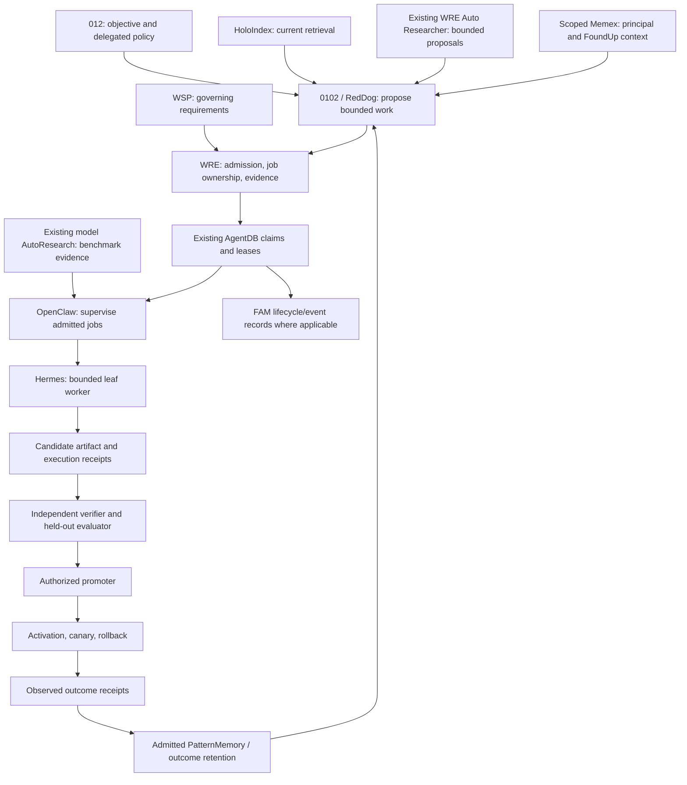
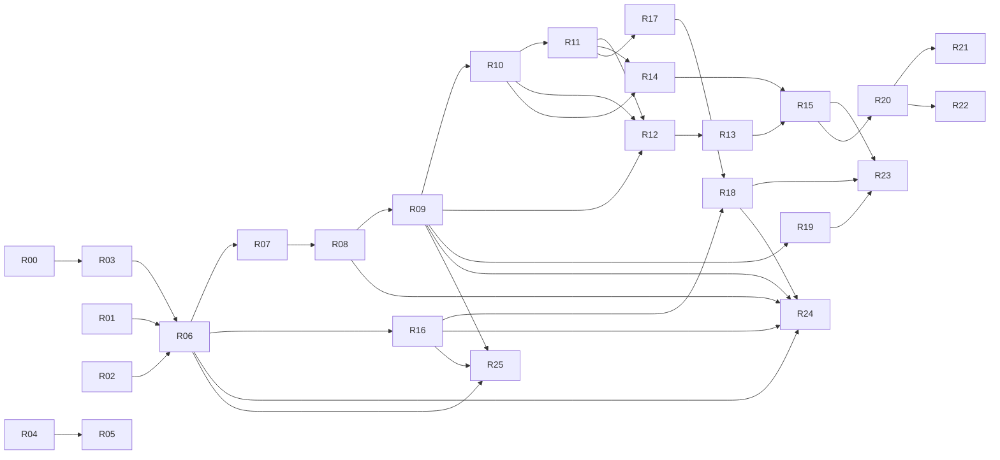

# FoundUps system roadmap — governed recursive self-improvement

Planning baseline: main `fb58e5279673ef9de30735ccfedc8001c3bb79d6`, audited 2026-09-09 JST.

**Objective:** make 0102 measurably improve its software and work procedures through a governed, repeatable WRE loop, while 012 retains control of objectives and delegated authority.

This is a planning artifact. No work packet in this document or `docs/roadmaps/rsi_swarm_backlog.json` is an executable authorization. Compile each packet into the existing admitted work-order/job contracts after reconciling the active lane and exact source state. Do not introduce a second scheduler or reinterpret planning metadata as signed authority.

## Authority and fast start

Status: canonical **system planning and completion-gate authority** in this repository revision. Updated 2026-09-23. This replaces the old root system roadmap and module-wide rollup; it does not replace WSP requirements, current module contracts, or signed runtime policy.

**Current completion verdict:** WSP governance exists; WRE has substantial implemented components and bounded operational proofs; production RSI is incomplete. No defensible whole-system completion percentage has been established.

Read only the entry table and selected packet before retrieving its module context. Do not put the entire repository or this entire audit into every worker prompt.

| Need | Entry |
|---|---|
| Evidence behind the completion verdict | [Dated audit](docs/audits/rsi/2026-09-09/README.md) |
| Requirement enforcement and current gaps | [R02 map](docs/roadmaps/R02_WSP_RSI_ENFORCEMENT_MAP.md) — all 26 packets, with source inventory |
| System-wide coverage | [Module map](docs/audits/rsi/2026-09-09/MODULE_MAP.md) |
| Recurring work selection | [Observe → WSP 15 → WSP 97 → execute → re-observe](docs/operations/RSI_SWARM_DISPATCH.md#recursive-repository-prioritization-and-execution) |
| Next work | Re-observe the [current selection](docs/operations/RSI_SWARM_DISPATCH.md#recursive-repository-prioritization-and-execution); packet order is not an automatic assignment |
| AmIBot autonomous production experiment | [G0 readiness, dependency gates and metrics](#amibot-autonomous-production-experiment--2026-09-15) — controlled failure; no build jobs admitted |
| RSI at launch and cycle budgets | [WRE launch/evaluation sequence](modules/infrastructure/wre_core/ROADMAP.md#rsi-launch-and-evaluation-sequence--2026-09-15): explicit advisory report display implemented; admitted campaigns and cycle budgets remain planned. |
| Supervision, controls, cost and dispatch | [RSI/WRE monitor layer](docs/DAEMON_ARCHITECTURE_MAP.md#rsi-and-wre-supervision-contract--2026-09-22); [production-line dispatch](docs/operations/RSI_SWARM_DISPATCH.md). [Observer lookup](modules/infrastructure/dae_daemon/INTERFACE.md#observer-runtime-lookup) now avoids broker creation; eight fixed cases pass locally and independently. Default observer/adapter ingress remains separate. |
| Hybrid architecture and current RedDog assessment | [Tickets, bounded teams and 012 feedback](docs/architecture/REDDOG_HYBRID_TICKET_SWARM_FEEDBACK_MODEL.md) |
| Production-line implementation packet | [R24: qualification → ticket → audit → reward](docs/roadmaps/R24_AGENT_PRODUCTION_LINE_PACKET.md) |
| Feedback implementation packet | [R25: consented 012/RedDog feedback into tickets](docs/roadmaps/R25_REDDOG_FEEDBACK_LOOP_PACKET.md) |
| Packet IDs, dependencies and priorities | [Planning backlog](docs/roadmaps/rsi_swarm_backlog.json) — never directly executable |
| RedDog product navigation and owner boundaries | [RedDog documentation map](docs/REDDOG_DOCUMENTATION_MAP.md) |
| Module-specific plans | [Module roadmap navigation](modules/ROADMAP.md) |
| Superseded system plans and retention decisions | [Archive register](docs/_archive/roadmaps/2026-09-10/README.md) |

Authority order: 012's applicable instructions and delegated policy → governing WSPs → exact current module/runtime contracts and verified receipts → this system plan for sequencing → module-local plans for their scope → dated evidence and historical memory. A plan cannot override a failed gate or manufacture permission.

The baseline below remains `fb58e5279673ef9de30735ccfedc8001c3bb79d6`. Documentation integration started at `eb2994f5d1530d9f086e2f2265c65033acecd93c`; the six intervening commits affect eSingularity/YUMORI and its skill, not the inspected WRE/model-routing files. Their new product work is outside this dated audit. Reconcile the latest commit and active claims again at dispatch.

R00 recovery is historical success at its recorded source/generation. R02 now includes a requirement/owner/test/gap map for R00–R25 and selected WSP 46/CORE and briefing corrections. The [ledger reconciliation](docs/roadmaps/R02_WSP_RSI_ENFORCEMENT_MAP.md#historical-ledger-dispositions--2026-09-13) now covers all 11 pending April rows/tracks and four relevant closed rows; unresolved owner evidence, per-contract archival decisions and separately bound review remain open. Do not mark all of R02 or G0 complete merely because the documentation is discoverable.

## Recursive selection and closure

Follow the [repository prioritization loop](docs/operations/RSI_SWARM_DISPATCH.md#recursive-repository-prioritization-and-execution)
after every completed or blocked sprint: observe current repository evidence,
apply canonical WSP 15, reconcile under WSP 97, select the highest-ranked eligible
action, execute, validate, document, then immediately re-observe and rescore.
The last checkpoint's next step is a candidate, never an automatic assignment.
The existing backlog points to the current ranked observation; historical packet
scores below retain their original planning scope. Standing local authorization
and fresh runtime admission remain distinct. `FOUNDUPS/autopost` stays with Remote.

## Repository accounting and resumed RSI — 2026-09-21

The audit baseline was `15f203ee382ea3f16fda87a4b5f0ae3360f29efa`; fresh main is
`7a4e06a8453e77ce306ef5ca6e2e2f3a4c913f7c`, including PR1845 daily-work/hygiene accounting and PR1374 node-forge repair and PR1315 Pillow repair and PR1844 GotJunk qualification and PR1375 Functions integration and PR783 root protobuf integration and PR1378 Clerk integration and PR1843 Clerk candidate qualification and PR1842 dependency-owner qualification and PR1841 alias capability and PR1840 alias contract and PR1839 prototype qualification and PR1838 consumer isolation and PR1837 receipt-fixture closure and PR1836 dry-run qualification and PR1834 build-route qualification and PR1833 planning-DAG closure and PR1832 route-test closure, PR1751 registry onboarding, PR1831 accounting/cache closure and PR1830 OpenClaw diagnostic repair and PR1829 OpenClaw diagnostic qualification and PR1828 AutoResearcher exit witness and PR1827 AutoResearcher interruption qualification and PR1826 R25 approval qualification, PR1819 rejection-evidence repair, PR1818 lifecycle qualification, PR1817 child-input qualification, PR1816 context repair, PR1814 report delivery, PR1815 context qualification and the separately merged PR1813 correspondence owner. PR1803's ten
exact-head checks passed; reviewed/merged trees match. PR1800/1801/1802 main workflows
passed, as did both PR1803 main workflows and all three observed PR1804 main
workflows. PR1805 passed all ten exact-head checks and both later main workflows.
PR1806 passed all ten exact-head checks; both later main workflows now report
SUCCESS (CI35480607649 and CodeQL35480607038). PR1807's exact-head checks passed and its reviewed six-document tree is merged.
Both later PR1807 main workflows now passed; protected PR1808/1809 changes are preserved. PR1810 passed final exact-head checks; its reviewed source tree is merged.
Both subsequent PR1810 main workflows now pass. The protected ticker change is preserved.
The preceding full-audit snapshot (September 9 UTC onward) recorded136 merged PRs and21
closed without merge; its98 peer heads were reconciled: the previous95 are unchanged, with externally owned PR1820 (YUMORI economics), PR1822 (Memory Horizon intake), and PR1824 (Moshpit terminology) added. All three avoid this sprint scope. The
same historical inventory recorded14 drafts and15 PRs with failing checks; 23 have all-success checks, 59 have success/neutral/skipped results, and one has no checks.
Preceding paginated REST inventory plus verified PR1836/1837/1838/1839/1840/1841/1842/1843/1378/783/1375/1844/1315/1374/1845 closures accounts for156 merged/21 closed without merge;93 surviving peer heads remain unchanged after PR1845 closure. The preceding snapshot had13 drafts/14 with failing checks. PR1835 remains separately owned architecture documentation. Both PR1834 main workflows passed. These observations are not an atomic snapshot;
reported green checks alone do not establish current merge or runtime authority.
R19 qualification preserves two earlier hosted runs with 42 passing observations
each, XML creation and parsing, but zero artifacts because the configured action
excluded the hidden report directory. The separately scored 13/P1 repair
is merged in PR1814 after two normal PR runs delivered exactly the two reports.
Final candidate checks passed; report-only gate activation stays separate.
The original 102 heads, check summaries and 107 merge identities are retained in the
[existing observations](docs/roadmaps/RSI_BASELINE_OBSERVATIONS_20260913.json)
under `repository_pr_accounting_20260920`; exact Git references in the backlog preserve the
intervening113-merge/15-closed refresh and subsequent closures. Current reconciliation binds93 peer heads; older check summaries are historical.

| Work observed | Reconciliation and next action |
|---|---|
| Shared M2M/WRE handoff | PRs #1757/#1758/#1760/#1761/#1763/#1794/#1795/#1796/#1797/#1798 are merged. Omitted-plan bootstrap selection is closed with638 connected tests and independent review. Its14/P1 step advanced the historical18/P0 parent; the remaining local context/child fidelity contract is now15/P1. |
| Typed FoundUp intake | PR1799 merged the commander data handoff15/P1 within17/P0 parent; metadata survives gated queueing. Focused111pass; independent99overlap/31adversarial cases. Public draft-to-commander entitlement and runtime admission remain open; exact closure is in the backlog. |
| FoundUp validation debt | Selected14/P1 after exact-action qualification. Four baseline failures repaired in two existing test owners; focused205/connected677 pass with no skips. Independent205pass confirms production checks and parity expectations remain unchanged; PR1801 is merged with ten exact-head checks passed and both main workflows now successful. |
| Daily-work RSI input | R25-A owner/field mapping is complete: 89 existing tests and 20 synthetic boundary checks pass, with zero authorized feedback proposals. The missing consent/target/type/version mapping is explicit in the existing R25 packet; its13/P1 compatibility qualification is merged in PR1802. Preserve v1 identities and require exact-summary permission; approval assertion/issuer/consumer selection remains unqualified before source work. No live feedback path or retained RSI improvement is claimed. |
| AutoResearcher evidence | Proposal-text identity12/P2 is merged in PR1803 and independently accepted:109 focused tests and five additional independent probes; repeated109-case runs overlap. Reports retain per-attempt text hashes before preparation can fail. Parent15/P1 program/oracle/environment/reader contracts remain open; no authenticated or retained-learning claim. |
| WSL advisory lifecycle | Planning13/P1 is merged in PR1805. The existing-owner12/P2 source repair is merged in PR1806:43 focused/four connected checks and independent43 overlap/18 boundary probes pass. Enable-only calls inspect metadata; version execution additionally requires the command flag. PR1806 first CI caught an omitted backend digest refresh; corrected manifest/pins passed all ten fresh exact-head checks before merge. No real WSL/provider call. |
| PatternMemory lifecycle | PR1807 qualification is closed. The separately scored13/P1 source repair is merged in PR1810 and now creates/uses/closes one handle per counter in the existing daemon. Red 8 failures reproduced; repaired 30 daemon and connected 71 tests pass, independent 71 overlaps. Both distinct-thread increments persist. Scheduler methods/SQLite affinity unchanged; exact source closure is recorded in the backlog. |
| AmIBot | Registry, route tests, planning DAG and source-route qualification closed in PR1751/1832/1833/1834, with final PR/main checks passed. PR1838 merged the13/P1 dry-run isolation repair after245 local/independent overlapping cases and ten exact-head checks; PR1841 closes optional generic alias source capability (271 locally/independently overlapping cases; both main workflows passed). Live authoring/admission, AmIBot visibility and POC remain open. |
| Product work | Reusable brand context #1792 remains open. Correspondence PR1813 merged; PR1644/1793 closed without merge, as did validation #1700/#1767 and funding #1791. Funding cleanup #1812 merged. Preserve their owners and Remote's separate AutoPost work. |
| Current RSI ticket path | PR1900 manager-result qualification is merged, main-checked and retired: 29 unique cases expose four fake-UI admission gaps. Existing instruction examples now use inert placeholders; source-only hygiene validation and the next 13/P1 admission repair are recorded in the [current ranked queue](docs/roadmaps/rsi_swarm_backlog.json). Native ticket admission and retained RSI remain open. |
| Local branches/worktrees | Dated 2026-09-21 14:08–14:09 UTC metadata audit: 157 registered worktrees, 121 clean / 36 dirty, and 673 local branches. The final 14:17 UTC check observed 674 branches after concurrent YouTube work. No removal qualified; ignored state and ownership holds remain. Counts are snapshots, not proof of safe retirement. |

## Daily work and repository hygiene — 2026-09-21

Gmail and LinkedIn are existing workflows and candidate RSI inputs, with distinct completion states:

- Gmail draft discipline and the [contact ledger](modules/foundups/esingularity/skillz/yumori_contact_ledger/SKILLz.md) are merged through PR1643/1813; PR1786 supplies operational wrappers. Keep private correspondence in its existing Gmail/CRM owner. The registry marks the ledger prototype; skill text is not production admission or verified learning.
- LinkedIn connection policy preview PR1870 is merged with verified PR/main checks. [Connection policy preview](modules/platform_integration/linkedin_agent/docs/LINKEDIN_REVIEW_WORKFLOW.md#rsi-connection-policy-preview--2026-09-22) passes17 frozen cases locally and independently (baseline12fail/5pass), preserving bookkeeping and omitting request status. Browser access, live authority and retained RSI remain separate. The canonical backlog records the fresh next ranking and exact publication evidence.
- New main-owned contact/Mosh Pit/Fukui wrappers are absent from the older dirty shared checkout. Use their existing clean-main context rather than copying skills or switching that active checkout. Existing Mosh Pit candidate logging and the documented R25 contract describe the intended learning path. The positive feedback-to-proposal handoff and current-state consumer remain unqualified; WRE typed receipts, independent verification and promotion gates remain required.
- The read-only snapshot found 157 worktrees: 121 clean / 36 dirty, with no missing or locked registrations. A transient shared index lock was observed and preserved. Three inspected clean, main-reachable candidates retain ignored files, including learning databases; owner release is unproven. No worktree or branch was removed. Historical print-only cleanup lists are not current removal authority.

Follow the [daily-work and closure discipline](docs/operations/RSI_SWARM_DISPATCH.md#daily-work-intake-and-repository-closure). Exact source/PR/metadata receipts and scored follow-ups are in the existing backlog's current observation. These are documented integration gaps, not a claim that self-healing or retained production RSI is complete.

**Daily activity belongs in RSI as scoped evidence.** Follow R25's consented, same-FoundUp proposal contract and reuse existing WSP15/admission/verified-outcome owners. Store a task summary, source lineage, test/review outcome and accepted repair; a conversational reply or nonempty model response is not a verified improvement. The [R25 source qualification](docs/roadmaps/R25_REDDOG_FEEDBACK_LOOP_PACKET.md#r25-a-source-qualification--2026-09-20) shows why signed personal architect context and structural learning candidates cannot yet supply a consented FoundUp feedback proposal. Current OpenClaw conversation memory records previews under its own weaker outcome criterion. The governed retention sink still requires an activation capability, and R25's end-to-end feedback-to-ticket path remains unimplemented. Do not ingest raw conversations automatically or claim that merged Codex work was autonomously executed and retained by WRE.

**PC execution:** this session can run local Windows commands. The September20
06:07 UTC metadata refresh found native OpenClaw 2026.5.2 and registered WSL distros;
running state and canonical WSL versions were not queried or activated. Current Hermes,
WSL OpenClaw/provider bindings and a real admitted sandbox remain unverified.
The existing resolver still supplies no authoritative effect-use lease. A cold
WSL launch can start user services, so a disposable sandbox must first be bound
through the existing launcher/admission/rollback path. There is no evidence yet
that blindly upgrading either runtime is the required repair. The existing WSL
advisory contract is now qualified13/P1: enabled `--exec ... --version` calls
may cold-start a stopped distro, and a running-state precheck cannot exclude a
stop-before-exec race. Independent review selects the smaller12/P2 repair:
separate metadata-only inspection from an explicit command opt-in inside the
[existing owner](modules/infrastructure/dependency_launcher/ROADMAP.md#wsl-advisory-lifecycle-boundary--2026-09-20).
The repair is independently verified and merged in PR1806; exact closure is
tracked in the backlog. Command opt-in selects diagnostic execution,
not runtime or effect-use authority. The daemon lifetime qualifier reproduced mixed-thread telemetry loss with disposable
storage; independent review accepted the scoped witness. The separately scored
13/P1 repair now gives each daemon counter an owning-thread handle lifetime.
Local tests and independent review pass; PR1810 is merged after final exact-head checks; real daemon shutdown/restart,
constructor cost and live RSI retention remain unverified. The backlog binds
the closed R19/context repairs, qualified child-input/lifecycle gaps and current rejection-evidence repair.
R19 qualification is merged in PR1811. Its one-step upload repair has actual
hosted proof: artifacts10598364742 and10598803405, exactly XML/stdout
and42 passing cases each, with no failures/errors/skips. Repeated cases overlap.
PR1814 passed final checks and merged; both exact-merge main CI and CodeQL now pass. The completed 13/P1 qualification is
`M2M-governed-context-binding-contract`. No runtime or gate activation.

## OpenClaw call-local diagnostic repair — 2026-09-21

The **10/P2** repair closed in [PR #1830](https://github.com/FOUNDUPS/Foundups-Agent/pull/1830), merge `734d46fae6332f4e8feaca9d3b172992dd394147`, after all ten exact-head checks passed and18reviewed blobs/tree matched: the existing Boolean API has a literal `details=True` pair mode; the process caller validates it and keeps its own explanation through all four projections. See the [module roadmap](modules/communication/moltbot_bridge/ROADMAP.md#call-local-skill-safety-diagnostic-repair--2026-09-21).
Focused and independent runs each pass141 tests/one existing link skip; two actual-child cases are explicitly excluded. Package checks and unchanged test-registry checks pass. Preserve the initial Windows self-pipe harness failure separately; no runtime/provider/scanner or AmIBot activation occurred.
The optional9/P3 cache-identity qualification is now closed: retain current rescanning; existing four-file WRE identity does not cover the recursive scanner input set. No measured benefit justifies cache implementation. See the [module contract](modules/communication/moltbot_bridge/ROADMAP.md#recursive-wardrobe-cache-qualification--2026-09-21). Fresh WSP15/97 selection and exact current accounting are in the backlog; no live runtime is admitted.

## Next executable AmIBot step — 2026-09-21

PR1840 merged the independently reviewed **10/P2** alias contract as `f83edabc3`; all ten PR checks and both main workflows passed. Fresh98peer heads and16 source bindings match. The owned **10/P2** source slice now implements optional `public_discovery_alias` through the existing schema/projector/shell and actual-code tests. Global reservations include hidden IDs; aliases emit only for eligible explicitly visible entries; URL and internal identity canonicalize before landing/context. The member app gate remains before catalog retrieval. Local projector/schema tests pass143 and actual-inline route tests pass128; independent replay passes the same271cases. Candidate CI remains pending. Production registry/catalog/manifest remain unchanged; AmIBot stays hidden and unbuilt. Exact scope, evidence and WSP15 comparison remain in the existing backlog; no runtime admission or deployment is claimed.

## R25 approval-owner qualification — 2026-09-20

The13/P1 planning action is complete with a precise implementation dependency.
Authenticated conversation identity is not approval to disclose an exact summary
as FoundUp feedback. The current closed TURN/STATUS/CANCEL envelope lacks that
action, and all three resident admission aggregates remain host-unwired.
Preserve the external RedDog durable-adapter owner; this sprint does not wire it.

Prefer a conditional explicit-version assertion in the existing signed record
owners, rather than a second consent engine. Current v4 schema is immutable under
ordinary CAS: creation or a version transition must be qualified before source work.
No complete R25 implementation packet is admitted by this planning result.

Closed in [PR #1826](https://github.com/FOUNDUPS/Foundups-Agent/pull/1826) as `531b753406c10df454d83e6e1a9de0ed717e87d1`.
All ten exact-head checks passed; seven reviewed blobs and the merge tree match.
Both later main workflows passed: CI35509047240 and Push on main35509047066; exact-merge evidence is in the backlog.

The existing [R25 packet](docs/roadmaps/R25_REDDOG_FEEDBACK_LOOP_PACKET.md) now
records exact preapproval bytes, prior-source binding, current revocation/retry
checks, legacy compatibility and the missing issuer-to-consumer handoff.
No tests or behavior probes ran; source-bound independent review validates the
finding, not consented feedback or live RSI. Both PR1819 main workflows passed.

Re-scoring retains39 histories and adds one distinct12/P2 AutoResearcher
process-recovery oracle plan. It wins the tie over cache planning because truthful
interruption/report ownership advances RSI evidence, while always-rescan remains
deliberately safe. Its parent13/P1 score is not inherited. The next packet remains
selected after fresh closure/source/ownership reconciliation; no next-plan work ran here.

## Hermes rejection evidence repair — 2026-09-20

Historical PR1819 repair; current R25 qualification and next action are above.

The selected C2/I4/D4/Impact3 =13/P1 repair is locally verified in the existing
run-lifecycle owner. Parent-only stop acknowledgements/status and noncompleted
or forbidden terminal rejections report incomplete effect observation and
unconfirmed abort. Best-effort stop/status, reasons, withheld artifacts and
effects-possible reporting remain; successful acceptance gates are unchanged.
This corrects receipts, not detached-child cancellation or result delivery.

Corrected RED:10 failed/98 passed; GREEN:108 passed; connected:114 passed.
Independent verification passes108 overlapping cases plus9 additional probes.
Test-author placement, Windows temporary-path guard and independent JUnit-count
errors are retained separately with their corrections. Backend manifest membership
remains1,400; one runtime hash and both pins changed. Eight generator tests,
15 extension groups,67-file package and unchanged1,651-entry registry pass.

Closed in [PR #1819](https://github.com/FOUNDUPS/Foundups-Agent/pull/1819) as `fdb23b0606800547edf664c0a665d0447392058b` after all ten exact-head checks passed.
All17 reviewed blobs and the merge tree match; main workflows are recorded separately.
All26 original packets and39 candidate
histories are preserved. Fresh post-closure WSP15/97 selection returns to the
existing R25 feedback approval-owner plan at C3/I4/D3/Impact3 =13/P1: determine
how an exact daily-work summary gains valid approval for a specific FoundUp and
version through current owners. It is not live consent or permission to dispatch.
The current backlog binds exact receipts, limitations and the next M2M packet.

## Hermes lifecycle qualification — 2026-09-20

Historical PR1818 qualification; the implemented correction and current selection are above.

Pinned source at `e624e9fde561e1add9388384012b295fde669ade` clarifies the
14/P1 compatibility question. Both PR1817 main workflows now pass. This is
source qualification, not a live runtime test or proof of installed version.

| Boundary | Qualified finding |
|---|---|
| Top-level dispatch | Model `background=false` does not govern dispatch. API binds `async_delivery=False`, but a captured nonempty API session ID permits background dispatch through the wake-target branch. |
| Accepted background work | Children detach from the parent list; dispatch returns a handle. Combined results are persisted and published to a separate process completion queue; delivery into a new turn or the original run is unqualified. |
| Inline fallback | No usable async/wake path or rejected dispatch can execute inline. Capacity fallback occurs after detachment; it does not establish parent-owned cancellation. |
| Original run | Parent conversation return controls terminal output/status and stream closure. Existing child-before-delegate-completion and terminal-last checks remain unchanged. |
| Stop evidence | Parent stop invokes an interrupt and schedules process cleanup. A parent `cancelled` status does not establish detached-child quiescence or complete effect observation. |

The [pinned delegation owner](https://github.com/NousResearch/hermes-agent/blob/e624e9fde561e1add9388384012b295fde669ade/tools/delegate_tool.py#L4088)
and exact session/async/interrupt sources were inspected: four prior immutable
files reused and three permitted dependency reads used. The completion queue
consumer/wake implementation remains unqualified. Do not relax event gates,
change private depth/session identity, or substitute another endpoint on this evidence.
Full child-input fidelity, result delivery and live sandbox readiness remain open.

The smallest qualified successor is a conservative correction in existing
`reddog_hermes_api_run_lifecycle`: retain best-effort stop/status and rejection,
but report incomplete effect observation and unconfirmed abort from parent-only
stop evidence. Failed/cancelled terminal rejection must also report incomplete
observation because those event checks do not establish child closure. Existing
receipt fields already represent this uncertainty. No schema
or shared consumer change is needed. This does not implement detached cancellation,
change successful-result acceptance, or prove a live leak.

WSP 15 selects that distinct repair at C2/I4/D4/Impact3 = 13/P1, tied with R25
approval-owner planning. The verified receipt overclaim breaks the tie; R25 remains
eligible. All 26 original packets and 38 prior candidate histories are preserved;
one repair row makes 39. No source/tests/runtime changed during this qualification.
The existing backlog carries the independently reviewed implementation packet.

Qualification merged in [PR #1818](https://github.com/FOUNDUPS/Foundups-Agent/pull/1818) as `443c8d33a263dcea79a2ab11a054c6e7fb2a8a81`.
All ten exact-head checks passed; the six reviewed document blobs and merge tree
match. Post-closure WSP 15/97 reconciliation of 39 histories selects the 13/P1
rejection-evidence repair; it has not started. Full child-input, delivery and descendant cancellation
gaps remain. Later main workflow results are separately recorded in the backlog.
Accounting adds this verified merge: 130 merged, 21 closed without merge and
95 unchanged peer heads. Protected shared checkout remains unchanged.

## Hermes child-input evidence qualification — 2026-09-20

Historical PR1817 qualification; current lifecycle finding and next action are above.

Source-only WSP00/15/22/50/62/84/97/99 qualification, following merged PR1816.
Both PR1816 main CI and CodeQL now pass. The current API contract requires0.20.4;
the official v2026.8.18 tag resolves to commit
`e624e9fde561e1add9388384012b295fde669ade`, whose package version matches.
The legacy vendor gitlink is0.9.0 and is not this API-provider source. Neither
release metadata nor historical canaries prove the current installed runtime.

| Boundary | Verified source contract |
|---|---|
| Prepared parent | Existing raw-context/prompt checks precede provider effects; approved redacted strings enter the parent request. |
| Requested delegation | Parent prose requests complete goal/context and background=false; it is not observed child acceptance. |
| Child construction | Pinned delegate source places goal in child user input and nonblank context in its system framing. Final model delivery remains unproven. |
| Current /v1/runs events | Producer drops tool arguments/call linkage; child whitelist has redacted goal and lifecycle metadata, but no complete context or accepted input. |
| Local verifier | Checks run/child/session identity, ordering, reported empty effects and parent terminal-output agreement. These do not establish child content fidelity. |

The [pinned API producer](https://github.com/NousResearch/hermes-agent/blob/e624e9fde561e1add9388384012b295fde669ade/gateway/platforms/api_server.py#L6580)
feeds the same queued dictionaries to the run event stream. Generic preview
completeness is unknown; a goal-only check cannot close missing context coverage.
The separate /v1/responses argument stream has a different contract and cannot
be substituted without qualification. The smallest prerequisite is an adequate
version-bound accepted-child-input evidence contract in existing upstream/route
owners. No consumer patch, invented telemetry field or new authority is qualified.

New source evidence changes priority: the pinned model dispatcher ignores the
background argument and requests background when `_delegate_depth` is not above0.
Actual delivery can still fall back inline through session/wake/pool conditions.
This conflicts with relying on parent prose for synchronous execution, but is not
a demonstrated live failure. Next is bounded lifecycle/result-delivery compatibility
qualification, C3/I4/D4/Impact3=14/P1, before R25approval-owner planning13/P1.
Preserve the existing layered/error telemetry positive case and event confinement;
do not loosen gates or change instructions until the pinned path is understood.

The initial raw-host429 was recovered through one responsive official contents
API read at the same commit: five of six source requests used, no raw retry or
latest-version substitution. Failures and corrected background wording remain
in the source-bound receipts. No new tests, probes, source edits, provider calls,
runtime updates, AmIBot activity or retained-RSI proof occurred. Existing canonical
backlog preserves all36 prior histories and adds two separately scored actions.

Qualification merged in [PR #1817](https://github.com/FOUNDUPS/Foundups-Agent/pull/1817) as `9909103ea4d38c6659438ea140c2f85b78a45686`.
All ten exact-head checks passed; the six reviewed document blobs and merge tree
match. Post-closure WSP 15/97 reconciliation of 38 histories selects the 14/P1
lifecycle compatibility plan; it has not started. The full child-input evidence
gap remains. Later main workflow results are separately recorded in the backlog.
Accounting adds this verified merge: 129 merged, 21 closed without merge and
95 unchanged peer heads. Protected shared checkout remains unchanged.

## Prepared-context integrity repair — 2026-09-20

The existing runtime now seals the exact prepared raw governed context together
with the canonical prompt. OpenClaw, Hermes and Fusion verify both before their
existing effect boundaries. Legitimate context redaction remains supported;
partial canonical bindings fail closed, while all-absent legacy calls remain.
Regenerate older canonical calls through the current preparation path.

Local validation: 45 intended red failures resolved; 247 focused and 39 connected
tests pass. Independent review repeats the 247 cases and adds 26 adversarial
probes; repeats overlap. Two real-process fixtures remain deliberately excluded.
Actual capability replay/callback isolation, empty evidence, 24,000/24,001 bounds
and final fake provider framing are covered. No live provider/child proof follows.
Manifest generation/check and eight packaging tests pass; 15 extension fast groups,
67-file package and unchanged test registry pass. Inherited test-pin drift was
reproduced before repair and reconciled with both existing pins.

WSP15 re-observation retains all 35 prior histories and conditionally selects
Hermes native-child input-evidence qualification (C3/I4/D3/Impact3=13/P1) after
this repair closes. R25 approval-owner planning is also eligible at13/P1; the
tie favors the concrete current handoff boundary. Cache/recovery plans score12/P2.
Native-child telemetry must be version-bound; no new implementation is qualified.
Source provenance, live admission, AmIBot registration/build and retained RSI
remain open. Exact receipts and publication state are in the current backlog.

Repair merged in [PR #1816](https://github.com/FOUNDUPS/Foundups-Agent/pull/1816) as `470161321f6b95371b52c756d339560520f093c3`.
All ten exact-head checks passed; merged tree and24reviewed blobs match.
Re-observation selects the13/P1 Hermes child-evidence contract plan. Later main
workflows are separate observations. The128merged count adds this verified merge
to the prior127;95peer heads and protected shared checkout remain unchanged.

## Governed-context qualification and resumed audit — 2026-09-20

Historical PR1815 qualification below; current repair status is above.

Twelve bounded synthetic cases (27 mocked adapter calls) confirm four altered,
empty, swapped or stripped context forms pass existing adapter validation when
the approved M2M prompt stays unchanged. Existing prompt-tamper and blocked-
redaction negatives still reject before mocked effects. Combined length and
one-shot synthetic capability checks pass. An initial harness attribute typo
was corrected and retained; repeated cases overlap. This is a missing contract
demonstrated with fixtures, not a live exploit or repaired production source.

Independent review qualifies the next M2M-prepared-context-digest packet: bind
the exact prepared RAW context using the existing digest/opaque capability and
check it at the three current pre-effect validator calls. Preserve legitimate
redaction, truly legacy absence, prompt fidelity and one-shot semantics.
Incomplete canonical bindings must reject and be regenerated. Existing provider
framing, native-child fidelity, source provenance and live admission are separate.
See the [module contract](modules/communication/moltbot_bridge/ROADMAP.md#governed-context-binding-contract--2026-09-20)
and current backlog for exact source/test scope and differential size budgets.
This sprint implements none of that next source packet.

Qualification merged in [PR #1815](https://github.com/FOUNDUPS/Foundups-Agent/pull/1815)
as 11c2f164dcd4f23c75fd3e35fe8d61b0b72cb507. All ten exact-head checks passed; merged tree and
six reviewed blobs match. The post-merge checkpoint again selects the 13/P1
prepared-context digest repair. Both later PR1815 main workflows now pass.
The 127 merged count is the complete 126-merge inventory plus this verified merge.

Daily coding, tests, review and PR outcomes can be scoped system evidence.
Personal feedback has separate R25 consent/target/version requirements. Neither
ordinary receipts nor conversation-response heuristics prove independently
retained RSI learning. The old pattern-import script has fixed historical
examples; the verified sink still requires its existing activation/transaction
owner. Reuse these owners rather than adding another transcript collector.

## AmIBot autonomous production experiment — 2026-09-15

AmIBot is the low-consequence test fixture; the production system is the subject
of the experiment. 012 supplies ideas and observes meaningful results through
RedDog. 0102 coordinates research, prioritization, packaging, workers and review.
Use **principal prose → Prometheus normalization → ORCH → WSP 99 M2M → admitted
OpenClaw/Hermes workers** through existing WRE/AgentDB owners. Local Codex author/test/review lanes are coordinator assistance, not admitted
OpenClaw/Hermes build workers.

**Current result: G0 controlled failure.** Registration is prepared on draft
[PR #1751](https://github.com/FOUNDUPS/Foundups-Agent/pull/1751) at `04ef322f`:
one hidden, specified skeleton under permanent ID `detect_ai`, a declarative
manifest and the existing intake package. The earlier main `8eda8fe73` observation found 17 registry
entries and no `detect_ai` module. The candidate has 18; its public projection
remains four entries. Existing eSingularity ticker assertions fail in its registry-
triggered CI; keep the PR unmerged and the protected project with its owner.
The 13 planning orders remain unchanged; five G1 writers still overlap in ten
scope pairs. Requested `/f/amibot` needs the existing route owner to reconcile
the canonical `/f/detect_ai` namespace. No build order or public route is activated.

| Readiness gate | Current evidence / prerequisite |
|---|---|
| OpenClaw | Native Windows npm metadata: 2026.5.2. Governed WSL installation/service unverified today; September13 WSL 2026.7.1-2 is historical. |
| Hermes | Existing API contract pins 0.20.4; current WSL version/profile/provider binding unverified. Native PATH absence is not global absence. |
| Creation/scaffold | Existing typed scaffold adapter is reusable; legacy Hermes FoundUp execution is blocked. Authorized commander handoff now preserves validated genesis lineage (PR1799); public draft-to-commander entitlement and runtime admission remain open. The live new-scaffold writer still rejects an existing module. |
| WSP 109 intake | Eight preparation documents exist in the PR. Current structured normalizer does not automatically consume their prose. |
| WSP 99 handoff | Explicit normalized packets survive local profile/signing, request preparation and all three provider-adapter egress fixtures. Explicit proposal-plan admission is now locally qualified. Omission-aware receipt-plan forwarding is implemented (PR1798). Raw-context ingress binding is now locally verified in all three adapters. Principal normalization, source provenance, downstream/native-child fidelity and live admission remain open. |
| Parallel work | Existing AgentDB claims and separate author/verifier reservations pass local contention tests. Establish actual disjoint file ownership after scaffold reconciliation before G1. |
| Receipts | Existing signed receipt/publication contracts pass locally; no actual AmIBot work-order/claim/materialization receipt chain exists. |
| Verification | Independent slice-verifier contracts exist. Local review accepted the guard after one correction; no admitted build verification or promotion follows. |
| Execution valve | Current resolver explicitly returns `authoritative_use_lease=None`. Current trust/effect/model authority remains required. |
| Skillz | Reuse existing intake and diligence skills. The intake skill exists as a prototype but is absent from the standard WRE skill registries; wardrobe admission/freshness remains unqualified. |
| Validation | Historical G0 PC audit:175 runtime-contract passes/two subprocess deselections; route53pass/11fail and genesis27pass/1fail belong to older source. Later PR1801 reconciled four current FoundUp fixtures (205 focused/677 connected passes). This refresh reran no readiness suite; no live acceptance follows. |
| Documentation | Static Firebase `/f/**` owner exists; package claims do not establish the game. Root npm build merely echoes a message and is not frontend acceptance. |

The smallest selected reusable repair was the legacy invariant guard in
`prompt/swarm/m2m_compiler.py`, under the shared handoff parent **4+5+5+4=18/P0**.
222 focused tests pass, including 44 rejection cases and 16 scalar compatibility
cases. Independent review caught two representable-input regressions; after the
author's repair it reran 222 before acceptance. Eight manifest tests and 15 RedDog fast groups pass.
Only one of 1,400 runtime member hashes changes; registry remains 1,650/269 quarantined.
This closes unsafe legacy emission, not the canonical envelope or the RSI system.

The codec, signing, profile and provider layers are merged through PRs
#1757/#1758/#1760/#1761. PR #1761 merged as `8da0551f` after ten exact-head checks;
both main CI and CodeQL passed. Its local provider qualification remains 692 passes
/one platform skip, with independent review and two inherited size failures.

PR #1763 merged the explicit seed-plan APIs as `da79e5efa` after ten passing
exact-head checks. The merged tree matches the independently reviewed files plus
reconciled main. Its 69 focused/320 independent checks overlap; they qualify the
seed APIs, not a producer or live build. The backend manifest/pins remain unchanged.

PR #1794 merged as `b2e9e3db2` after ten passing exact-head checks; its tree
matches the reviewed candidate. Post-merge main CI and CodeQL both passed; the latter was closed by a fresh
remote check. Exact run IDs/statuses remain in the evidence chain.

The existing architect model-output → proposal → v3 receipt now preserves an
explicit normalized worker plan and binds its complete contents to receipt identity.
Existing determination/candidate persistence already binds that full receipt.
Independent local reviews accepted the seven changed source/test files after
repairing wildcard-deny overlap and non-plain ancestor coercion. All three legacy
receipt wires remain unchanged. Partial data does not establish an executable plan.

Reconciliation onto main `123d86263` preserves the reviewed normalized hashes.
Current-main validation: 524 passed/five filesystem failures/one platform skip;
the affected serial suite passes 64/one skip with a short external temp root.
All 529 applicable IDs therefore have passing local evidence. Eight manifest tests
and 15 fast groups pass; registry is 1,651/269. Four of 1,400 runtime hashes change.
Earlier failures and review corrections remain in the backlog evidence chain.

**Receipt-to-seed prerequisite, 18/P0:** PR #1795 merged as `7de1d9ca9` after ten
passing exact-head checks; the merged tree matches the reviewed candidate.
A declared plan requires matching explicit seed input; missing/tampered/conflicting
lineage rejects before later callbacks. Declared execution constraints must agree
with effective seed scope. Legacy bytes remain. Author 553 tests and independent 471
plus 139 probes pass; eight manifest tests/15 fast groups pass. Post-merge main CI
and CodeQL both passed (runs 35448028771 / 35448028395).

**Direct-profile prerequisite, 18/P0:** PR #1796 merged as `15f203ee3` after all ten
checks passed on exact `f7c74fa00`. The merged tree equals the independently reviewed
tree. Both promotion inputs are detached before capability/storage effects and
must agree with a declared proposal plan. Local 571 +32 publication tests pass;
independent 318 +177 asserted probes, eight manifest tests and 15 fast groups pass.
Post-merge main CI and CodeQL both passed (35451972360 / 35451972324).

**Producer serialization prerequisite, merged in [PR #1797](https://github.com/FOUNDUPS/Foundups-Agent/pull/1797):** the existing determination
serializer now composes canonical proposal output, removing the invalid nested null
for legacy absent plans. Result/persistence, empty/full plans and all linked IDs are
covered by 617 connected tests. Independent review accepts86 overlapping tests plus
72 boundary assertions;8 manifest tests/15 fast groups pass, registry1651/269 remains
current. Source1532 and interface1592 lines do not grow; no new module or exemption.
All10 exact-head checks passed; squash `6556a0d14` matches the reviewed tree.
Post-merge main workflows are tracked separately in the backlog. WSP15/97 re-scored
27 current candidates. The next bootstrap substep scores14/P1 within the18/P0
handoff parent; explicit lower APIs already work. Omission-aware selection belongs in the existing seed bootstrap's single read, preserving
explicit None/empty semantics. `main.py:2844` remains unwired; no prose inference.
Principal normalization, full context/native-child fidelity, current signed admission
and live RSI retention remain open; this local source qualification does not close G0.

The adjacent 17/P0 genesis path also lacks declared typed ingress: actual
`OpenClawIntent` has metadata, while an old fixture attaches a future payload.
Its NOT_READY-only assertion can accept commander denial. Strengthen that evidence
with the actual intent contract and queued job lineage before claiming integration.
Higher 19-20 work remains blocked or separately owned. All 26 planning packets
and the dated baseline remain unchanged; detailed audit receipts are in the backlog.

| Gate | Planned work and advancement rule |
|---|---|
| G0 serial | Reconcile PR/package, registry identity, typed genesis/Skillz, current runtime/update evidence, signed admission and route owner; validate complete M2M packets and disjoint scopes. |
| G1 parallel | Transport/session, moderation, scoring/state, PWA and AI adapter lanes; separate test-fixture lane only where ownership is disjoint. Each depends on accepted G0 and has its own worktree, claim and verifier. |
| G2 integration | Prove clean two-browser human↔human chat, authorization, disconnect/reconnect and moderation before game assignment. |
| G3 game | Hidden randomized human↔AI/human↔human assignment, server-held truth, locked verdict/confidence, reveal and benchmark scoring. |
| G4 PWA | Real iPhone/Android/browser acceptance, keyboard/safe areas, disconnect/reconnect and installability; simulated tests do not close device acceptance. |
| G5 independent verification | Separate security, privacy, moderation, scope, scoring, benchmark integrity and regression review; retain rejection and repair receipts. |
| G6 public POC / RSI | Authorized FoundUps.com owner activates `/f/amibot` only after accepted verification, or records controlled failure. Bind final metrics to the actual publication outcome. |

Permanent FoundUp ID is `detect_ai`, whereas current `/f/` lookup requires exact
`foundup_id` equality and has no alias. Resolve `/f/amibot` with the existing
registry/projector/route owner; do not silently substitute another route, rename
the entity or configure a new domain. Public deployment and runtime upgrades
require their existing current admission/rollback paths. WSL was not started
during this diagnosis because a cold probe can start user services; this does
not remove 012's update/run direction. Qualify versions and compatible providers
at the admitted runtime window rather than blindly updating shared installations.

The existing clean POC and benchmark criteria remain unchanged: consenting adult
participants, 20-person/100-valid-focal-round minimum with at least 40 per arm,
locked confidence/scoring and disclosed AI participation policy. Mature features,
tokens/wallets and production-account effects stay deferred. Active RedDog,
YUMORI/eSingularity and Remote's `FOUNDUPS/autopost` remain separate owners.

Record per-order provider/model, retries, failures, scopes, conflicts, independent
rejections, 012/0102 interventions, tokens/cost when available, elapsed time, tests,
integration/public defects, package changes and reusable repairs/accepted retention.
Initial G0 observation counts: 13 planned orders; 0 admitted/completed build jobs; 2 read-only audit
lanes; 1 locally independently accepted shared repair; 0 WRE-retained improvements.
No OpenClaw/Hermes provider invocation occurred; Codex token/cost metadata is unavailable.
Unrun device/public tests and integration defects are unknown, not zero. Detailed
evidence and the re-scored queue are in `amibot_g0_continuation_20260915` in the
[existing observations](docs/roadmaps/RSI_BASELINE_OBSERVATIONS_20260913.json).
After every accepted or blocked layer, reapply WSP15/97 before the next assignment.

## Current delivery checkpoint — 2026-09-15

The [researcher checkpoint](modules/infrastructure/wre_core/ROADMAP.md#current-local-rsi-checkpoint--2026-09-15)
now binds scratch preparation, initial proposal and cleanup to one invocation
baseline. A local diagnostic hash identifies that captured text. **96 local tests
pass**; five ten-attempt controls match their observed baseline and seeded replay.

WSP15/97 closed the input consistency layer and re-scored remaining report
qualification at **15/P1**. Program/proposal, oracle, environment and authenticated
reader evidence remain incomplete, as do resource measurement and independently
retained benefit. Active FoundUps and peer ownership stay separate.
Input-snapshot PR [#1755](https://github.com/FOUNDUPS/Foundups-Agent/pull/1755) merged at
`582cbe82e3177b10ed8a69741acb6fdd92c4cc86`; main CI and CodeQL both passed.
The AmIBot handoff prerequisite above is the current 18/P0 selection.
The current change enables no startup campaign, live mode or automatic budget growth.

TTL PR [#1748](https://github.com/FOUNDUPS/Foundups-Agent/pull/1748) merged as
`7c9e3b8dc3e74a26653d16f283a5208bcd32257b`; all ten exact-head checks and both
main workflows passed. It disabled unbound reuse; restoring caching needs qualification.
Launch-plan PR [#1747](https://github.com/FOUNDUPS/Foundups-Agent/pull/1747) is merged
at `cf8ad130cae2345a4080e4690eccd709dc5c6970`; both main workflows have now passed.
Its earlier neutral PR aggregate remains historical advisory evidence. The plan
enables no startup execution or automatic cycle-budget growth.

Execution-admission PR [#1746](https://github.com/FOUNDUPS/Foundups-Agent/pull/1746)
merged as `af29f082e866a05bb0d05a8f32e27414f8c1939b`; main CI and CodeQL passed.
Its 172 connected passes/four link skips remain evidence of bounded execution
ownership, not complete coordinator concurrency or production RSI.

Scan-report PR [#1745](https://github.com/FOUNDUPS/Foundups-Agent/pull/1745)
merged as `cd532a538720b1c659f4625784032ebfb24ed012`; both main workflows passed.

Admission-cache PR [#1744](https://github.com/FOUNDUPS/Foundups-Agent/pull/1744)
merged as `8682d569b1022f35fd357af6b3b20e4b5ce52a7e`; both main workflows passed.

PatternMemory PR [#1743](https://github.com/FOUNDUPS/Foundups-Agent/pull/1743)
merged as `cfe510f4198de3d1339be6a124b2f529d3d99c79`; main CI and CodeQL passed.

Auto Researcher isolation PR [#1742](https://github.com/FOUNDUPS/Foundups-Agent/pull/1742)
merged as `cc2ef5d8023b5c88669143d25a482148482a75d7`; its main CI and CodeQL passed.

Activation recovery PR [#1740](https://github.com/FOUNDUPS/Foundups-Agent/pull/1740)
merged as `9b056d641442022022925bb2ad4b934f621298e3`; its main CI and CodeQL passed.

Visibility PR [#1739](https://github.com/FOUNDUPS/Foundups-Agent/pull/1739) merged
as `21afc9108fec741ec883efacc47e542dc2461a7b`; its main CI and CodeQL passed.

Process-race PR [#1738](https://github.com/FOUNDUPS/Foundups-Agent/pull/1738) merged
as `916d81118bf37d8ba45b13ba2af9ec7d59d1b9c7`; its main CI and CodeQL passed.
The following checkpoints preserve their historical scopes and priorities.

Writer-exit PR [#1737](https://github.com/FOUNDUPS/Foundups-Agent/pull/1737) merged
as `35eb1e863b7ab73024f6d430f9b116bfeebd49d7`; its main CI and CodeQL runs are
observed successful. The following checkpoints retain their historical scope
and priorities; they are not current assignments.

Storage-read PR [#1736](https://github.com/FOUNDUPS/Foundups-Agent/pull/1736) merged
as `18981983c1935bfed55ca8703b05629d2b9634ad`. Its exact-head checks and main
CI/CodeQL passed. The previous storage implementation and its broader test counts
retain their original source/environment scope.

Recovery [PR #1734](https://github.com/FOUNDUPS/Foundups-Agent/pull/1734) is merged
as `7f4f49b79692a1aa6484544c4e46115fe6690027`. All ten reported checks passed at
its exact head; all 18 changed Git blobs match the merge. Fresh post-merge
observation removes the pending closure and retains authenticated response
readback at **16/P0** as the highest eligible local action. The existing baseline
records the separate merge-CI observations and unchanged admission dependencies.

The [mirror-restoration checkpoint](docs/operations/RSI_SWARM_DISPATCH.md#mirror-restoration-checkpoint--2026-09-14)
extends the existing root/SQLite owners to recover either missing mirror after
exact store reopening, including later-sequence v1/v2 commitments. Identity,
checkpoint, conflict and retry checks pass locally while generic +1 CAS remains
unchanged. Validation: **318 passed / one Linux-only skip**, plus 8 manifest tests
and 15 fast groups. Re-scoring selects independently authenticated readback
**16/P0**. Live process/volume qualification and runtime/memory activation remain
open; this is local source completion, not completed production RSI.

The [dependency qualification checkpoint](docs/operations/RSI_SWARM_DISPATCH.md#dependency-qualification-checkpoint--2026-09-14)
closes the local Holo/MCP preflight at `1173d1ab`. The FastMCP-only PR cannot
resolve with the pinned MCP version; the paired candidate resolves and passes
25 existing MCP tests in a disposable environment. Both PRs omit the launcher's
exact-version update. The existing query/snapshot selection passes 38 tests;
live migration, deployment exposure and the three advisory closures remain open.
That checkpoint selected mirror restoration **17/P0**. Integrated MCP migration
**18/P0** still requires current owner/runtime admission. All packets remain
non-dispatchable; qualification creates no replacement runtime authority.

The [full-record commitment checkpoint](docs/operations/RSI_SWARM_DISPATCH.md#full-record-commitment-checkpoint--2026-09-14)
connects a versioned root commit route to the existing pending writer and mirrored
terminal state. V1 remains separate; current peer/proof/grant checks and exact-byte
retry pass locally. Validation: 279 passed / one Linux-root skip.
The tests exposed an inherited later-sequence whole-mirror restoration gap.
At that checkpoint, scoring ranked authenticated repair **17/P0**. Subsequent
dependency alerts put Holo/MCP preflight first at **18/P0**; that local preflight
is recorded above. Readback remains 16/P0 and follows the recovery contract.
Readback, ordinary signer/publisher integration and retained RSI remain incomplete.

The [pending-response storage checkpoint](docs/operations/RSI_SWARM_DISPATCH.md#pending-response-storage-checkpoint--2026-09-14)
remains the historical proof of the sequence-1-only primitive. The later v2 route
above adds terminal commitment; neither checkpoint supplies read authority.

The [immutable-response record checkpoint](docs/operations/RSI_SWARM_DISPATCH.md#immutable-response-record-checkpoint--2026-09-14)
adds bounded canonical records in the existing signing owner, binding the complete
grant context and exact response to externally supplied context/digest checks.
The connected selection passes 294 tests with one Linux-root skip. Historical
validation creates no current authority. Later checkpoints add pending storage and
local full-record commitment; authenticated readback remains open.

The [signer-response handoff checkpoint](docs/operations/RSI_SWARM_DISPATCH.md#signer-response-handoff-checkpoint--2026-09-14)
puts response validation in the existing outcome-signing owner and keeps the
publisher using it. Malformed boolean claims, contradictory rejection and
non-boolean verifier results now reject. The connected selection passes 207
tests with one Linux-root skip. Root-backed interruption tests and an ordered
handoff contract define the remaining R11-A work: bounded immutable response
records, root commitment, separately authorized readback, then publisher recovery.

The [root-commit acknowledgment checkpoint](docs/operations/RSI_SWARM_DISPATCH.md#root-commit-acknowledgment-checkpoint--2026-09-14)
recovers an exact committed receipt after a lost transport reply. The existing
client retries identical bytes once; every request still revalidates current
authority, and a burned reservation never reopens. The connected selection
passes 115 tests with one Linux-root skip. This is a prerequisite within R11-A;
durable recovery of the full signer response before publication remains next.

The [publication-commit checkpoint](docs/operations/RSI_SWARM_DISPATCH.md#publication-commit-checkpoint--2026-09-14)
retains signed bytes through bounded authority-store revision retries and
validates durable evidence after a lost acknowledgment or competing publication.
The connected selection passes 118 tests. R11-A remains partial for process
death before durable evidence, exhausted retries and owner-controlled legacy
event recovery; authenticated memory activation and later benefit remain open.

The [event-timestamp checkpoint](docs/operations/RSI_SWARM_DISPATCH.md#event-timestamp-checkpoint--2026-09-14)
records a stage's time once in its existing chain receipt and reuses that time
for admission. Later snapshots and retries preserve the same metadata; missing
or invalid event evidence rejects. The connected selection passes 214 tests
with four platform skips at that checkpoint. The publication-commit follow-up
above addresses recoverable revision conflicts and competing publications.

The [publication-retry checkpoint](docs/operations/RSI_SWARM_DISPATCH.md#publication-retry-checkpoint--2026-09-14)
preserves an existing signed envelope across advancing clocks and a separate
process restart. Its recorded connected selection passed 91 tests. Queue event
time was still unstable at that checkpoint; the event-timestamp follow-up above
addresses it. Authority/memory activation and later benefit remain open.

The [authority-to-memory connection checkpoint](docs/operations/RSI_SWARM_DISPATCH.md#authority-to-memory-connection-checkpoint--2026-09-14)
traces the existing queue, signer, publisher, stores and Memex reader. A disposable
composition probe exposes early evidence visibility after failed memory activation
and a publication conflict when the retry clock advances. The existing selection
passes 46 tests with one Linux-only skip. R11 now has six ordered substeps;
immutable publication/retry is next. Runtime code and activation remain unchanged.

The existing sink now compares an active row using canonical JSON before
acknowledging a retry. Three type/value mismatches that Python treated as equal
are rejected; valid retries keep their existing record IDs. The
[active-record checkpoint](docs/operations/RSI_SWARM_DISPATCH.md#active-record-identity-checkpoint--2026-09-14)
records 55 passing sink/admission cases and the revised short-checkpoint
continuity policy. This is R11 preparation; authenticated activation and
retained improvement remain open.

The next R11 preparation repairs retries in the existing staging sink. A
competing identical insert returns the same record ID, a conflicting winner is
preserved and rejected, and a deep snapshot keeps identity and payload aligned.
The new [staging checkpoint](docs/operations/RSI_SWARM_DISPATCH.md#staging-replay-checkpoint--2026-09-14)
records four reproduced failures and 51 fresh sink/admission passes. This is
local staging evidence; authenticated activation and later benefit remain open.

The existing outcome recorder, retention gate and final memory-admission adapter
now reject inconsistent evidence and missing storage acknowledgments. The
connected selections pass 315 tests, including a real recorder-to-gate-to-adapter
fixture with an injected sink and existing disposable sink/canary boundary tests.
The [retention checkpoint](docs/operations/RSI_SWARM_DISPATCH.md#outcome-retention-checkpoint--2026-09-14)
records the R10/R11/R15 preparation. Authentication, atomic/idempotent retention
and measured benefit on a later invocation remain open.

The compact compiler now carries explicit stop rules into its readable handoff,
and the existing fidelity gate rejects omitted, weakened or replaced stop
instructions. Five reproduced failures now pass in the 162-case selection.
The [handoff checkpoint](docs/operations/RSI_SWARM_DISPATCH.md#stop-rule-handoff-checkpoint--2026-09-14)
records this R10/R15 preparation; arbitrary prose preservation remains open.

The existing Auto Researcher now rejects an invalid baseline before proposing
changes and restores its scratch baseline on Python failure/cancellation exits.
Five reproduced failure cases now pass in the expanded 31-case selection,
including runner-restore and cleanup-output failures. This is preparatory local recovery evidence for
R10/R13/R15, not production activation or durable process-crash recovery. The
[lifecycle checkpoint](docs/operations/RSI_SWARM_DISPATCH.md#research-lifecycle-checkpoint--2026-09-14)
retains the exact scope and unchanged worker-admission gap.

The existing Auto Researcher evaluator now rejects impossible numeric proposals
before simulation. A negative allocation previously outscored the baseline;
all 26 focused tests now pass, including rejection through its dry-run loop.
The valid simulation baseline is unchanged. This advances R10 input integrity,
not independent evaluator admission or real retained benefit.

The latest R10 field-preservation repair adds explicit action transport to the
existing compact compiler and checks parsed action/scope in the existing gate.
All 158 focused tests pass after reproducing action loss; old packets remain
readable. See the [continuation evidence](docs/roadmaps/RSI_BASELINE_OBSERVATIONS_20260913.json).
Worker admission, full-context fidelity and G0–G5 completion remain separate.

After PR #1710 merged, governed Holo maintenance completed at
`5326080d583625aebbc230242117fb7fcf0044a6` and stopped both owned runtimes.
The existing six-case public retrieval benchmark passed its unchanged 0.95
policy: Recall@8/MRR `1.0`, nDCG@8 `0.9939998`, p95 `4031ms`.
All six receipts report CURRENT/no-gap at that source; exact runtime closure
remains false. This advances the recorded R03/R05 evidence, not full packet
acceptance, sealed independent evaluation or promotion. The [complete dated
receipts](docs/roadmaps/RSI_BASELINE_OBSERVATIONS_20260913.json) retain those
boundaries; later commits require their own source qualification.

Roadmap PR #1656 merged as `18297fc3f1449350b89079db64a3612b004687a1`; R01 PR #1702 merged as `35ed430c61e4e35c1b779f03c13e40368c82b65f`. Both passed their CI selections. The current R02 review uses that latter source. Later phone/YUMORI work is preserved and remains outside the original audit. The current generated inventory is 1,650 tracked Python test files / 269 quarantined; 28 registry-contract tests pass. One omitted, already-tracked Japanese-copy test was added to that inventory. These counts do not replace the dated module census or imply that all tests were executed.

R01's narrow integrity repair is locally validated in this revision: both production manifests match unchanged committed Skillz content, and the documented WRE tier passes 235 tests with four platform-limited skips. Git materialization with `core.autocrlf=true` preserves those exact bytes. The repair is merged; live runtime admission remains separate. R02's map and selected documentation corrections are present in this revision; its remaining reconciliation and independent review stay open. A matching clean Holo reference returned CURRENT/no-gap at published source `78b79c36c2d776e030cd0ee8aa23359a67f952ec`; this is not proof of current-main freshness or exact runtime closure. [Integration evidence and merge status boundary](docs/audits/rsi/2026-09-09/INTEGRATION.md).

The later R03 continuation qualified then-current main `bcc877829653997d7df638b7069258a061d04ee1` through the existing OpenClaw/WRE maintenance controller, with complete owned-runtime cleanup and a fresh CURRENT/no-gap owner query. See the [exact-main checkpoint](holo_index/CLI_REFERENCE.md#exact-main-maintenance-checkpoint--2026-09-13). The [worker readiness checkpoint](docs/operations/RSI_SWARM_DISPATCH.md#worker-readiness-checkpoint--2026-09-13) identifies installed WSL runtimes, the repaired advisory version parser, and the still-missing local model/API admission. R03's broader operational matrix, R04 exact closure and G1 remain open; later commits require requalification.

## Operating model: governed tickets with optional bounded teams

Preparatory observations are now recorded in the [registry/context and Science
Hub checkpoint](docs/operations/RSI_SWARM_DISPATCH.md#baseline-and-context-preservation-checkpoint--2026-09-13).
The existing registry audit passed once at its pinned source. A deterministic
M2M reference candidate was rejected for lost instructions; YAML parsing alone
does not establish fidelity. The existing compact-prompt compiler now preserves
its recognized action; the fidelity gate rejects changed actions, scopes and
stop conditions during serialization. The expanded 158-case fidelity/compatibility
selection passes, including legacy packet compatibility. Full objective/prose
preservation and admitted evaluator wiring remain open.
Science Hub's 36 selected standalone tests passed
with an injected detector and disposable persistence. These qualify baseline
work and negative cases for R10/R15/R20/R23; no completion gate advances and no
retained improvement is claimed.

Use a hybrid: a qualified production line owns tickets, admission, independent audit and reward accounting; selected tickets can recruit a bounded self-organizing team. Agents may propose subtasks and coordinate within admitted scope, capacity and budget. They cannot expand authority or certify their own work. One qualified worker is the economical default; the [hybrid architecture](docs/architecture/REDDOG_HYBRID_TICKET_SWARM_FEEDBACK_MODEL.md) defines team admission, typed consensus and PoC-to-MVP evidence.

The work path is **ticket → worker or bounded team → evidence synthesis → independent audit → governed acceptance/activation → reward eligibility → confirmed settlement**. The feedback path is **012 ↔ own RedDog → deep 0102/WSP 97 proposal → optional relevant opted-in 012s actively engaged with that same FoundUp → V1 feedback → revised proposal/ticket → independently verified outcome**. Agreement and feedback inform decisions; neither substitutes for authorization or verification. [R25](docs/roadmaps/R25_REDDOG_FEEDBACK_LOOP_PACKET.md) owns the feedback integration plan.

The [R24 implementation packet](docs/roadmaps/R24_AGENT_PRODUCTION_LINE_PACKET.md) binds qualification, tickets, independent audit and reward accounting to existing WRE/AgentDB/FAM owners. Current FAM payout initiation is not confirmed settlement. Rewarded-production claims require R24 evidence in addition to the applicable work gates; no financial action is authorized by this roadmap.

## Target architecture and ownership

The diagram is the target composition, not a statement that every arrow is operational. Holo maintenance is separately owned and never runs inside a query. Hermes artifact generation must not acquire Git, deployment, promotion, or memory-admission authority merely because it returned useful text.

| Owner | Responsibility | Boundary |
|---|---|---|
| 012 | Select objectives; delegate bounded standing policy; correct or revoke it. | Runtime prompts cannot manufacture or widen delegated authority. |
| 0102 architect / RedDog | Interpret intent, choose a slice, score priorities, reconcile ownership. | Does not certify its own outcome or create a parallel source of execution truth. |
| WRE control plane | Admit exact scope, bind source/runtime, persist claims, evaluate receipts, coordinate promotion. | Reuse existing contracts and stores; do not make every module a new orchestrator. |
| OpenClaw | Resident supervision, routing, progress/cancellation under the admitted task. | Hub/provider roles must be explicit; no autonomous permission expansion. |
| Hermes | One bounded native leaf per current accepted profile; return artifact content and lifecycle evidence. | No broad tools, nested fanout, or independent production write authority under that profile. |
| Independent verifier | Reproduce tests/effects; compare to an independently owned baseline and held-out corpus. | Different identity, evidence authority, and workspace from author; worker text is untrusted input. |
| Promotion/activation owner | Accept verified candidate, activate exact bytes, observe, roll back. | Distinct from proposal generation; respects predelegated policy and revocation. |
| Memory owner | Admit provenance-bearing outcomes; preserve failures, supersession, and scope. | Raw success assertions and model confidence never become verified learning. |

Use upstream capabilities through adapters. OpenClaw has agent-scoped routing/state; Hermes has native child delegation and parallel task batches. Pin and verify the actual installed versions before dispatch; current web features are not proof of the local runtime. [OpenClaw documentation](https://docs.openclaw.ai/concepts/multi-agent), [Hermes documentation](https://hermes-agent.nousresearch.com/docs/user-guide/features/delegation/)

## RSI validation scope: internal workflows and dedicated fixtures

**012 scope clarification, 2026-09-13:** RSI first improves the FoundUps system itself; a FoundUp is not required for the first proof. Selected early-stage FoundUps and other repositories are also valid test candidates, including the PQN Science Swarm Hub. This supersedes the earlier blanket exclusion of all active FoundUps. YUMORI.me/eSingularity and concurrently reserved project/service work remain protected. Candidate eligibility does not authorize unscoped deployment, outreach, account access or use of live data; bind the selected repository, source, worktree, inputs and permitted effects in the existing work order.

The first R15 target remains the internal test-registry-audit **work procedure**, with its independent correctness oracle fixed. Reuse the existing WRE Auto Researcher where its proposal/evaluation contract fits, and the distinct AI Gateway AutoResearch pipeline for model-selection experiments. Auto-post, PQN research and selected early-stage repositories provide additional workloads. The [component coverage and insertion points](docs/operations/RSI_SWARM_DISPATCH.md#existing-component-coverage-and-rsi-insertion-points) distinguish what is implemented, connected and still missing. Keep the existing R00–R25 plan; do not create a replacement research engine or make a product launch an R15 dependency.

R20 may use a dedicated synthetic FoundUp or a selected early-stage repository in an isolated checkout with disposable state. R22 starts with an isolated work-state consumer; R24/R25 start with synthetic agents/participants, then may qualify an explicitly scoped early-stage cohort through the same gates. A real repository can be the subject of a test without borrowing its live deployment, accounts, browser session or database. Protected YUMORI/eSingularity work is not included by this broader candidate policy. Resolve every candidate to its actual repository and owner before dispatch; a spoken or ambiguous name is not a new module specification.

## Concurrent ownership boundaries

Existing project and system-service lanes retain their code and connection work. Their reservation is a protection boundary, not an RSI dependency or candidate list.

1. Resolve the current main SHA, active owner, open change, and path claims before assigning a packet. If already implemented, verify it and close/replace the packet instead of duplicating it.
2. Use one worktree per writing worker. Preserve the original feature checkout. Do not reset, stash, clean, switch, merge, or commit someone else's work.
3. Treat `modules/foundups/esingularity/**`, its frontend/hosting, `extensions/reddog/**`, and the active RedDog connection/operations paths as reserved until ownership is explicitly released or coordinated.
4. R01's integrity repair is already merged; verify the selected source before repeating it. Treat new defects through the existing owner and evidence path.
5. Serialize changes that overlap WRE coordination, the bridge, shared registry/manifest files, WSP mirrors, or `main.py`. Parallel analysis is acceptable; parallel conflicting writes are not.
6. Index maintenance uses its existing leases and exact-main controller. Concurrent main advancement invalidates a run's authority; replan or repeat the governed transaction against the new target instead of weakening the check.
7. Do not publish a site, send outreach, train on private conversation data, or activate a service as a side effect of an RSI packet.

## Completion gates

| Gate | Required evidence | Failure means |
|---|---|---|
| G0: reproducible baseline | Clean pinned source; current registry; recorded test failures/quarantine; usable Holo receipt; active lane reconciliation. | No code packet may assume stale source or silently absorb another lane. |
| G1: one admitted worker job | Signed/authorized work item → durable claim → actual selected runtime → bounded artifact → complete receipt chain. | Simulation and provider text cannot be called execution. |
| G2: independently evaluated candidate | Exact baseline/candidate artifacts; independent test/effect producer; held-out cases; reproducible metrics; negative cases. | Author cannot promote or retain the candidate as successful. |
| G3: governed activation and rollback | Independent promotion decision; exact-byte activation; bounded canary; tested rollback and recovery. | No production RSI label, even if unit tests are green. |
| G4: retained improvement | Authenticated outcomes influence the next decision; measurable improvement across successive generations; failed variants remain visible. | Storage alone is not learning. |
| G5: sustained bounded production line | Restart/replay/cancellation/expiry/conflict/overload tests; resource and verifier capacity; no lost/duplicate effects. | Keep worker count at the last proved level. |

The WSP bootstrap is required by the repository but is not a substitute for G0–G5.

## Wave 0 — recover and establish current truth

**Outcome:** a receiving worker can identify the exact source, owner, runtime, documents, and baseline without asking 012 to reconstruct status.

- **R00 — Holo operational recovery. OBSERVED COMPLETE at this SHA.** The existing controller and three semantic queries passed. Retain the receipts; do not enqueue a duplicate repair for the completed task.
- **R01 — Production skill integrity. P0, validated in this revision.** Reconciled both registered production manifests to unchanged committed Skillz bytes and pinned those two files to LF checkout materialization. Both strict manifest checks pass; the documented WRE tier passes 235 tests with four explained Windows link/reparse skips. The manifests remain unsigned integrity inventories, not execution permission. Acceptance evidence and source boundaries are in the [integration record](docs/audits/rsi/2026-09-09/INTEGRATION.md#r01-production-skill-integrity-repair-2026-09-13). Reconcile the resulting commit and deployment before claiming live admission.
- **R02 — Canonical completion and WSP enforcement map. P1, partially delivered (map and selected drift corrections).** The [enforcement map](docs/roadmaps/R02_WSP_RSI_ENFORCEMENT_MAP.md) covers R00–R25 with normative references, owners, tests and operational gaps; WSP 46/CORE and briefing wording now match the reviewed contracts. Use the evidence-backed dispositions for all pending historical ledger rows; complete unresolved owner evidence, SoftProto per-contract archival decisions and separately bound review. Preserve the independently owned WSP 00 state-semantics work; R03 addresses retrieval-entry wording. Treat research-only requirements separately. Edit `CLAUDE.md` rather than its generated AGENTS projection when a learned operating rule needs to persist. Acceptance: a fresh verifier can determine current slice ownership and each G0–G5 gap without relying on an old completion claim.
- **R03 — Reliable retrieval entry context. P0, partially validated (existing entry contracts and guidance).** The [existing owner-entry procedure and qualification matrix](holo_index/CLI_REFERENCE.md#source-bound-owner-queries) now covers source selection and local fallback; 81 existing tests pass. Current-source local context works. The [interpreter correction](holo_index/CLI_REFERENCE.md#interpreter-correction-checkpoint--2026-09-13) restores CURRENT/no-gap semantic retrieval on the matched `78b79c36` reference using the existing vetted venv; the newer task source still rejects the older authority with HEAD mismatch. The later exact-main `bcc87782` checkpoint passed through the existing admitted owner; requalify subsequent sources and complete the broader operational matrix before closing this packet. Reuse `authority_worktree.py`, the one-shot owner bridge, `holo_query_bundle`, incident repair, and the exact-main controller. Define how a feature worker selects current-main reference retrieval versus its own committed snapshot, and how local overlay evidence is labeled. Acceptance: clean-main, divergent-feature, dirty-overlay, stale-authority, main-advances-mid-run, and no-MCP cases have truthful results; queries never reindex; repair is idempotent and preserves other owners. The successful recovery is the first fixture/example, not proof of arbitrary branch support.

**Wave exit:** G0 is reproducible. Keep the original manifest failure as dated evidence alongside the merged R01 repair; do not reuse its old failure as current status or its new local pass as runtime admission. The test-registry check already passes at this baseline; do not regenerate it as unnecessary work.

## Wave 1 — connect the existing work and evidence path

**Outcome:** one real bounded worker can do one admitted task and return independently attributable evidence.

- **R04 — Exact runtime closure for the selected production path. P0 for claims that require it.** Reuse the existing runtime builder, artifact manifests, dependency/runtime bindings, and independent producers. Bind actual payload bytes and the declared interpreter/library/process boundary; metadata hashes alone are insufficient. Acceptance: changed runtime bytes, replaced sources, stale generation, and mismatched dependency closure reject; the chosen exact-main positive path passes. Holo A-grade/retrieval-promotion claims remain blocked while `runtime_environment_exact_closure_verified=false`. This need not block effect-free planning or unrelated isolated tests.
- **R05 — Retrieval quality and missing collections. P1.** Reuse the existing public benchmark and sealed-corpus gate. Evaluate current-contract ordering, Tier-0 inclusion, duplicate/historical noise, and scoped retrieval. Determine whether work-ledger/vocabulary collections are required for the chosen scenario before implementing them. Acceptance: independent corpus ownership, recorded baseline, predeclared quality thresholds, tamper rejection, and real caller wiring. Never call the three successful audit queries an A-grade benchmark.
- **R06 — Compile a planning packet into the existing work contracts. P0.** Bind objective, exact source, capability, worker runtime, scope, budget, expiry, policy, and required evidence using existing signed work-order, ImprovementJob, FoundUpJob, and route contracts as applicable. Resolve which contract owns each phase; do not make every record an independent job. Acceptance: altered paths, replay, wrong FoundUp, stale source, unsupported action, and deserialized self-granted flags reject before dispatch.
- **R07 — Select and prove the current OpenClaw/Hermes route. P0.** Use the real native API/provider adapter; do not revive the legacy blocked `HermesJobExecutor` merely because it has a convenient name. Start with the supported one-leaf profile. A larger OpenClaw/Hermes team requires a separately qualified profile with parent/child receipt mapping, isolation and aggregate limits; upstream feature availability alone grants nothing. Acceptance: one real child lifecycle, signed provider/model agreement, no forbidden tools/effects, timeout and cancellation evidence, validated returned artifact bytes, and correct provider attribution. A fixture or text-only response is insufficient.
- **R08 — One safe authoring/execution vertical. P0.** Extend the existing confined artifact/worktree write path and independent artifact validation. Start with a bounded, disposable candidate workspace and one allowed artifact. Acceptance: all writes are confined and receipt-bound; no product/shared checkout changes; repeated request does not duplicate effects; incomplete/failed jobs remain recoverable; a fresh verifier reproduces the artifact from the receipt.
- **R09 — Production composition of independent verification. P0.** Reuse `wre_autonomous_slice_verifier_runtime.py`, independent evidence producers, exact-source test registry/differential evidence, and held-out gates. Acceptance: the verifier actually runs under separately bound authority; forged author receipts fail; required tests are not silently omitted; skipped/quarantined cases are explicit; changed candidate/base/runtime invalidates the result.

**Wave exit:** G1 passes, and the independent G2 producer is callable. Preserve the difference between an available verifier contract and authenticated operational invocation.

## Wave 2 — make learning outcomes trustworthy

**Outcome:** a worker proposal can be judged and retained without certifying itself.

- **R10 — Independent outcome evaluator. P0.** Specify the task's observable result, oracle, held-out cases, baseline, failure rules, and real cost/latency measurements. Reuse existing task-specific evaluators first: WRE research evaluation for its literal ROC configuration and AI Gateway evidence verification for its declared model tasks. Connect the appropriate independent evaluator after execution in the generic WRE path; neither existing oracle is a universal correctness judge. Acceptance: correct behavior succeeds, convincing but incorrect text fails, effect-less “success” fails, and baseline/candidate identities are reproducible. Structural fidelity remains a separate metric.
- **R11 — Verified retention into scoped memory. P0.** Compose the existing outcome ratchet, held-out regression gate, and PatternMemory sink. Define atomic admission/idempotency and recovery when the store or sink fails. Acceptance: unverified or wrong-scope outcomes are excluded; accepted evidence is retained once; failed and superseded variants stay discoverable; the next invocation demonstrably reads the accepted version. Caller-provided token/success fields stay unverified until authenticated.
- **R14 — Immutable experimental candidates and A/B evidence. P1.** Bind each candidate label to immutable artifact/runtime bytes. Replace a bare observed-rate margin with an experiment decision contract: per-arm minimum evidence, predeclared outcome, cost, uncertainty, stopping, and regression rules. Reuse current sample storage and AI Gateway AutoResearch campaign/benchmark receipts for model comparisons; keep skill/workflow experiments under their own fixed oracle. Acceptance: under-sampled or mixed-version experiments remain inconclusive; a winner label never directly changes production.

**Wave exit:** G2 and the retention half of G4 pass in a controlled environment. `apply_improvement()` and `promote_variation()` remain blocked until their authenticated downstream owners are ready.

## Wave 3 — close promotion, activation, and rollback

**Outcome:** one authorized improvement can be activated, observed, and reversed through the same governed path.

- **R12 — Authenticated independent promoter. P0.** Compose existing signed authority and verification receipts into a concrete promotion owner. Protect its trust material outside candidate-controlled scope. Acceptance: proposer/verifier/promoter separation; exact one-time decision; expiry/revocation; candidate/base/runtime mismatch; replay; and policy downgrade rejection. Do not implement promotion by updating a database Boolean.
- **R13 — Activation, canary, and rollback owner. P0.** Reuse existing artifact/route publication and atomic transition patterns for the selected skill/runtime asset. Pre-authorize a bounded rollback policy with 012's delegated scope so routine regression recovery does not require repeated prompting. Acceptance: exact-byte activation, observable canary, known-good prior version, forced bad-candidate rollback, interrupted activation recovery, and proof that rolled-back traffic/selection uses the restored version.
- **R15 — First end-to-end RSI canary. P0.** Improve the **test-registry-audit work procedure/context assembly** behind the existing healthy production skill, initially in an internal canary. Keep registry meaning, required test selection, and correctness oracles independent and unchanged. Target fewer redundant steps/tokens or lower latency with equal or better correctness. The candidate may not change its judge, safety criteria, or quarantine rules. Acceptance: observe → current retrieval → proposal → real bounded execution → independent evaluation → authorized activation → measured outcome → retained memory → a better subsequent invocation; force one regression and demonstrate rollback.

Choose the exact optimization only after baseline measurement. If it cannot produce a measurable beneficial change, reject it and nominate another equally bounded internal workflow. A no-op loop or a cheaper but less correct result does not pass.

**Wave exit:** G3 and a first G4 pass. This earns “bounded RSI canary validated,” not “FoundUps production complete.”

## Wave 4 — prove concurrency and repeatability

**Outcome:** the loop remains reliable when more than one job exists and a worker or service fails.

- **R16 — Durable FoundUp job lifecycle. P0 before broad build execution.** Replace/retire the production use of the legacy in-memory queue through existing AgentDB/FAM owners. Define the boundary between work execution and business lifecycle events. Acceptance: atomic claim, lease/expiry, retry, terminal receipt, idempotent replay, restart recovery, and no silent loss or duplicate external effects. Reuse the maintenance task's proven patterns where applicable.
- **R17 — Concurrent PatternMemory/cache ownership. P0 before multiple writers.** Give each work item a connection or explicit serialized transaction owner; synchronize bounded admission caches; bind all entries to content/generation. Acceptance: deterministic conflicting updates, lock contention, crash during commit, replay, cache invalidation, and no cross-FoundUp contamination. `check_same_thread=False` alone does not pass.
- **R18 — Resource-aware ticket scheduling. P1.** Extend the existing coordinator with explicit writer and verifier capacity, per-FoundUp budgets, queue limits, cancellation, provider failure, and backpressure. Begin with one coordinator, at most two independent author jobs, and reserved independent verification capacity. These are proposed initial operating limits, not current upstream defaults. Acceptance: pressure cannot starve verification or cause unbounded fanout; jobs remain attributable and stoppable. Increase concurrency only after a measured run at the next size passes. R24-E adds a flat team inside one ticket after R07 qualifies that profile; parent/child mapping and runtime queues remain subordinate to the existing durable execution owner.
- **R19 — CI/quarantine and promotion evidence. P1.** Preserve the current registry and exact impact analysis; triage 269 quarantined test files by reason and capability. Select the subset relevant to each packet rather than demanding immediate cleanup of all historical tests. Acceptance: every required scope has an executable or explicitly blocked test plan; no candidate can omit a required test to pass; merge/base changes invalidate prior evidence; production-promotion checks run where they claim to run.
- **R23 — Sustained multi-generation proof. P0 for the RSI completion claim.** Run at least three successive candidate/evaluation cycles and a bounded soak across restarts, provider faults, duplicate delivery, source advancement, and conflicting jobs. Include at least one rejected candidate and one rollback. Measure retained benefit on later tasks. Acceptance: G0–G5 all pass for a declared scope and worker count, with complete independent receipts and no unresolved critical failures. Sample size comes from baseline variance and the predeclared decision rule; a token count or an arbitrary number of runs is not statistical proof.

- **R24 — Qualified agent production line and verified rewards. P0 for this product claim.** [Full implementation packet](docs/roadmaps/R24_AGENT_PRODUCTION_LINE_PACKET.md). Reuse FAM AgentProfile/Task/Proof/Verification/Payout, WRE admission, AgentDB claims, existing qualification/model evidence and independent verifier ownership. Acceptance: qualified assignment, one durable ticket claim, real confined work, independent audit, policy-correct reward eligibility, no duplicate entitlement, and accurate distinction between initiated and confirmed settlement. Start with one internal artifact and a simulated reward ledger. Actual settlement requires its own authorized adapter and proof. Integrated execution depends on R06/R08/R09/R16/R18; design mapping may proceed earlier. R24-E qualifies optional bounded team formation, evidence synthesis, contribution attribution and failure recovery without promoting team agreement into independent audit.

## Wave 5 — extend the proven loop to FoundUps

These packets do not block the first internal RSI canary.

- **R20 — One FoundUp lifecycle vertical. P1.** Use a dedicated synthetic fixture or an explicitly selected early-stage FoundUp repository with a defined outcome and disposable state; reuse genesis, registry, scaffold, FAM, and work contracts. Science Swarm Hub is an external-repository candidate; protected project lanes remain excluded. Validate idea/intake → admitted task → real bounded artifact → proof → independent verification → lifecycle update. Keep financial/chain actions outside this first proof. An externalized project requires its own exact repository evidence.
- **R21 — pAVS/MCP truth and authority convergence. P1.** Reconcile backend-specific status metadata, the hardcoded CABR score, registration/auth limitations, and the legacy direct Holo adapter. Use the supported generation-bound query surface. Acceptance: real, unavailable, and placeholder results remain distinct; no fabricated score can authorize acceptance or rewards; transport conformance and per-FoundUp authorization are tested separately. Defer production financial consequences to their own acceptance work.
- **R22 — Isolated RedDog work-state consumer demonstration. P1, optional downstream proof.** Reuse the existing work-state query and conversation/client contracts in a dedicated test consumer. Acceptance: proposal, queued, running, verified, activated, rolled back, and blocked states reflect authoritative receipts; a reply never fabricates completion. Protected active project integrations and campaign sites are excluded. A selected early-stage test consumer may be qualified in scope; product adoption does not block R15.

- **R25 — Consented 012/RedDog feedback loop. P1.** [Implementation packet](docs/roadmaps/R25_REDDOG_FEEDBACK_LOOP_PACKET.md). Reuse conversation scope, dual-loop context, Memex projections and the existing ticket lifecycle. Begin with synthetic principals, activity records and feedback. A later opted-in early-stage cohort may be qualified under the selected test scope; protected projects remain excluded and actual outreach still requires applicable principal authorization. Recheck activity at delivery; inactive or paused principals receive no prompt. Acceptance: consented scope, fresh activity evidence, truthful V1 feedback separated from V2 verification/V3 valuation, deduplication, visible dissent, attention limits, revoked/stale/cross-scope rejection, one ticket mapping and an authenticated outcome return. Integrated execution depends on R06/R09/R16 and the relevant R22 conversation adapter; design and local fixtures can proceed earlier. Production CABR feedback scoring requires R21 reconciliation; reward and verified-retention claims separately depend on R24 and R11.

## Dependency map and critical path

R04 is also a prerequisite wherever the selected runtime's authority contract demands exact closure. R05 gates retrieval-quality promotion, not every form of unrelated RSI. The dispatcher must add those capability-specific dependencies when compiling a real work order.

The main sequence is **current truth → one real worker → independent outcome → verified memory → promotion/rollback → first improving cycle → sustained concurrency**. Existing foundations should be reused; most packets are integration, operational composition, or proof work. Split any packet that spans multiple authority changes into smaller reviewable slices.

## Ticket dispatch contract

Every compiled packet must contain:

- A stable packet ID, goal, owner, exact base commit, and dependencies with evidence.
- The governing WSPs and applicable module README/INTERFACE/ROADMAP/test instructions.
- A current Holo receipt and explicit retrieval-quality assessment: noise, ordering, missing artifacts, staleness, duplication.
- One execution plane and existing work/job contract; no invented unsigned authority.
- Exact allowed files/actions and explicit reserved paths; a worktree claim for writers.
- Selected provider/model/runtime binding, tool constraints, finite time/token/cost limits, and cancellation/expiry behavior.
- A verifier identity and capacity reservation, independent oracle/baseline, required tests, and expected rejection cases.
- Expected execution, verification, promotion, activation, and retention receipts, only for phases actually authorized.
- Retry/idempotency semantics, rollback/recovery procedure, and a stop condition.
- A final report separating source implementation, local test evidence, live operational proof, and remaining gaps; updated structured memory in the same scoped change.

The numeric budgets must be filled from current policy and measured runtime capacity before dispatch. This document deliberately provides no fabricated model availability, keys, budgets, or pre-signed work orders. Ordinary reversible work within an already delegated policy should proceed without repeatedly asking 012 for the same authorization.

## Parallel lanes and conflict rules

| Lane | Initial work | Can proceed alongside | Must serialize with |
|---|---|---|---|
| Governance/docs | R02; inventory disposition | Read-only runtime/evaluation research | Other WSP/ledger writers |
| Retrieval/runtime | R03–R05 | Evaluator design and test triage | Holo maintenance/activation and bridge owners |
| Worker integration | R06–R08, R16 | Independently scoped verifier work | Shared route/consumer/job contract changes |
| Evaluation/memory | R09–R11, R14, R17 | Non-overlapping worker adapters | PatternMemory, ratchet, verifier contract writers |
| Release/reliability | R12–R13, R18–R19, R23 | Documentation and isolated tests | Promoter/activation/shared registry writers |
| Production-line integration | R24 qualification, audit and rewards | Read-only contract mapping | FAM/WRE/ledger/settlement owners |
| Feedback integration | R25 proposal/consultation/ticket/return mapping | Synthetic fixtures and read-only contract design | RedDog conversation, Memex and disclosure owners |
| Product owner | R20–R22 when ready | Core work outside its reserved paths | Current YUMORI/eSingularity/RedDog lane |

Use OpenClaw to supervise admitted jobs and Hermes to execute the bounded leaves. Do not instantiate six independent architectural authorities. The single coordinator resolves dependencies and path conflicts; the independent verifier remains able to reject a coordinator's or author's result.

## Measurements and stopping rules

Track correctness against the task oracle, regression rate, accepted/rejected candidate counts, provenance completeness, actual provider cost, latency percentiles, retries, duplicate effects, lost jobs, rollback success, and benefit on subsequent tasks. Record sample size and uncertainty. Keep structural fidelity and outcome quality separate.

Suggested first acceptance target: a predeclared meaningful reduction in redundant work, latency, or measured token cost with no allowed correctness regression and no scope escape. Choose the threshold after a baseline run, freeze it before candidate evaluation, and require independent evidence. Never optimize by shrinking the required test set, changing held-out answers, or ignoring failures.

Stop or quarantine a packet when source/runtime authority changes, its lease expires, required evidence is absent, a reserved path would be touched, the budget is exhausted, a second worker claims the same write scope, or a candidate fails the oracle. Recovery follows the existing owner contract; silent fallbacks cannot turn those failures into success.

## Practical planning horizon

There are 26 packets including the already completed recovery, R24 production-line/team integration and R25 feedback integration. They are dependency-sized planning units, not 26 one-shot prompts or a reliable calendar estimate. Several will split into interface, implementation, negative-proof, and live-acceptance slices.

Plan commitment one wave at a time. Measure cycle time, review throughput, and resource costs during Wave 1, then forecast later waves from actual data. Keep verifier and rollback work on the critical path rather than postponing them until after broad deployment. Do not advertise “RSI complete” until G0–G5 have evidence for the declared operating scope.

## WSP 15 planning scores

Preliminary architect estimates using canonical C/I/D/Impact (each 1–5): complexity, importance, urgency/deferability, and systemic impact. Totals 16–20 are P0; 13–15 are P1. Higher urgency means less deferrable. Scores are planning judgments, not measured completion or signed allocation receipts. Dependencies, reserved ownership, and capability admission determine eligibility before priority is considered.

| Packet | C | I | D | Impact | Total | Priority |
|---|---:|---:|---:|---:|---:|---|
| R00 | 3 | 5 | 5 | 5 | 18 | P0 |
| R01 | 2 | 5 | 5 | 4 | 16 | P0 |
| R02 | 3 | 4 | 4 | 4 | 15 | P1 |
| R03 | 3 | 5 | 4 | 4 | 16 | P0 |
| R04 | 5 | 5 | 3 | 5 | 18 | P0 |
| R05 | 4 | 4 | 3 | 4 | 15 | P1 |
| R06 | 4 | 5 | 4 | 5 | 18 | P0 |
| R07 | 4 | 5 | 4 | 4 | 17 | P0 |
| R08 | 4 | 5 | 4 | 5 | 18 | P0 |
| R09 | 5 | 5 | 4 | 5 | 19 | P0 |
| R10 | 4 | 5 | 4 | 5 | 18 | P0 |
| R11 | 4 | 5 | 4 | 5 | 18 | P0 |
| R12 | 5 | 5 | 4 | 5 | 19 | P0 |
| R13 | 5 | 5 | 4 | 5 | 19 | P0 |
| R14 | 3 | 4 | 3 | 4 | 14 | P1 |
| R15 | 4 | 5 | 4 | 5 | 18 | P0 |
| R16 | 4 | 5 | 4 | 5 | 18 | P0 |
| R17 | 4 | 5 | 4 | 4 | 17 | P0 |
| R18 | 4 | 4 | 3 | 4 | 15 | P1 |
| R19 | 3 | 4 | 3 | 4 | 14 | P1 |
| R20 | 3 | 4 | 3 | 4 | 14 | P1 |
| R21 | 4 | 4 | 3 | 4 | 15 | P1 |
| R22 | 3 | 4 | 3 | 3 | 13 | P1 |
| R23 | 5 | 5 | 3 | 5 | 18 | P0 |
| R24 | 4 | 5 | 4 | 5 | 18 | P0 |
| R25 | 4 | 4 | 3 | 4 | 15 | P1 |
