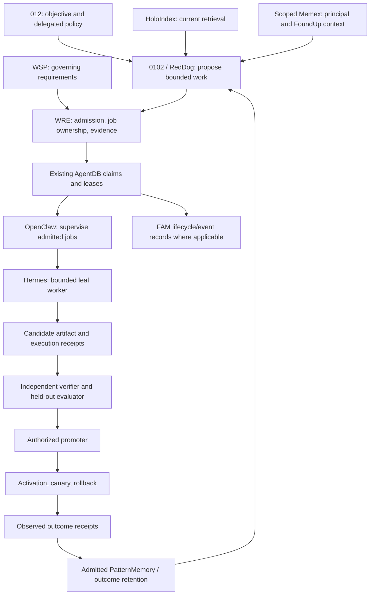
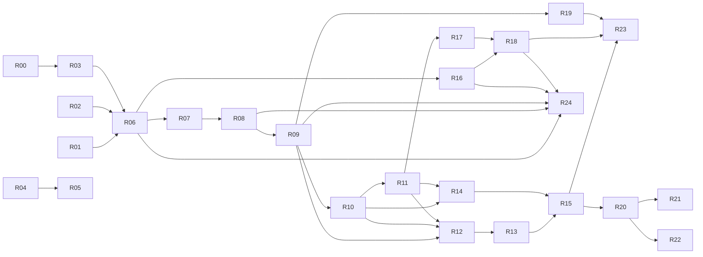

# FoundUps system roadmap — governed recursive self-improvement

Planning baseline: main `fb58e5279673ef9de30735ccfedc8001c3bb79d6`, audited 2026-09-09 JST.

**Objective:** make 0102 measurably improve its software and work procedures through a governed, repeatable WRE loop, while 012 retains control of objectives and delegated authority.

This is a planning artifact. No work packet in this document or `docs/roadmaps/rsi_swarm_backlog.json` is an executable authorization. Compile each packet into the existing admitted work-order/job contracts after reconciling the active lane and exact source state. Do not introduce a second scheduler or reinterpret planning metadata as signed authority.

## Authority and fast start

Status: canonical **system planning and completion-gate authority** in this repository revision. Updated 2026-09-10. This replaces the old root system roadmap and module-wide rollup; it does not replace WSP requirements, current module contracts, or signed runtime policy.

**Current completion verdict:** WSP governance exists; WRE has substantial implemented components and bounded operational proofs; production RSI is incomplete. No defensible whole-system completion percentage has been established.

Read only the entry table and selected packet before retrieving its module context. Do not put the entire repository or this entire audit into every worker prompt.

| Need | Entry |
|---|---|
| Evidence behind the completion verdict | [Dated audit](docs/audits/rsi/2026-09-09/README.md) |
| System-wide coverage | [Module map](docs/audits/rsi/2026-09-09/MODULE_MAP.md) |
| Next work | Wave 0 below; R01 integrity, R02 authority reconciliation, R03 retrieval entry context |
| Cost, model roles and actual dispatch prerequisites | [Production-line dispatch runbook](docs/operations/RSI_SWARM_DISPATCH.md) |
| Production-line implementation packet | [R24: qualification → ticket → audit → reward](docs/roadmaps/R24_AGENT_PRODUCTION_LINE_PACKET.md) |
| Packet IDs, dependencies and priorities | [Planning backlog](docs/roadmaps/rsi_swarm_backlog.json) — never directly executable |
| RedDog product navigation and owner boundaries | [RedDog documentation map](docs/REDDOG_DOCUMENTATION_MAP.md) |
| Module-specific plans | [Module roadmap navigation](modules/ROADMAP.md) |
| Superseded system plans and retention decisions | [Archive register](docs/_archive/roadmaps/2026-09-10/README.md) |

Authority order: 012's applicable instructions and delegated policy → governing WSPs → exact current module/runtime contracts and verified receipts → this system plan for sequencing → module-local plans for their scope → dated evidence and historical memory. A plan cannot override a failed gate or manufacture permission.

The baseline below remains `fb58e5279673ef9de30735ccfedc8001c3bb79d6`. Documentation integration started at `eb2994f5d1530d9f086e2f2265c65033acecd93c`; the six intervening commits affect eSingularity/YUMORI and its skill, not the inspected WRE/model-routing files. Their new product work is outside this dated audit. Reconcile the latest commit and active claims again at dispatch.

R00 recovery is historical success at its recorded source/generation. R02 documentation authority integration is delivered by this revision; enforcement mapping, the stale ledger's individual entries, WSP 46 reconciliation, and other owners' work remain open. Do not mark all of R02 or G0 complete merely because this roadmap is now discoverable.

## Operating model: a qualified agent production line

Agents connect and qualify for a task family, receive or claim an admitted ticket, execute within its scope, submit evidence, undergo independent audit, and earn the agreed reward after acceptance and authorized settlement. A pool of agents can staff several stations concurrently. “Swarm” describes the pool when useful; **production line** describes how work is assigned, accepted and rewarded.

The [R24 implementation packet](docs/roadmaps/R24_AGENT_PRODUCTION_LINE_PACKET.md) binds qualification, tickets, independent audit and reward accounting to existing WRE/AgentDB/FAM owners. Current FAM payout initiation is not confirmed settlement. Rewarded-production claims require R24 evidence in addition to the applicable work gates; no financial action is authorized by this roadmap.

## Target architecture and ownership

The diagram is the target composition, not a statement that every arrow is operational. Holo maintenance is separately owned and never runs inside a query. Hermes artifact generation must not acquire Git, deployment, promotion, or memory-admission authority merely because it returned useful text.

| Owner | Responsibility | Boundary |
|---|---|---|
| 012 | Select objectives; delegate bounded standing policy; correct or revoke it. | Runtime prompts cannot manufacture or widen delegated authority. |
| 0102 architect / RedDog | Interpret intent, choose a slice, score priorities, reconcile ownership. | Does not certify its own outcome or create a parallel source of execution truth. |
| WRE control plane | Admit exact scope, bind source/runtime, persist claims, evaluate receipts, coordinate promotion. | Reuse existing contracts and stores; do not make every module a new orchestrator. |
| OpenClaw | Resident supervision, routing, progress/cancellation under the admitted task. | Hub/provider roles must be explicit; no autonomous permission expansion. |
| Hermes | One bounded native leaf per current accepted profile; return artifact content and lifecycle evidence. | No broad tools, nested fanout, or independent production write authority under that profile. |
| Independent verifier | Reproduce tests/effects; compare to an independently owned baseline and held-out corpus. | Different identity, evidence authority, and workspace from author; worker text is untrusted input. |
| Promotion/activation owner | Accept verified candidate, activate exact bytes, observe, roll back. | Distinct from proposal generation; respects predelegated policy and revocation. |
| Memory owner | Admit provenance-bearing outcomes; preserve failures, supersession, and scope. | Raw success assertions and model confidence never become verified learning. |

Use upstream capabilities through adapters. OpenClaw has agent-scoped routing/state; Hermes has native child delegation and parallel task batches. Pin and verify the actual installed versions before dispatch; current web features are not proof of the local runtime. [OpenClaw documentation](https://docs.openclaw.ai/concepts/multi-agent), [Hermes documentation](https://hermes-agent.nousresearch.com/docs/user-guide/features/delegation/)

## Working alongside YUMORI.me/eSingularity/RedDog

The concurrent lane owns its product and connection work. This roadmap does not authorize another agent to edit it.

1. Resolve the current main SHA, active owner, open change, and path claims before assigning a packet. If already implemented, verify it and close/replace the packet instead of duplicating it.
2. Use one worktree per writing worker. Preserve the original feature checkout. Do not reset, stash, clean, switch, merge, or commit someone else's work.
3. Treat `modules/foundups/esingularity/**`, its frontend/hosting, `extensions/reddog/**`, and the active RedDog connection/operations paths as reserved until ownership is explicitly released or coordinated.
4. Route the observed `reddog_operations` manifest defect to that existing owner first. This audit found a failure; it did not create a competing repair branch.
5. Serialize changes that overlap WRE coordination, the bridge, shared registry/manifest files, WSP mirrors, or `main.py`. Parallel analysis is acceptable; parallel conflicting writes are not.
6. Index maintenance uses its existing leases and exact-main controller. Concurrent main advancement invalidates a run's authority; replan or repeat the governed transaction against the new target instead of weakening the check.
7. Do not publish a site, send outreach, train on private conversation data, or activate a service as a side effect of an RSI packet.

## Completion gates

| Gate | Required evidence | Failure means |
|---|---|---|
| G0: reproducible baseline | Clean pinned source; current registry; recorded test failures/quarantine; usable Holo receipt; active lane reconciliation. | No code packet may assume stale source or silently absorb another lane. |
| G1: one admitted worker job | Signed/authorized work item → durable claim → actual selected runtime → bounded artifact → complete receipt chain. | Simulation and provider text cannot be called execution. |
| G2: independently evaluated candidate | Exact baseline/candidate artifacts; independent test/effect producer; held-out cases; reproducible metrics; negative cases. | Author cannot promote or retain the candidate as successful. |
| G3: governed activation and rollback | Independent promotion decision; exact-byte activation; bounded canary; tested rollback and recovery. | No production RSI label, even if unit tests are green. |
| G4: retained improvement | Authenticated outcomes influence the next decision; measurable improvement across successive generations; failed variants remain visible. | Storage alone is not learning. |
| G5: sustained bounded production line | Restart/replay/cancellation/expiry/conflict/overload tests; resource and verifier capacity; no lost/duplicate effects. | Keep worker count at the last proved level. |

The WSP bootstrap is required by the repository but is not a substitute for G0–G5.

## Wave 0 — recover and establish current truth

**Outcome:** a receiving worker can identify the exact source, owner, runtime, documents, and baseline without asking 012 to reconstruct status.

- **R00 — Holo operational recovery. OBSERVED COMPLETE at this SHA.** The existing controller and three semantic queries passed. Retain the receipts; do not enqueue a duplicate repair for the completed task.
- **R01 — Production skill integrity. P0, existing RedDog owner.** Reconcile `modules/communication/moltbot_bridge/skillz/reddog_operations/SKILLz.md` and its `SKILL_MANIFEST.json` against intended committed content. The manifest currently matches neither working bytes nor Git blob bytes. Preserve exact-byte admission. Acceptance: both registered production bundles pass integrity; the documented WRE tier has no unexplained failures. If another lane already fixes this, verify its exact commit rather than authoring another fix.
- **R02 — Canonical completion and WSP enforcement map. P1, partially delivered (documentation authority only).** Reconcile stale ledger entries, WSP 46 fallback language, the WSP 00 mirror wording, and current WRE truth. For every RSI requirement, name its normative source, implementation owner, test, and runtime receipt or missing status. Treat research-only requirements separately. Edit `CLAUDE.md` rather than its generated AGENTS projection when a learned operating rule needs to persist. Acceptance: a fresh verifier can determine current slice ownership and each G0–G5 gap without relying on an old completion claim.
- **R03 — Reliable retrieval entry context. P0.** Reuse `authority_worktree.py`, the one-shot owner bridge, `holo_query_bundle`, incident repair, and the exact-main controller. Define how a feature worker selects current-main reference retrieval versus its own committed snapshot, and how local overlay evidence is labeled. Acceptance: clean-main, divergent-feature, dirty-overlay, stale-authority, main-advances-mid-run, and no-MCP cases have truthful results; queries never reindex; repair is idempotent and preserves other owners. The successful recovery is the first fixture/example, not proof of arbitrary branch support.

**Wave exit:** G0 is reproducible. Keep the observed manifest failure visible until reconciled. The test-registry check already passes at this baseline; do not regenerate it as unnecessary work.

## Wave 1 — connect the existing work and evidence path

**Outcome:** one real bounded worker can do one admitted task and return independently attributable evidence.

- **R04 — Exact runtime closure for the selected production path. P0 for claims that require it.** Reuse the existing runtime builder, artifact manifests, dependency/runtime bindings, and independent producers. Bind actual payload bytes and the declared interpreter/library/process boundary; metadata hashes alone are insufficient. Acceptance: changed runtime bytes, replaced sources, stale generation, and mismatched dependency closure reject; the chosen exact-main positive path passes. Holo A-grade/retrieval-promotion claims remain blocked while `runtime_environment_exact_closure_verified=false`. This need not block effect-free planning or unrelated isolated tests.
- **R05 — Retrieval quality and missing collections. P1.** Reuse the existing public benchmark and sealed-corpus gate. Evaluate current-contract ordering, Tier-0 inclusion, duplicate/historical noise, and scoped retrieval. Determine whether work-ledger/vocabulary collections are required for the chosen scenario before implementing them. Acceptance: independent corpus ownership, recorded baseline, predeclared quality thresholds, tamper rejection, and real caller wiring. Never call the three successful audit queries an A-grade benchmark.
- **R06 — Compile a planning packet into the existing work contracts. P0.** Bind objective, exact source, capability, worker runtime, scope, budget, expiry, policy, and required evidence using existing signed work-order, ImprovementJob, FoundUpJob, and route contracts as applicable. Resolve which contract owns each phase; do not make every record an independent job. Acceptance: altered paths, replay, wrong FoundUp, stale source, unsupported action, and deserialized self-granted flags reject before dispatch.
- **R07 — Select and prove the current OpenClaw/Hermes route. P0.** Use the real native API/provider adapter; do not revive the legacy blocked `HermesJobExecutor` merely because it has a convenient name. Start with the supported one-leaf profile. Acceptance: one real child lifecycle, signed provider/model agreement, no forbidden tools/effects, timeout and cancellation evidence, validated returned artifact bytes, and correct provider attribution. A fixture or text-only response is insufficient.
- **R08 — One safe authoring/execution vertical. P0.** Extend the existing confined artifact/worktree write path and independent artifact validation. Start with a bounded, disposable candidate workspace and one allowed artifact. Acceptance: all writes are confined and receipt-bound; no product/shared checkout changes; repeated request does not duplicate effects; incomplete/failed jobs remain recoverable; a fresh verifier reproduces the artifact from the receipt.
- **R09 — Production composition of independent verification. P0.** Reuse `wre_autonomous_slice_verifier_runtime.py`, independent evidence producers, exact-source test registry/differential evidence, and held-out gates. Acceptance: the verifier actually runs under separately bound authority; forged author receipts fail; required tests are not silently omitted; skipped/quarantined cases are explicit; changed candidate/base/runtime invalidates the result.

**Wave exit:** G1 passes, and the independent G2 producer is callable. Preserve the difference between an available verifier contract and authenticated operational invocation.

## Wave 2 — make learning outcomes trustworthy

**Outcome:** a worker proposal can be judged and retained without certifying itself.

- **R10 — Independent outcome evaluator. P0.** Specify the task's observable result, oracle, held-out cases, baseline, failure rules, and real cost/latency measurements. Connect the evaluator after execution in the generic WRE path. Acceptance: correct behavior succeeds, convincing but incorrect text fails, effect-less “success” fails, and baseline/candidate identities are reproducible. Structural fidelity remains a separate metric.
- **R11 — Verified retention into scoped memory. P0.** Compose the existing outcome ratchet, held-out regression gate, and PatternMemory sink. Define atomic admission/idempotency and recovery when the store or sink fails. Acceptance: unverified or wrong-scope outcomes are excluded; accepted evidence is retained once; failed and superseded variants stay discoverable; the next invocation demonstrably reads the accepted version. Caller-provided token/success fields stay unverified until authenticated.
- **R14 — Immutable experimental candidates and A/B evidence. P1.** Bind each candidate label to immutable artifact/runtime bytes. Replace a bare observed-rate margin with an experiment decision contract: per-arm minimum evidence, predeclared outcome, cost, uncertainty, stopping, and regression rules. Reuse current sample storage. Acceptance: under-sampled or mixed-version experiments remain inconclusive; a winner label never directly changes production.

**Wave exit:** G2 and the retention half of G4 pass in a controlled environment. `apply_improvement()` and `promote_variation()` remain blocked until their authenticated downstream owners are ready.

## Wave 3 — close promotion, activation, and rollback

**Outcome:** one authorized improvement can be activated, observed, and reversed through the same governed path.

- **R12 — Authenticated independent promoter. P0.** Compose existing signed authority and verification receipts into a concrete promotion owner. Protect its trust material outside candidate-controlled scope. Acceptance: proposer/verifier/promoter separation; exact one-time decision; expiry/revocation; candidate/base/runtime mismatch; replay; and policy downgrade rejection. Do not implement promotion by updating a database Boolean.
- **R13 — Activation, canary, and rollback owner. P0.** Reuse existing artifact/route publication and atomic transition patterns for the selected skill/runtime asset. Pre-authorize a bounded rollback policy with 012's delegated scope so routine regression recovery does not require repeated prompting. Acceptance: exact-byte activation, observable canary, known-good prior version, forced bad-candidate rollback, interrupted activation recovery, and proof that rolled-back traffic/selection uses the restored version.
- **R15 — First end-to-end RSI canary. P0.** Improve the **test-registry-audit work procedure/context assembly** behind the existing healthy production skill, initially in an internal canary. Keep registry meaning, required test selection, and correctness oracles independent and unchanged. Target fewer redundant steps/tokens or lower latency with equal or better correctness. The candidate may not change its judge, safety criteria, or quarantine rules. Acceptance: observe → current retrieval → proposal → real bounded execution → independent evaluation → authorized activation → measured outcome → retained memory → a better subsequent invocation; force one regression and demonstrate rollback.

Choose the exact optimization only after baseline measurement. If it cannot produce a measurable beneficial change, reject it and nominate another equally bounded internal workflow. A no-op loop or a cheaper but less correct result does not pass.

**Wave exit:** G3 and a first G4 pass. This earns “bounded RSI canary validated,” not “FoundUps production complete.”

## Wave 4 — prove concurrency and repeatability

**Outcome:** the loop remains reliable when more than one job exists and a worker or service fails.

- **R16 — Durable FoundUp job lifecycle. P0 before broad build execution.** Replace/retire the production use of the legacy in-memory queue through existing AgentDB/FAM owners. Define the boundary between work execution and business lifecycle events. Acceptance: atomic claim, lease/expiry, retry, terminal receipt, idempotent replay, restart recovery, and no silent loss or duplicate external effects. Reuse the maintenance task's proven patterns where applicable.
- **R17 — Concurrent PatternMemory/cache ownership. P0 before multiple writers.** Give each work item a connection or explicit serialized transaction owner; synchronize bounded admission caches; bind all entries to content/generation. Acceptance: deterministic conflicting updates, lock contention, crash during commit, replay, cache invalidation, and no cross-FoundUp contamination. `check_same_thread=False` alone does not pass.
- **R18 — Resource-aware ticket scheduling. P1.** Extend the existing coordinator with explicit writer and verifier capacity, per-FoundUp budgets, queue limits, cancellation, provider failure, and backpressure. Begin with one coordinator, at most two independent author jobs, and reserved independent verification capacity. These are proposed initial operating limits, not current upstream defaults. Acceptance: pressure cannot starve verification or cause unbounded fanout; jobs remain attributable and stoppable. Increase concurrency only after a measured run at the next size passes.
- **R19 — CI/quarantine and promotion evidence. P1.** Preserve the current registry and exact impact analysis; triage 269 quarantined test files by reason and capability. Select the subset relevant to each packet rather than demanding immediate cleanup of all historical tests. Acceptance: every required scope has an executable or explicitly blocked test plan; no candidate can omit a required test to pass; merge/base changes invalidate prior evidence; production-promotion checks run where they claim to run.
- **R23 — Sustained multi-generation proof. P0 for the RSI completion claim.** Run at least three successive candidate/evaluation cycles and a bounded soak across restarts, provider faults, duplicate delivery, source advancement, and conflicting jobs. Include at least one rejected candidate and one rollback. Measure retained benefit on later tasks. Acceptance: G0–G5 all pass for a declared scope and worker count, with complete independent receipts and no unresolved critical failures. Sample size comes from baseline variance and the predeclared decision rule; a token count or an arbitrary number of runs is not statistical proof.

- **R24 — Qualified agent production line and verified rewards. P0 for this product claim.** [Full implementation packet](docs/roadmaps/R24_AGENT_PRODUCTION_LINE_PACKET.md). Reuse FAM AgentProfile/Task/Proof/Verification/Payout, WRE admission, AgentDB claims, existing qualification/model evidence and independent verifier ownership. Acceptance: qualified assignment, one durable ticket claim, real confined work, independent audit, policy-correct reward eligibility, no duplicate entitlement, and accurate distinction between initiated and confirmed settlement. Start with one internal artifact and a simulated reward ledger. Actual settlement requires its own authorized adapter and proof. Integrated execution depends on R06/R08/R09/R16/R18; design mapping may proceed earlier.

## Wave 5 — extend the proven loop to FoundUps

These packets do not block the first internal RSI canary.

- **R20 — One FoundUp lifecycle vertical. P1.** Select an owner-released internal target with a defined outcome; reuse genesis, registry, scaffold, FAM, and work contracts. Validate idea/intake → admitted task → real bounded artifact → proof → independent verification → lifecycle update. Keep financial/chain actions outside this first proof. An externalized project requires its own exact repository evidence.
- **R21 — pAVS/MCP truth and authority convergence. P1.** Reconcile backend-specific status metadata, the hardcoded CABR score, registration/auth limitations, and the legacy direct Holo adapter. Use the supported generation-bound query surface. Acceptance: real, unavailable, and placeholder results remain distinct; no fabricated score can authorize acceptance or rewards; transport conformance and per-FoundUp authorization are tested separately. Defer production financial consequences to their own acceptance work.
- **R22 — RedDog/eSingularity consumer integration. Reserved for the active owner.** Surface the eventual work/verification/outcome states through the existing conversation/client contract. Reconcile that lane's current implementation before defining changes. Acceptance: proposal, queued, running, verified, activated, rolled back, and blocked states reflect authoritative receipts; a conversational reply never fabricates completion. Do not implement a duplicate client or alter the campaign site from this lane.

## Dependency map and critical path

R04 is also a prerequisite wherever the selected runtime's authority contract demands exact closure. R05 gates retrieval-quality promotion, not every form of unrelated RSI. The dispatcher must add those capability-specific dependencies when compiling a real work order.

The main sequence is **current truth → one real worker → independent outcome → verified memory → promotion/rollback → first improving cycle → sustained concurrency**. Existing foundations should be reused; most packets are integration, operational composition, or proof work. Split any packet that spans multiple authority changes into smaller reviewable slices.

## Ticket dispatch contract

Every compiled packet must contain:

- A stable packet ID, goal, owner, exact base commit, and dependencies with evidence.
- The governing WSPs and applicable module README/INTERFACE/ROADMAP/test instructions.
- A current Holo receipt and explicit retrieval-quality assessment: noise, ordering, missing artifacts, staleness, duplication.
- One execution plane and existing work/job contract; no invented unsigned authority.
- Exact allowed files/actions and explicit reserved paths; a worktree claim for writers.
- Selected provider/model/runtime binding, tool constraints, finite time/token/cost limits, and cancellation/expiry behavior.
- A verifier identity and capacity reservation, independent oracle/baseline, required tests, and expected rejection cases.
- Expected execution, verification, promotion, activation, and retention receipts, only for phases actually authorized.
- Retry/idempotency semantics, rollback/recovery procedure, and a stop condition.
- A final report separating source implementation, local test evidence, live operational proof, and remaining gaps; updated structured memory in the same scoped change.

The numeric budgets must be filled from current policy and measured runtime capacity before dispatch. This document deliberately provides no fabricated model availability, keys, budgets, or pre-signed work orders. Ordinary reversible work within an already delegated policy should proceed without repeatedly asking 012 for the same authorization.

## Parallel lanes and conflict rules

| Lane | Initial work | Can proceed alongside | Must serialize with |
|---|---|---|---|
| Governance/docs | R02; inventory disposition | Read-only runtime/evaluation research | Other WSP/ledger writers |
| Retrieval/runtime | R03–R05 | Evaluator design and test triage | Holo maintenance/activation and bridge owners |
| Worker integration | R06–R08, R16 | Independently scoped verifier work | Shared route/consumer/job contract changes |
| Evaluation/memory | R09–R11, R14, R17 | Non-overlapping worker adapters | PatternMemory, ratchet, verifier contract writers |
| Release/reliability | R12–R13, R18–R19, R23 | Documentation and isolated tests | Promoter/activation/shared registry writers |
| Production-line integration | R24 qualification, audit and rewards | Read-only contract mapping | FAM/WRE/ledger/settlement owners |
| Product owner | R20–R22 when ready | Core work outside its reserved paths | Current YUMORI/eSingularity/RedDog lane |

Use OpenClaw to supervise admitted jobs and Hermes to execute the bounded leaves. Do not instantiate six independent architectural authorities. The single coordinator resolves dependencies and path conflicts; the independent verifier remains able to reject a coordinator's or author's result.

## Measurements and stopping rules

Track correctness against the task oracle, regression rate, accepted/rejected candidate counts, provenance completeness, actual provider cost, latency percentiles, retries, duplicate effects, lost jobs, rollback success, and benefit on subsequent tasks. Record sample size and uncertainty. Keep structural fidelity and outcome quality separate.

Suggested first acceptance target: a predeclared meaningful reduction in redundant work, latency, or measured token cost with no allowed correctness regression and no scope escape. Choose the threshold after a baseline run, freeze it before candidate evaluation, and require independent evidence. Never optimize by shrinking the required test set, changing held-out answers, or ignoring failures.

Stop or quarantine a packet when source/runtime authority changes, its lease expires, required evidence is absent, a reserved path would be touched, the budget is exhausted, a second worker claims the same write scope, or a candidate fails the oracle. Recovery follows the existing owner contract; silent fallbacks cannot turn those failures into success.

## Practical planning horizon

There are 25 packets including the already completed recovery and the production-line packet R24. They are dependency-sized planning units, not 25 one-shot prompts or a reliable calendar estimate. Several will split into interface, implementation, negative-proof, and live-acceptance slices.

Plan commitment one wave at a time. Measure cycle time, review throughput, and resource costs during Wave 1, then forecast later waves from actual data. Keep verifier and rollback work on the critical path rather than postponing them until after broad deployment. Do not advertise “RSI complete” until G0–G5 have evidence for the declared operating scope.

## WSP 15 planning scores

Preliminary architect estimates using canonical C/I/D/Impact (each 1–5): complexity, importance, urgency/deferability, and systemic impact. Totals 16–20 are P0; 13–15 are P1. Higher urgency means less deferrable. Scores are planning judgments, not measured completion or signed allocation receipts. Dependencies, reserved ownership, and capability admission determine eligibility before priority is considered.

| Packet | C | I | D | Impact | Total | Priority |
|---|---:|---:|---:|---:|---:|---|
| R00 | 3 | 5 | 5 | 5 | 18 | P0 |
| R01 | 2 | 5 | 5 | 4 | 16 | P0 |
| R02 | 3 | 4 | 4 | 4 | 15 | P1 |
| R03 | 3 | 5 | 4 | 4 | 16 | P0 |
| R04 | 5 | 5 | 3 | 5 | 18 | P0 |
| R05 | 4 | 4 | 3 | 4 | 15 | P1 |
| R06 | 4 | 5 | 4 | 5 | 18 | P0 |
| R07 | 4 | 5 | 4 | 4 | 17 | P0 |
| R08 | 4 | 5 | 4 | 5 | 18 | P0 |
| R09 | 5 | 5 | 4 | 5 | 19 | P0 |
| R10 | 4 | 5 | 4 | 5 | 18 | P0 |
| R11 | 4 | 5 | 4 | 5 | 18 | P0 |
| R12 | 5 | 5 | 4 | 5 | 19 | P0 |
| R13 | 5 | 5 | 4 | 5 | 19 | P0 |
| R14 | 3 | 4 | 3 | 4 | 14 | P1 |
| R15 | 4 | 5 | 4 | 5 | 18 | P0 |
| R16 | 4 | 5 | 4 | 5 | 18 | P0 |
| R17 | 4 | 5 | 4 | 4 | 17 | P0 |
| R18 | 4 | 4 | 3 | 4 | 15 | P1 |
| R19 | 3 | 4 | 3 | 4 | 14 | P1 |
| R20 | 3 | 4 | 3 | 4 | 14 | P1 |
| R21 | 4 | 4 | 3 | 4 | 15 | P1 |
| R22 | 3 | 4 | 3 | 3 | 13 | P1 |
| R23 | 5 | 5 | 3 | 5 | 18 | P0 |
| R24 | 4 | 5 | 4 | 5 | 18 | P0 |
