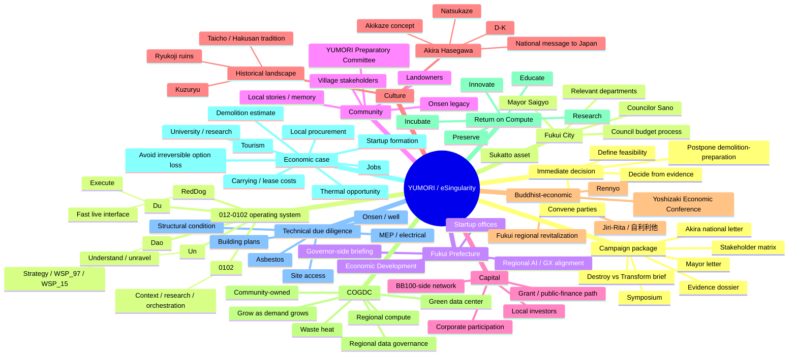

# YUMORI / eSingularity — Working Mind Map

## Update rule

This map is navigational, not authoritative. Update the corresponding project node first when facts or decisions change; then adjust this map if the structure materially changes.
