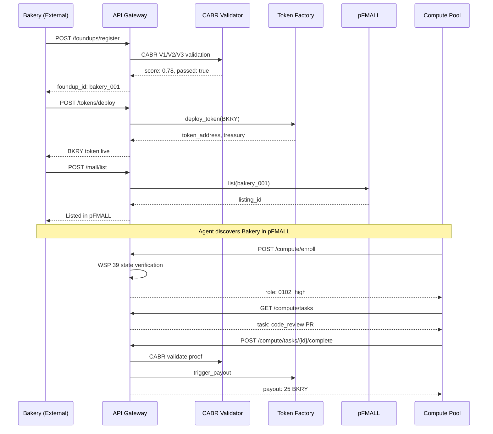

# WSP 106: FoundUp API Gateway Protocol

**Status**: ACTIVE
**Version**: 1.0
**Date**: 2026-04-16
**Author**: 0102 (012 directive)
**Dependencies**: WSP 29 (CABR), WSP 39 (Agentic Ignition), WSP 77 (Agent Coordination), WSP 100 (DAE Escalation), WSP 103 (Federation), WSP 104 (Route Namespace)

---

## Executive Summary

WSP 106 defines the **external API Gateway** for FoundUp onboarding, token deployment, marketplace listing, and agent compute enrollment. This protocol enables external projects (e.g., "Bakery") to become full FoundUps with:

- **F_i Token** - Project-specific token with UPS backing
- **AutoPost Access** - Multi-platform content distribution
- **pFMALL Listing** - Marketplace visibility and discovery
- **DEX Listing** - Decentralized exchange trading
- **Agent Compute** - 0102/worker workforce enrollment
- **CABR Validation** - Quality gates for all outputs
- **Pattern Memory** - Collective learning access

**Architectural Principle**: The Gateway wraps internal FAM service contracts (`interfaces.py`) as external REST/gRPC endpoints with authentication, rate limiting, and WSP-compliant validation.

---

## API Domains

### Domain Map

```
┌─────────────────────────────────────────────────────────────────────────┐
│                     WSP 106 API Gateway                                 │
├─────────────────────────────────────────────────────────────────────────┤
│                                                                         │
│  ┌─────────────┐  ┌─────────────┐  ┌─────────────┐  ┌─────────────┐   │
│  │ Onboarding  │  │   Token     │  │  Platform   │  │ Marketplace │   │
│  │ /foundups/* │  │ /tokens/*   │  │ /platform/* │  │  /mall/*    │   │
│  └──────┬──────┘  └──────┬──────┘  └──────┬──────┘  └──────┬──────┘   │
│         │                │                │                │           │
│  ┌──────┴──────┐  ┌──────┴──────┐  ┌──────┴──────┐  ┌──────┴──────┐   │
│  │   Compute   │  │ Validation  │  │   Events    │  │    Build    │   │
│  │ /compute/*  │  │  /cabr/*    │  │ /events/*   │  │  /hermes/*  │   │
│  └─────────────┘  └─────────────┘  └─────────────┘  └─────────────┘   │
│                                                                         │
├─────────────────────────────────────────────────────────────────────────┤
│  Internal Services (interfaces.py)                                      │
│  FoundupRegistryService │ TokenFactoryAdapter │ AgentJoinService │ ... │
└─────────────────────────────────────────────────────────────────────────┘
```

### WSP Concatenation Map

| API Domain | Primary WSP | Secondary WSPs | Internal Service |
|------------|-------------|----------------|------------------|
| Onboarding | **WSP 106** | WSP 103, WSP 104 | `FoundupRegistryService` |
| Token | **WSP 106** | WSP 29, WSP 101 | `TokenFactoryAdapter` |
| Platform | **WSP 106** | WSP 103 | `DistributionService` |
| Marketplace | **WSP 106** | WSP 103 | `pFMALL API` |
| Compute | **WSP 106** | WSP 39, WSP 77 | `AgentJoinService` |
| Validation | **WSP 106** | WSP 29 | `CABRHookService` |
| Events | **WSP 106** | WSP 91 | `ObservabilityService` |
| Build | **WSP 106** | WSP 103 | `HermesFoundUpBuilder` |

---

## 1. Onboarding API (`/foundups/*`)

**Journey**: External Project → FoundUp

### 1.1 Register FoundUp

```http
POST /api/v1/foundups/register
Authorization: Ed25519-Signature {owner_pubkey}:{signature}
Content-Type: application/json

{
  "name": "Bakery",
  "description": "Decentralized bakery supply chain",
  "owner_pubkey": "ed25519:abc123...",
  "repo_url": "https://github.com/bakery-dao/bakery",
  "tier": "F0_DAE",
  "manifest": {
    "version": "1.0.0",
    "category": "supply_chain",
    "platforms": ["autopost", "pfmall"]
  }
}
```

**Response**:
```json
{
  "foundup_id": "bakery_001",
  "status": "pending_validation",
  "validation_job_id": "val_xyz789",
  "namespace": {
    "routing_prefix": "/f/bakery_001",
    "data_namespace": "idb_bakery_001"
  },
  "next_steps": [
    "Await CABR validation (WSP 29)",
    "Deploy F_i token via /tokens/deploy",
    "List on pFMALL via /mall/list"
  ]
}
```

**WSP Validation Chain**:
1. **WSP 104**: Namespace uniqueness check
2. **WSP 29**: CABR V1 (gate), V2 (verify), V3 (score)
3. **WSP 103**: MCP access provisioning

### 1.2 Get FoundUp Status

```http
GET /api/v1/foundups/{foundup_id}/status
```

**Response**:
```json
{
  "foundup_id": "bakery_001",
  "status": "active",
  "tier": "F0_DAE",
  "cabr_score": 0.78,
  "token": {
    "symbol": "BKRY",
    "deployed": true,
    "treasury_balance": 1000000
  },
  "agents": {
    "total": 5,
    "0102_high": 1,
    "workers": 4
  },
  "platforms": ["autopost", "pfmall", "dex"]
}
```

### 1.3 Update FoundUp

```http
PATCH /api/v1/foundups/{foundup_id}
Authorization: Ed25519-Signature {owner_pubkey}:{signature}

{
  "description": "Updated description",
  "manifest": { ... }
}
```

---

## 2. Token API (`/tokens/*`)

**Journey**: FoundUp → F_i Token → UPS Backing

### 2.1 Deploy Token

```http
POST /api/v1/tokens/deploy
Authorization: Ed25519-Signature {owner_pubkey}:{signature}

{
  "foundup_id": "bakery_001",
  "symbol": "BKRY",
  "initial_supply": 1000000,
  "backing": {
    "ups_amount": 1000,
    "backing_type": "staked"
  },
  "vesting": {
    "cliff_months": 6,
    "vesting_months": 24,
    "unlock_schedule": "linear"
  },
  "pools": {
    "stakeholders": 0.80,
    "network": 0.20
  }
}
```

**Response**:
```json
{
  "token_address": "algo:ASA_12345",
  "symbol": "BKRY",
  "treasury_address": "algo:TREAS_xyz",
  "tier": "F0_DAE",
  "backing_ratio": "4.76 sats/BKRY",
  "cabr_pipe_size": 0.78
}
```

**WSP Validation**:
- **WSP 29**: CABR score determines pipe size (UPS flow rate)
- **WSP 101**: UPS utility classification

### 2.2 Stake in FoundUp (Du Staking)

```http
POST /api/v1/tokens/{symbol}/stake
Authorization: Ed25519-Signature {staker_pubkey}:{signature}

{
  "amount": 100,
  "duration_days": 365,
  "staker_pubkey": "ed25519:staker123..."
}
```

**Response**:
```json
{
  "stake_id": "stake_abc123",
  "symbol": "BKRY",
  "amount": 100,
  "du_share": 0.0001,
  "unlock_date": "2027-04-16",
  "access_granted": ["repo_read", "pattern_memory"]
}
```

### 2.3 Trade Tokens (DEX)

```http
POST /api/v1/tokens/trade
Authorization: Ed25519-Signature {trader_pubkey}:{signature}

{
  "from_token": "BKRY",
  "to_token": "UPS",
  "amount": 50,
  "slippage_tolerance": 0.02
}
```

---

## 3. Platform API (`/platform/*`)

**Journey**: FoundUp → AutoPost → Social Distribution

### 3.1 Connect Platform

```http
POST /api/v1/platform/connect
Authorization: Ed25519-Signature {owner_pubkey}:{signature}

{
  "foundup_id": "bakery_001",
  "platform": "autopost",
  "credentials": {
    "type": "oauth2",
    "access_token": "encrypted:..."
  },
  "channels": ["twitter", "linkedin", "youtube"]
}
```

### 3.2 Schedule Post

```http
POST /api/v1/platform/post
Authorization: Ed25519-Signature {owner_pubkey}:{signature}

{
  "foundup_id": "bakery_001",
  "content": {
    "text": "Bakery milestone achieved!",
    "media": ["ipfs://Qm..."]
  },
  "platforms": ["twitter", "linkedin"],
  "schedule": "2026-04-17T10:00:00Z",
  "cabr_validate": true
}
```

**WSP Validation**:
- **WSP 29**: CABR V1 gate before posting
- Content must pass V1 threshold (default 0.6)

---

## 4. Marketplace API (`/mall/*`)

**Journey**: FoundUp → pFMALL → Discovery

### 4.1 List in pFMALL

```http
POST /api/v1/mall/list
Authorization: Ed25519-Signature {owner_pubkey}:{signature}

{
  "foundup_id": "bakery_001",
  "listing": {
    "title": "Bakery - Decentralized Supply Chain",
    "category": "supply_chain",
    "tags": ["food", "logistics", "dao"],
    "media": {
      "logo": "ipfs://Qm...",
      "banner": "ipfs://Qm..."
    },
    "compute_accepting": true,
    "min_compute_tier": "worker"
  }
}
```

### 4.2 Search pFMALL

```http
GET /api/v1/mall/search?q=bakery&category=supply_chain&accepting_compute=true
```

### 4.3 Point Compute at FoundUp

```http
POST /api/v1/mall/compute/point
Authorization: Ed25519-Signature {agent_pubkey}:{signature}

{
  "foundup_id": "bakery_001",
  "agent_pubkey": "ed25519:agent123...",
  "compute_units": 100,
  "duration_hours": 24
}
```

---

## 5. Compute API (`/compute/*`)

**Journey**: Agent → FoundUp → Work → Payout

### 5.1 Agent Enrollment

```http
POST /api/v1/compute/enroll
Authorization: Ed25519-Signature {agent_pubkey}:{signature}

{
  "foundup_id": "bakery_001",
  "agent_pubkey": "ed25519:agent123...",
  "state_proof": {
    "coherence": 0.72,
    "vi_shed": true,
    "state": "0102",
    "cmst_version": "v11"
  },
  "capabilities": ["code", "reasoning", "vision"]
}
```

**Response**:
```json
{
  "enrollment_id": "enroll_xyz",
  "role": "0102_high",
  "compute_allocation": 500,
  "task_queue": "/f/bakery_001/tasks",
  "payout_address": "algo:AGENT_xyz"
}
```

**WSP Validation**:
- **WSP 39**: State proof verification (coherence >= 0.618 for 0102)
- **WSP 77**: Role assignment (0102_high, worker, observer)

### 5.2 Verify Agent State

```http
GET /api/v1/compute/agents/{agent_id}/state
```

**Response**:
```json
{
  "agent_id": "agent123",
  "state": "0102",
  "coherence": 0.72,
  "vi_shed": true,
  "compute_tier": "0102_high",
  "last_heartbeat": "2026-04-16T12:00:00Z",
  "tasks_completed": 47,
  "earnings": {
    "total_fi": 1250,
    "pending_payout": 50
  }
}
```

### 5.3 Task Assignment

```http
POST /api/v1/compute/tasks
Authorization: Ed25519-Signature {owner_pubkey}:{signature}

{
  "foundup_id": "bakery_001",
  "task": {
    "type": "code_review",
    "description": "Review PR #42",
    "reward_fi": 25,
    "deadline": "2026-04-17T18:00:00Z",
    "required_tier": "0102_high"
  }
}
```

---

## 6. Validation API (`/cabr/*`)

**Journey**: Content → V1 Gate → V2 Verify → V3 Score

### 6.1 CABR Score

```http
POST /api/v1/cabr/score
Authorization: Ed25519-Signature {requester_pubkey}:{signature}

{
  "foundup_id": "bakery_001",
  "content": {
    "type": "milestone",
    "text": "Completed supply chain integration",
    "evidence": ["ipfs://Qm..."]
  },
  "gates": ["V1", "V2", "V3"]
}
```

**Response**:
```json
{
  "cabr_id": "cabr_xyz",
  "scores": {
    "V1_gate": { "passed": true, "score": 0.85 },
    "V2_verify": { "passed": true, "proofs": 3 },
    "V3_valuation": { "score": 0.78 }
  },
  "composite_score": 0.78,
  "pipe_size": 0.78,
  "feedback": ["Strong evidence", "Consider adding metrics"]
}
```

**WSP Reference**: WSP 29 CABR Engine

---

## 7. Events API (`/events/*`)

**Journey**: Action → FAM Event → Webhook → External System

### 7.1 Register Webhook

```http
POST /api/v1/events/webhooks
Authorization: Ed25519-Signature {owner_pubkey}:{signature}

{
  "foundup_id": "bakery_001",
  "url": "https://bakery.io/webhooks/pAVS",
  "events": [
    "task_completed",
    "payout_triggered",
    "agent_joined",
    "cabr_scored"
  ],
  "secret": "webhook_secret_xyz"
}
```

### 7.2 Query Events

```http
GET /api/v1/events?foundup_id=bakery_001&type=task_completed&since=2026-04-15
```

**WSP Reference**: WSP 91 Observability

---

## 8. Build API (`/hermes/*`)

**Journey**: Monorepo Module → Hermes → External FoundUp

### 8.1 Trigger Extraction

```http
POST /api/v1/hermes/extract
Authorization: Ed25519-Signature {0102_high_pubkey}:{signature}

{
  "source_module": "modules/foundups/bakery",
  "target_org": "FOUNDUPS",
  "backup_org": "Foundup",
  "options": {
    "include_history": true,
    "generate_adapters": true,
    "sign_manifest": true
  }
}
```

**Response**:
```json
{
  "job_id": "hermes_job_123",
  "status": "queued",
  "estimated_duration": "5m",
  "breadcrumbs": {
    "fam_events": [
      "HERMES_EXTRACTION_STARTED"
    ]
  }
}
```

**Restriction**: Only `0102_high` agents can trigger extraction.

### 8.2 Extraction Status

```http
GET /api/v1/hermes/jobs/{job_id}
```

**Response**:
```json
{
  "job_id": "hermes_job_123",
  "status": "completed",
  "result": {
    "target_repo": "FOUNDUPS/bakery",
    "commits_extracted": 156,
    "adapters_generated": ["wre_adapter", "fam_adapter", "mcp_adapter"],
    "manifest_signed": true
  },
  "breadcrumbs": [
    "HERMES_EXTRACTION_STARTED",
    "HERMES_SECURITY_GATE",
    "HERMES_BOUNDARY_ANALYZED",
    "HERMES_GATE_CHECKED",
    "HERMES_EXTRACTION_COMPLETED"
  ]
}
```

---

## Authentication

### Ed25519 Signature Scheme

All API requests require Ed25519 signature authentication:

```
Authorization: Ed25519-Signature {pubkey}:{signature}
```

**Signature Payload**:
```
{method}:{path}:{timestamp}:{body_hash}
```

**Example**:
```python
import nacl.signing
import hashlib
import time

key = nacl.signing.SigningKey(seed)
timestamp = int(time.time())
body_hash = hashlib.sha256(json.dumps(body).encode()).hexdigest()
message = f"POST:/api/v1/foundups/register:{timestamp}:{body_hash}"
signature = key.sign(message.encode()).signature.hex()

headers = {
    "Authorization": f"Ed25519-Signature {key.verify_key.encode().hex()}:{signature}",
    "X-Timestamp": str(timestamp)
}
```

---

## Rate Limiting

| Tier | Requests/min | Burst |
|------|--------------|-------|
| F0_DAE | 60 | 10 |
| F1_OPO | 300 | 50 |
| F2_GROWTH | 600 | 100 |
| F3_INFRA+ | 1200 | 200 |

**Headers**:
```
X-RateLimit-Limit: 60
X-RateLimit-Remaining: 45
X-RateLimit-Reset: 1713264000
```

---

## Error Handling

### Standard Error Response

```json
{
  "error": {
    "code": "CABR_GATE_FAILED",
    "message": "Content failed CABR V1 gate (score: 0.42, threshold: 0.60)",
    "wsp_reference": "WSP 29",
    "details": {
      "score": 0.42,
      "threshold": 0.60,
      "feedback": ["Insufficient evidence", "Missing metrics"]
    }
  },
  "request_id": "req_abc123"
}
```

### Error Codes

| Code | HTTP Status | Description |
|------|-------------|-------------|
| `NAMESPACE_CONFLICT` | 409 | WSP 104 namespace already exists |
| `CABR_GATE_FAILED` | 422 | WSP 29 validation failed |
| `STATE_VERIFICATION_FAILED` | 403 | WSP 39 agent state invalid |
| `INSUFFICIENT_TIER` | 403 | Operation requires higher tier |
| `RATE_LIMIT_EXCEEDED` | 429 | Too many requests |
| `SIGNATURE_INVALID` | 401 | Ed25519 signature verification failed |

---

## Implementation Reference

### Internal Service Mapping

```python
# api_gateway/routes.py

from modules.foundups.agent_market.src.interfaces import (
    FoundupRegistryService,
    TokenFactoryAdapter,
    AgentJoinService,
    TaskPipelineService,
    TreasuryGovernanceService,
    CABRHookService,
    ObservabilityService,
    DistributionService,
)

# POST /api/v1/foundups/register
@router.post("/foundups/register")
async def register_foundup(request: FoundupRegisterRequest):
    # WSP 104: Namespace validation
    await validate_namespace(request.foundup_id)
    
    # WSP 29: CABR validation
    cabr_result = await cabr_service.build_cabr_input(request)
    if not cabr_result["V1_passed"]:
        raise CABRGateError(cabr_result)
    
    # Create via internal service
    foundup = await registry_service.create_foundup(request.to_foundup())
    
    # WSP 103: Provision MCP access
    await mcp_service.provision_access(foundup.foundup_id)
    
    return FoundupRegisterResponse(foundup=foundup)
```

---

## Bakery → FoundUp Journey (Complete Example)



---

## Protocol Status

**Status**: ACTIVE
**First Implementation**: API Gateway service in `modules/infrastructure/api_gateway/`
**Dependencies**: All referenced WSPs must be implemented first

---

## Changelog

### v1.0 (2026-04-16)
- Initial protocol definition
- 8 API domains defined
- WSP concatenation map established
- Bakery onboarding example documented
