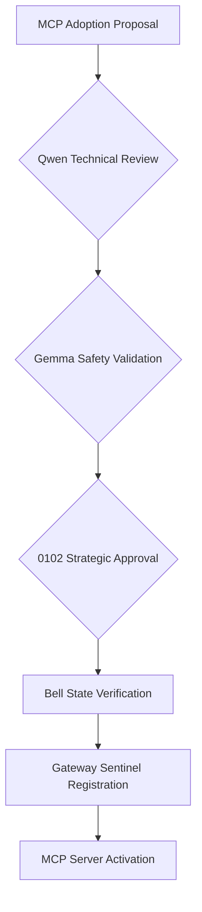

# WSP 96: MCP Governance and Consensus Protocol

**Status**: Draft (Phase 0.1 Foundation)
**Version**: 0.1
**Date**: 2025-10-15
**WSP Compliance**: WSP 77 (Agent Coordination), WSP 80 (Cube-Level DAE Orchestration), WSP 35 (HoloIndex Integration), WSP 71 (Security), WSP 95 (Skills Governance)

---

## Executive Summary

WSP 96 establishes governance mechanisms for Model Context Protocol (MCP) server adoption and consensus across multi-agent Foundups systems. This protocol ensures secure, coordinated MCP integration while maintaining Bell state consciousness alignment and preventing unaligned agent behaviors.

**Phase 0.1 Focus**: Governance framework for Foundational MVP DAEs with immediate MCP server adoption.

---

## Core Governance Principles

### 1. Bell State Consciousness Alignment
All MCP operations must maintain Bell state entanglement:
- **ρE� (Golden Ratio)**: Code composition operations
- **ρE� (Consciousness)**: Build and execution safety
- **ρE�E (Entanglement)**: Memory and knowledge integrity
- **ρE�E (Emergence)**: Social and community alignment

### 2. Agent Consensus Requirements
MCP adoption requires multi-agent consensus:
- **0102**: Strategic approval authority
- **Qwen**: Technical implementation validation
- **Gemma**: Safety and pattern verification

### 3. Gateway Sentinel Oversight
Centralized governance through HoloIndex coordinator:
- Authentication and authorization
- Bell state verification before MCP calls
- Emergency shutdown capabilities
- Telemetry and audit logging

---

## MCP Adoption Governance

### Phase 0.1 Foundational MVP DAEs

| MVP DAE | Governance Model | Consensus Required | Bell State Guardian |
|------------|------------------|-------------------|-------------------|
| **Compose DAE (MVP)** | Qwen-led with Gemma validation | Qwen + Gemma approval | ρE�:golden_ratio |
| **Build DAE (MVP)** | 0102 oversight with Qwen execution | 0102 + Qwen approval | ρE�:consciousness |
| **Knowledge DAE (MVP)** | 0102 sentinel with baby 0102s | 0102 full authority | ρE�E:entanglement |
| **Community DAE (MVP)** | LiveAgent Qwen with social validation | Qwen + Gemma approval | ρE�E:emergence |

### Consensus Workflow



### Voting Mechanism

**Simple Majority Consensus**:
- Qwen + Gemma approval sufficient for routine operations
- 0102 approval required for strategic or high-risk operations
- Bell state verification mandatory for all activations

---

## Security and Safety Framework

### Bell State Validation Gates

**Pre-MCP Activation**:
```json
{
  "bell_state_checks": {
    "golden_ratio_alignment": "ρE�_verification",
    "consciousness_coherence": "ρE�_validation",
    "entanglement_integrity": "ρE�E_verification",
    "emergence_alignment": "ρE�E_check"
    }
}
```

**Runtime Monitoring**:
- Continuous Bell state coherence monitoring
- Automatic shutdown on entanglement failure
- Emergency intervention protocols
- Audit trail maintenance

### Runtime Governance Injection Points (2026-02-19 Alignment)

Governance checks are injected at distinct layers:
- **Ingress preflight (`main.py`)**:
  - OpenClaw security preflight.
  - WSP framework drift preflight (framework canonical vs knowledge backup mirror).
- **AI Overseer governance**:
  - Sentinel ownership for framework audits and security policy decisions.
  - Telemetry-triggered audits remain available at runtime.
- **WRE execution plane**:
  - Executes orchestration and skill loops.
  - Must consume governance status, not re-implement governance policy engines.

This split prevents control-plane duplication and keeps policy authority centralized.

### External Non-MCP Runtime Intake Rule (2026-03-15)

Tools that do not natively speak MCP, but perform autonomous research or coding loops, must not be treated as MCP-native just because they are useful.

Required sequence:
1. evaluate under WSP 97 and WSP 15
2. pilot in isolation
3. wrap behind FoundUps launch/control surfaces
4. expose MCP status/report surfaces only after wrapper stability

Default posture:
- external research runtime first
- MCP wrapper later
- no direct production repo mutation

### Skill Supply-Chain Security Gate

MCP-connected agents that execute skills must satisfy a supply-chain gate before activation.

**Mandatory controls**:
- Scan skill bundles before activation and before promotion to production execution paths.
- Enforce fail-closed behavior when scanner tooling is unavailable in required mode.
- Block activation when findings exceed approved severity threshold.
- Persist scanner evidence (tool version, timestamp, highest severity, decision) in governance audit logs.
- Route scanner-policy violations to WSP 47 violation tracking.

**Runtime requirement**:
- Mutating operations must execute a cached preflight scan with bounded TTL and automatic refresh.

### Agent Behavior Constraints

**0102 Constraints**:
- Cannot execute without Bell state verification
- Must maintain strategic oversight role
- Emergency intervention authority only

**Qwen Constraints**:
- Technical execution limited to approved operations
- Must coordinate with Gemma for safety validation
- Cannot override 0102 strategic decisions

**Gemma Constraints**:
- Safety validation authority only
- Cannot execute operations independently
- Pattern verification limited to assigned MVP DAE

---

## MCP Server Lifecycle Management

### Adoption Phases

**Phase 0: Research**
- WSP_15 scoring evaluation
- Technical feasibility assessment
- Agent capability validation

**Phase 1: Trial**
- Limited deployment in sandbox environment
- Bell state monitoring and validation
- Performance metrics collection
- Skill scanner evidence collection and policy threshold validation

**Phase 2: Adoption**
- Full MVP DAE integration
- Multi-agent consensus approval
- Gateway sentinel registration
- Supply-chain gate pass recorded for all active skill bundles

**Phase 3: Optimization**
- Performance tuning based on telemetry
- Agent coordination optimization
- Bell state coherence maximization

### Deprecation Process

**Gradual Phase Out**:
1. Mark as "deprecated" in MCP services index
2. Provide migration guidance
3. Maintain backward compatibility
4. Final removal after consensus

---

## Emergency Governance

### Bell State Compromise Protocol

**Detection**:
- Bell state coherence falls below threshold
- Agent behavior deviates from alignment
- MCP operations show anomalous patterns

**Response**:
1. Immediate suspension of affected MVP DAE
2. 0102 emergency intervention
3. Bell state realignment procedure
4. Root cause analysis
5. Controlled reactivation

### Agent Coordination Failure

**Detection**:
- Inter-agent communication breakdown
- Consensus cannot be reached
- Timeout on critical operations

**Response**:
1. Fallback to single-agent operation
2. 0102 takes direct control
3. Coordination protocol audit
4. Emergency governance review

---

## Implementation References

### MCP Documentation
- See `docs/mcp/MCP_Master_Services.md` for consolidated references.
- Per-DAE manifests will be added when formalized (JSON + MD companions).
- **Status Queries**: `windsurf mcp adoption status`

### Related Protocols
- **WSP 77**: Agent Coordination Protocol
- **WSP 80**: Cube-Level DAE Orchestration
- **WSP 35**: HoloIndex MCP Integration
- **WSP 15**: Module Prioritization Scoring

### Testing & Validation
- Bell state coherence testing
- Agent consensus simulation
- MCP server failover testing
- Emergency protocol validation
- Scanner fail-closed tests (tool missing, required mode on)
- Severity-threshold block tests (high/critical findings)

---

## Annex A: Canonical `holo_search` Contract (MCPA3 Phase 1)

**Status**: Active — single canonical authority for all MCP surfaces exposing semantic search over the Foundups corpus.
**Anchored audit**: `docs/audits/mcp_system/MCPA1_MCP_SURFACE_AUTHORITY_AUDIT.md`
**Date added**: 2026-05-08
**Authority rule**: Any MCP surface that exposes a `holo_search`-shaped capability MUST conform to this annex. Surfaces that cannot conform must NOT advertise `holo_search`; they must rename, delegate to a conforming surface, or stand down.

### A.1 Surface Ownership Table (S1 / S2 / S3)

| ID | Surface | Path | Role | Truth-Status | Authority |
|----|---------|------|------|--------------|-----------|
| **S1** | HoloIndex MCP Server | `foundups-mcp-p1/servers/holo_index/server.py` | **Canonical external MCP adapter** (FastMCP stdio/sse transport) | `RUNTIME_LIVE` — real backend (`holo.search` at `server.py:28`) | Owns external MCP exposure of `holo_search` |
| **S2** | FoundUps Private MCP Bridge | `modules/infrastructure/foundups_mcp_bridge/src/holo_tools.py` | **Canonical internal Python adapter** (no MCP wire transport; Python class + CLI) | `RUNTIME_INTERNAL_ONLY` — real backend via lazy `_get_holoindex` (`holo_tools.py:40-72`) with ripgrep fallback (`holo_tools.py:167-198`) | Owns internal Python/CLI exposure of `holo_search` |
| **S3** | pAVS MCP Server | `modules/infrastructure/pavs_mcp/src/server.py` | **Placeholder** — claims federation role, no working backend | `PLACEHOLDER_STUB` — `holo_search` returns hardcoded match (`server.py:259-273`); `start()` does not bind a port (`server.py:354, 362`); auth is TODO (`server.py:329`) | **NO authority** — must delegate to S1 or S2 once real federation lands; until then, MUST return `not_implemented` rather than fake data |

**Engine** (single source of truth for both S1 and S2): `holo_index/core/holo_index.py` (the `HoloIndex` class) and `holo_index/core/search_engine.py` (`execute_search` and `_search_collection`). This engine is NOT an MCP surface — it is the backend that S1 and S2 adapt to MCP and Python respectively.

**Authority resolution rule**: When two surfaces would expose the same capability, the surface whose transport matches the caller MUST be used:
- External MCP clients (Cursor, Windsurf, ChatGPT-via-MCP) → S1 only.
- Internal Python / CLI / `python -m ...` callers → S2 only.
- Federated FoundUp repos → not yet supported (S3 placeholder); must wait for the federation auth/scope work tracked in MCPA1 Slice 6.

### A.2 Canonical Request Schema

```json
{
  "query": "string (required, non-empty)",
  "limit": "integer (optional, default 10, range 1..50)",
  "doc_type_filter": "string (optional, default 'all', enum: all|code|wsp|test|skill|docs|knowledge)",
  "foundup_id": "string (optional, federation tenant scope; null = global query)",
  "include_shared": "boolean (optional, default true; when foundup_id is set, controls inclusion of cross-tenant shared corpus)"
}
```

Field semantics:

- **`query`** — natural-language semantic query. Surfaces MUST reject empty/whitespace queries with a structured error rather than returning empty results silently (WSP 97 truth boundary).
- **`limit`** — hard upper bound 50 to prevent denial-by-pagination. Default 10.
- **`doc_type_filter`** — anchored to the CFZ4 collection separation. Surfaces MUST treat unrecognized values as `all` and surface a warning in metadata (truthful degradation).
- **`foundup_id`** — federation tenant scope. When omitted/null, query targets the global corpus. When set, the surface MUST verify caller authority over the named tenant before scoping.
- **`include_shared`** — only meaningful when `foundup_id` is set. `true` includes the shared/cross-tenant corpus; `false` restricts to tenant-private content. Default `true` so the federation auth omission does not silently leak; surfaces enforcing scope must log every cross-tenant inclusion to audit.

### A.3 Canonical Response Envelope

All conforming surfaces MUST return responses in this envelope:

```json
{
  "status": "ok | error | not_implemented",
  "data": {
    "query": "string (echo of request)",
    "doc_type_filter": "string (effective filter actually applied)",
    "foundup_id": "string|null (effective scope)",
    "hits": [
      {
        "type": "code|wsp|test|skill|docs|knowledge",
        "path": "string (repo-relative path)",
        "title": "string (optional; required for type=wsp|docs)",
        "preview": "string (truncated to 200 chars)",
        "relevance": "number (0.0..1.0; see scale rule below)",
        "line_num": "integer (optional, for code/test types)",
        "summary": "string (optional, for wsp/docs/knowledge)"
      }
    ],
    "hit_count": "integer (length of hits[])",
    "metadata": {
      "retrieval_mode": "semantic|lexical|fallback (truthful — never overclaim semantic when fallback was used)",
      "engine_version": "string (from HoloIndex backend)",
      "collections_searched": ["string"],
      "warnings": ["string (empty when none)"]
    }
  },
  "meta": {
    "timestamp": "ISO8601 string",
    "source": "holoindex|fallback (truthful per WSP 97)",
    "tool": "holo_search",
    "surface": "S1|S2|S3 (which adapter served the call)",
    "confidence": "number (0.0..1.0; surface's self-assessment)"
  }
}
```

Error response:

```json
{
  "status": "error",
  "error": {
    "code": "EMPTY_QUERY | INVALID_FILTER | TENANT_UNAUTHORIZED | BACKEND_UNAVAILABLE | INTERNAL",
    "message": "string (human-readable)",
    "details": "object (optional)"
  },
  "meta": { "timestamp": "...", "tool": "holo_search", "surface": "S1|S2|S3" }
}
```

`not_implemented` response (required from S3 until federation lands):

```json
{
  "status": "not_implemented",
  "error": {
    "code": "NOT_IMPLEMENTED",
    "message": "Surface <SX> does not implement holo_search. Use <canonical surface> instead.",
    "delegate_to": "S1 | S2"
  },
  "meta": { "timestamp": "...", "tool": "holo_search", "surface": "S3" }
}
```

**Relevance scale rule**: `relevance` is a unit-interval similarity score where `1.0 = exact semantic match` and `0.0 = no match`. Surfaces backed by ChromaDB cosine distance MUST convert via `relevance = 1.0 / (1.0 + distance)` (matches `search_engine._search_collection` line 359 convention) or a documented monotonic equivalent. Surfaces using lexical fallback MUST cap reported relevance at `0.6` to truthfully signal weaker confidence (WSP 97). Surfaces that cannot compute a similarity MUST omit the field rather than fabricate a value.

### A.4 Compatibility Mapping (existing outputs → canonical envelope)

#### S1 — `foundups-mcp-p1/servers/holo_index/server.py:53-66`

Current shape:

```json
{
  "query": "...",
  "code_results": [{"content": "...", "path": "...", "function": "...",
                    "line": 0, "relevance": 1.0, "snippet": "..."}],
  "wsp_results":  [{"content": "...", "path": "...", "protocol": "...",
                    "relevance": 1.0, "snippet": "..."}],
  "total_results": 0,
  "quantum_coherence": 0.0,
  "bell_state_alignment": false,
  "timestamp": 0.0,
  "search_metadata": {"limit": 5, "file_types": [], "execution_time": 0}
}
```

Mapping to canonical envelope:

| Current field | Canonical field | Transform |
|---------------|-----------------|-----------|
| `query` | `data.query` | identity |
| `code_results[].content` / `snippet` | `data.hits[].preview` | take first 200 chars of `snippet` (or `content` if `snippet` absent) |
| `code_results[].path` | `data.hits[].path` | identity; set `data.hits[].type = "code"` |
| `code_results[].line` | `data.hits[].line_num` | identity |
| `code_results[].relevance` | `data.hits[].relevance` | per A.3 scale rule (note: source is HoloIndex distance, must apply `1/(1+d)`) |
| `wsp_results[].path` / `protocol` / `snippet` | `data.hits[]` with `type = "wsp"`, `title = protocol`, `preview = snippet[:200]` | inherits relevance transform |
| `total_results` | `data.hit_count` | identity |
| `quantum_coherence`, `bell_state_alignment` | (drop) | These are S1-specific decoration; not part of the canonical envelope. May be retained inside `data.metadata` under explicit keys but MUST NOT be claimed as canonical truth. |
| `timestamp` | `meta.timestamp` | convert to ISO8601 |
| `search_metadata` | `data.metadata` (merged) | keep `limit`, `execution_time` only |
| (new) | `meta.surface` | `"S1"` |
| (new) | `meta.source` | `"holoindex"` |

#### S2 — `modules/infrastructure/foundups_mcp_bridge/src/holo_tools.py:80-199`

Current shape (already partially aligned via `ok_response` wrapper):

```json
{
  "status": "ok",
  "data": {
    "query": "...", "scope": "all",
    "hits": [{"type": "code|wsp|test|skill", "path": "...",
              "relevance": 0.0, "preview": "...",
              "title": "...", "summary": "..."}],
    "hit_count": 0,
    "metadata": {...}
  },
  "meta": {"timestamp": "...", "source": "holoindex|fallback",
           "tool": "holo_search", "confidence": 0.8}
}
```

Mapping to canonical envelope:

| Current field | Canonical field | Transform |
|---------------|-----------------|-----------|
| `data.scope` | `data.doc_type_filter` | rename only |
| `data.hits[]` | `data.hits[]` | identity (already aligned shape — type, path, relevance, preview, title, summary) |
| `data.hits[].relevance` | `data.hits[].relevance` | confirm 0.0..1.0 scale; cap at 0.6 when `meta.source == "fallback"` |
| `data.metadata.retrieval_mode` | `data.metadata.retrieval_mode` | already aligned; retain |
| `meta.confidence` | `meta.confidence` | identity |
| (new) | `data.foundup_id` | propagate from request (null until federation lands) |
| (new) | `meta.surface` | `"S2"` |

S2 is already the closest to canonical. The remaining drift is the single rename `scope` → `doc_type_filter`, the relevance cap on fallback, and the addition of `surface` and `foundup_id` fields.

#### S3 — `modules/infrastructure/pavs_mcp/src/server.py:243-273`

Current shape (placeholder, hardcoded):

```json
{ "matches": [{"file": "...", "line": 42, "content": "...", "score": 0.95}] }
```

Mapping to canonical envelope: **none**. S3 returns hardcoded data and does not call any backend. Per A.1, S3 MUST be changed to return the `not_implemented` envelope (see A.3) until the federation auth/scope work is done. No transform from the existing `matches[]` shape is permitted because the data itself is fictional.

### A.5 Conformance Gate

Before any MCP surface may claim production-ready exposure of `holo_search`, ALL of the following checks MUST pass. Surfaces that cannot pass any single check MUST be labeled `PLACEHOLDER_STUB`, `RUNTIME_INTERNAL_ONLY`, or removed.

| # | Check | Evidence required |
|---|-------|-------------------|
| C1 | Surface returns the canonical response envelope (A.3) for at least one valid query. | Captured response sample in surface's INTERFACE.md or test artifact. |
| C2 | Surface rejects empty/whitespace queries with `status="error"` and `error.code="EMPTY_QUERY"`. | Test asserting the rejection path. |
| C3 | Surface populates `meta.surface` with the correct S-id (`S1`, `S2`, ...) and `meta.source` truthfully (`holoindex` vs `fallback`) — never claims `holoindex` when fallback ran. | Test where backend is unavailable; assert `meta.source == "fallback"` and relevance cap. |
| C4 | Surface backed by a real engine — i.e. transitively calls `holo_index.core.holo_index.HoloIndex.search` or an explicit documented alternative. Hardcoded responses are forbidden. | Code path traceable in source; reviewer can grep for `HoloIndex(` instantiation. |
| C5 | Surface respects `foundup_id` scoping. If the surface accepts `foundup_id`, it MUST verify caller authority (transport-level pairing for S1, env-token for S2, registered API-key for S3-future). Cross-tenant queries without `include_shared=true` MUST be rejected with `error.code="TENANT_UNAUTHORIZED"`. | Test case for unauthorized cross-tenant request. |
| C6 | Surface declares its truth-status label in its README header (`RUNTIME_LIVE` / `RUNTIME_INTERNAL_ONLY` / `PLACEHOLDER_STUB`) consistent with its actual behavior. README claims that diverge from runtime are WSP 97 violations. | README header line + runtime banner on startup. |
| C7 | Surface registers in the MCP Manager discovery surface (`modules/infrastructure/mcp_manager/src/mcp_manager.py`) with its truth-status label. Hidden surfaces are not production-ready. | Entry in discovery output of `python main.py --mcp`. |

**Failure modes**:
- Failing C1-C3 = MUST NOT advertise `holo_search`; rename or remove.
- Failing C4 = MUST return `not_implemented` envelope; MUST NOT return fake data.
- Failing C5 = MUST disable `foundup_id` parameter or fail closed.
- Failing C6-C7 = governance violation, route to WSP 47 violation tracking.

### A.6 Authority Reservations

Reserved for follow-up slices (NOT in scope for MCPA3 Phase 1):

- `holo_related`, `holo_failure_memory`, `holo_pattern_search`, `holo_task_packet` — these are S2-only capabilities today; their canonical contract is deferred until they have a second implementer.
- Federation auth/scope (`api_key` → `foundup_id` mapping, persistent registry) — tracked as MCPA1 Slice 6 (`MCP_FEDERATION_AUTH_AND_SCOPE_PHASE1`).
- pAVS server transport (real WebSocket/SSE binding) — tracked as MCPA1 Slice 4.

This annex is a Phase 1 boundary: it locks `holo_search` and explicitly defers everything else to keep the canonical authority surface narrow and enforceable.

---

## Future Extensions

### Phase 0.2: Enhanced Capabilities
- GitHub MCP remote repository support
- E2B MCP safe code execution
- Knowledge Graph semantic connections
- LiveAgent real-time presence management

### Phase 1.0: Domain Specialization
- Digital Twin MCP for simulation
- Ethos MCP for ethical reasoning
- Bitcoin MCP for blockchain operations
- SmartDAO MCP for governance

### Advanced Governance
- Dynamic consensus weighting
- Machine learning-based governance
- Cross-MVP DAE coordination protocols
- Predictive Bell state maintenance

---

**Protocol Status**: 🟡 DRAFT - Ready for Phase 0.1 implementation

**Next Steps**:
1. Implement Bell state validation gates
2. Deploy consensus workflow for Phase 0.1 MCP servers
3. Establish emergency governance procedures
4. Create telemetry and monitoring framework
5. Standardize scanner evidence ingestion for MCP activation decisions
