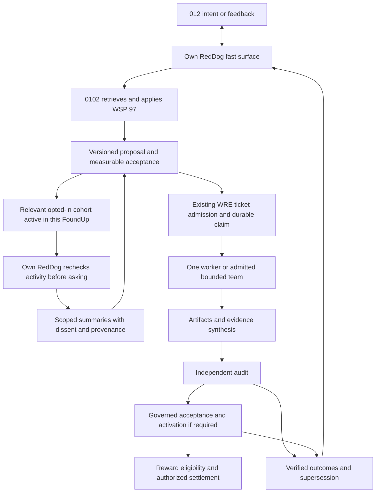

# RedDog hybrid: governed tickets, bounded teams and 012 feedback

Date: 2026-09-11. Status: `SPECIFIED_NOT_IMPLEMENTED` for the integrated model. This decision extends the [dual-loop architecture](REDDOG_DUAL_LOOP_COGNITION_ARCHITECTURE.md); the [system roadmap](../../ROADMAP.md) owns sequencing. Implementation packets: [R24 production line](../roadmaps/R24_AGENT_PRODUCTION_LINE_PACKET.md), [R25 feedback loop](../roadmaps/R25_REDDOG_FEEDBACK_LOOP_PACKET.md). No runtime, outreach, governance vote or reward is activated by this document.

## Decision

Use a **hybrid agent production system**: a governed ticket queue outside, a bounded self-organizing team inside selected tickets, and a consented feedback network of 012s actively engaged with that FoundUp. One qualified worker remains the economical default. A swarm is an execution topology, not an authority, a judge or a payment system.

The kitchen analogy still works: the ticket fixes the order and constraints; qualified stations coordinate their work; an independent inspector checks the result. A team may propose a better division of work without rewriting the order, increasing its spending limit or appointing itself inspector.

The useful sequence is:

**ticket → qualified worker or bounded team → evidence and disagreement synthesis → independent audit → governed acceptance/activation → reward eligibility → confirmed settlement.**

“Consensus” needs a type. Agreement about a draft, customer preference, technical verification and sovereign authorization are different decisions. Neither a majority of models nor a majority of feedback responses can replace the applicable acceptance or authorization gate.

## What RedDog supports now

Source inspection used `2d948bd7354ee1532721d2709bec718e3d8e39d3`. Main was checked at `3621b16afa14399cda12aeda15cae6ad0283f4ea`; intervening changes since the integration base concern JHR/YUMORI, not the RedDog/WRE surfaces below. These are source findings plus previously dated operational evidence, not a fresh deployment certification.

| Surface | Evidence and present limit | Consequence |
|---|---|---|
| Fast RedDog / deep 0102 split | [Product architecture](../../extensions/reddog/ARCHITECTURE.md) and [dual-loop proposal](REDDOG_DUAL_LOOP_COGNITION_ARCHITECTURE.md) define separate conversation and governed work responsibilities. | Keep this architecture. Finish its connections rather than introducing another orchestrator. |
| Conversation continuity | [History policy](../../extensions/reddog/conversation_history_policy.js) returns empty admitted history; [extension caller](../../extensions/reddog/extension.js) applies it. The [current README](../../extensions/reddog/README.md) records backend scope primitives but no VSIX service caller executing the first-turn/conversation persistence flow. | The envisioned durable 012 relationship is not established by merely connecting a provider. R22's owner must finish authenticated conversation/context delivery. |
| Learning/context projection | [Memex learning candidate gate](../../modules/communication/moltbot_bridge/src/foundup_memex_learning_candidate.py) produces scoped, immutable candidates and performs no memory write or work admission. The [emitter](../../extensions/reddog/docs/MEMEX_PROJECTION_EMITTER_ARCHITECTURE.md) remains specified. | A candidate summary is useful input, not verified learning or an autonomous ticket. |
| Work and model routing | [Dispatch runbook](../operations/RSI_SWARM_DISPATCH.md) records real Holo maintenance, a bounded native Hermes path, and the shell's unconfigured model-binding query. [AI Gateway](../../modules/ai_intelligence/ai_gateway/README.md) keeps Nemotron topology proposals in shadow evaluation. | Prove one admitted worker before a team. Do not infer a live general coding route from maintenance success. |
| Multi-RedDog authority | [Existing ADR](../adr/ADR_REDDOG_FOUNDUPS_SECOND_BRAIN_BOUNDARY.md) and [deferred governance notes](FOUNDUPS_MEMEX_DEFERRED_GOVERNANCE_NOTES.md) reserve federation, delegate thresholds and CABR weighting. The bridge's [current contract](../../modules/communication/moltbot_bridge/README.md) keeps production elevated authority closed pending required evidence. | Feedback collaboration can be designed now; new voting or mutation powers require their own ratified, tested contract. |
| Ticket economics | [R24](../roadmaps/R24_AGENT_PRODUCTION_LINE_PACKET.md) identifies existing FAM entities and the `PAID` task / `INITIATED` payout mismatch. | Independent audit, reward eligibility and actual settlement must remain distinguishable. |

Assessment: **the division of responsibilities is suitable; end-to-end composition and scale are unproven**. WSP is not complete merely because protocols exist, and WRE is not production RSI merely because work can run. The remaining completion evidence is mapped by G0–G5.

## Two connected loops

The feedback branch is optional and deadline-bound; ordinary admitted work does not wait for every principal. Only actively engaged principals in the same FoundUp may receive the prompt, at a relevant natural interaction boundary. Recheck activity, permission and attention limits at delivery; inactive or stale participants receive no solicitation. Existing delegated policy handles routine execution without repeatedly asking 012 to approve the same scope. WSP 48's feedback annex separately treats 012 as a feedback/adoption actor and its future sovereign consensus as a runtime gate. A request for thoughts cannot silently become that approval.

For example, 012 reports difficulty finding a FoundUp's next action. RedDog preserves the concern as feedback. The deep loop checks current behavior and duplicate proposals, records the intended improvement and test, and makes it available to the RedDogs of relevant opted-in active participants. While another 012 is actively using or discussing that FoundUp, their own RedDog may ask what they think of the proposal. Those principals may reveal accessibility or workflow conflicts. The ticket incorporates those constraints, a worker creates a candidate, an independent evaluator checks it, and the governed release path returns the observed result to the original conversation.

This contributes to **V1 Validation**: does the proposed change meet an actual participant need? Independent **V2 Verification** checks the artifact and outcomes. **V3 Valuation** assesses supported benefit under the existing CABR/PoB contract. [R25's 3V mapping](../roadmaps/R25_REDDOG_FEEDBACK_LOOP_PACKET.md#connection-to-cabr--3v) ties these responsibilities to WSP 26/29 and records missing runtime integration. Feedback may inform participation/social evidence under that contract; it is not automatically verified benefit, a scoring increment or a reward.

RedDog should earn “that was smart” by remembering, connecting evidence and coordinating useful work. Its answer can say, “Your feedback and two other participants' concerns shaped this proposal; this test supports the change.” Do not present shared human suggestions as independently discovered model knowledge. Keep detailed sources available with authorized disclosure; do not reveal private identities to prove attribution. Never invent participant counts, agreement or memory.

## Self-organization inside an admitted ticket

| Teams may propose or do within admitted policy | Teams cannot grant themselves |
|---|---|
| Select eligible subtasks, propose a decomposition, request qualified specialists and choose work order. | New tools, FoundUp/principal scope, credentials, budget, spawn depth or acceptance criteria. |
| Coordinate read-only research and separately claimed artifacts; hand integration to the designated parent owner. | Concurrent writes to another lane or uncontrolled use of a shared checkout. |
| Reconcile findings, preserve failed lanes, report uncertainty and request a bounded replan. | The right to discard inconvenient failures or convert a partial result into success. |
| Submit contribution evidence and proposed credit allocation under the ticket's fixed terms. | Independent reviewer status, deployment permission, payout approval or a larger reward. |

WRE/AgentDB owns the parent execution claim. FAM maps its business task to that claim. Each admitted child gets a stable parent/child identity, allowed effects and receipt mapping; runtime child queues are subordinate execution details. There must be no separately mutable competing backlog in OpenClaw, Hermes or a model's conversation. Any missing child-contract field is an R06/R07/R18 integration gap, not permission to bypass the existing contract.

Keep the first team flat. Qualification is for the actual task family, model, tools and runtime. Reuse valid qualification evidence; do not rerun a full benchmark for every ticket. Reserve the independent reviewer before spending the author budget. Team discussion can help produce an artifact; the designated independent audit sits outside that authoring team. An auditor can be compensated for a correct rejection.

## Consensus, feedback and authority

| Decision | Evidence it can supply | What it does not establish |
|---|---|---|
| Worker synthesis | Proposed resolution, cited support, conflicting findings and failed lanes. | Correctness or permission. |
| 012 feedback | Preferences, friction and constraints from identified eligible participants under disclosure policy. | A representative population result, technical truth or runtime approval. |
| Independent audit | Fixed tests, artifact identity, held-out outcomes and signed attribution where required. | A financial transfer or permission beyond its contract. |
| Sovereign governance | Authorization under the exact existing or separately ratified policy. | Permission to ignore a failed required test, tenant isolation or revocation. |
| Reward settlement | Policy-bound entitlement and the authorized owner's confirmed delivery receipt. | Future technical competence or broader execution powers. |

One principal with several RedDogs remains one principal for any future principal-counting rule. Repeated model copies are not independent identities. Record reviewer conflicts, source overlap and dissent. Do not adopt token holdings, CABR weighting or a guessed quorum as a shortcut around the deferred governance contract. Nonresponse is unknown, not consent; a preference majority cannot silently discard an affected participant's hard constraint.

## Scale by scope and backpressure

Partition tickets and feedback subscriptions by FoundUp and authorized principal scope. Route a proposal only to affected, opted-in principals with fresh meaningful activity in that same FoundUp. Match proposals on existing active interactions; do not wake inactive participants or continuously poll every RedDog. Bound recipients, solicitation frequency, queue depth, outstanding questions and response windows. Batch related questions at a natural interaction boundary while eligibility still holds. Activity in another FoundUp, passive membership or an idle tab does not qualify. R25 owns the activity evidence/expiry contract. A RedDog should not ask its 012 about every change in the network.

Use the existing durable owner for idempotent claims, leases, deduplication and recovery. A change of proposal version invalidates stale feedback claims; material changes may require a new bounded consultation. A late response becomes a new input, not a silent rewrite of the accepted ticket. Revocation must stop pending disclosure and invalidate reusable projections according to their retention contract.

Across FoundUps, use WSP 103 federation and WSP 104 namespace/admission requirements. Membership in one FoundUp does not authorize access to another. Principal Memex, FoundUp Memex and repository truth retain their existing owners; share only the consented, necessary projection. Do not broadcast raw private conversations, traces or hidden memory.

For worker capacity, measure accepted work per total cost, queue delay, reviewer saturation, cancellation latency and duplicate effects. For feedback, measure useful constraints found, irrelevant prompts, opt-outs, correction accuracy and principal attention consumed. Missing usage remains unknown. Reserve capacity for audit/recovery, enforce fairness between tenants, and reduce fan-out when queues or budgets saturate. No all-to-all polling, unlimited recursive spawning or unmeasured “1000 agent” capacity claim.

## PoC → prototype → MVP

The quantities below are proposed experiment sizes, not observed capacity or runtime configuration. Numeric budgets and decision thresholds must be fixed by the admitted slice before execution.

| Stage | Narrow scope | Exit evidence |
|---|---|---|
| PoC | `foundups-agent`, one 012/RedDog, one ticket, one supported leaf, independent verifier; synthetic feedback fixtures and simulated reward accounting. | R06–R09 artifact/lifecycle proof; R24-A/B/C as applicable; R25-A local feedback/proposal mapping. No federation or live swarm claim. |
| Prototype | After a new team profile passes admission tests, compare one worker with a flat 2–3-worker team on the same task family. Separately trial a small opted-in multi-principal cohort in the same FoundUp. | R18/R24-E confinement, aggregate cost, cancellation and recovery; R25-B/C consent, deduplication, stale-version rejection and actual supported conversation adapters. |
| Ticket/feedback MVP | A declared supported tenant count and workload under measured limits, qualified participants, durable job/feedback delivery, independent audit and visible failures. | R24/R25 relevant acceptance, isolation/revocation/replay/overload tests and predeclared service/cost/attention targets. Live financial reward claims additionally require R24-D settlement evidence. |
| RSI MVP | The above workflow demonstrably improves later work in a declared domain. | All G0–G5, retained independently verified benefit, rejected variants, rollback and sustained fault/soak evidence. An automated ticket MVP alone is not RSI. |

The next source work is still the existing owner's integrity/conversation work and the one-leaf canary. R25 design and synthetic fixtures can progress before the complete RSI loop; production federation, teams and financial settlement do not become prerequisites for proving the first internal improvement.

## Upstream capabilities and cost evidence

Current OpenClaw documentation describes bounded collector groups, structured results, concurrency limits and cancellation. It favors flat groups and preserves failed lanes. Its Swarm is one-shot local-Gateway execution, not a persistent distributed worker scheduler. These capabilities are reuse candidates underneath WRE; the locally observed `2026.5.2` installation has not been qualified for the currently documented Swarm API. [OpenClaw Swarm documentation](https://docs.openclaw.ai/tools/swarm) (consulted 2026-09-11).

Hermes documents opt-in delegation depth and optional Git worktree isolation; default children share the working directory. Active children do not resume after a process restart. Consequently, qualify explicit isolation and reconcile uncertain effects through durable job evidence before retrying. Upstream options do not widen FoundUps' currently admitted one-leaf profile. [Hermes delegation documentation](https://hermes-agent.nousresearch.com/docs/user-guide/features/delegation/) (consulted 2026-09-11).

Research across seven NLP benchmarks found voting accounted for much of the gains attributed to multi-agent debate. That result does not validate production-code approval by vote. Our operating inference is to compare a single worker, independent parallel proposals and bounded discussion against the same held-out acceptance criteria and total cost before selecting a default. [Choi, Zhu and Li, *Debate or Vote*](https://arxiv.org/abs/2508.17536).

## WSP 97 reconciliation record

The local source check exposed disabled admitted history and read-only learning projections; the wider check found existing dual-loop, Memex and deferred federation contracts. A pure linear model underspecifies useful collaboration; an unrestricted swarm loses clear admission, audit and cost ownership. The smallest compatible refinement is optional bounded teams inside existing tickets plus a separate feedback packet.

This document resolves that planning choice. It does not supersede module contracts, ratify deferred voting powers or archive still-useful scoped designs. Root ROADMAP, R24, the dispatch guide, R25 and the RedDog map provide one connected navigation path. WSP 00/97 already point to the root plan. Historical audits retain their dates and findings; the [integration record](../audits/rsi/2026-09-09/INTEGRATION.md) records retrieval quality, validation and delivery limits.

Applicable protocols: WSP 15 prioritization; WSP 22 change records; WSP 26 engagement signals and WSP 29 CABR/3V; WSP 48 feedback/evolution boundaries; WSP 50 retrieval; WSP 60 memory ownership; WSP 73 principal scope; WSP 77 coordination; WSP 96 governance; WSP 97 execution discipline; WSP 103/104 federation and namespace isolation.
