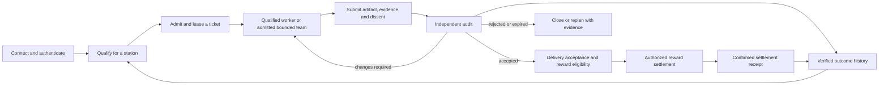

# R24 — Qualified agent production line with bounded teams

Parent authority: [system roadmap](../../ROADMAP.md). Packet registry: [ticket backlog](rsi_swarm_backlog.json). Operating guide: [production-line dispatch](../operations/RSI_SWARM_DISPATCH.md).

Status: `SPECIFIED_NOT_IMPLEMENTED` for the integrated production line described here. Documentation added 2026-09-10; hybrid refinement 2026-09-11. This is a planning packet, not a signed work order, permission grant or payout instruction. Compile one bounded slice at a time into the existing runtime contracts.

## Outcome and terminology

An agent connects, proves eligibility for a station, receives or claims a suitable ticket, completes bounded work, submits evidence, receives independent audit, and earns the reward specified by the accepted ticket. Accepted and rejected results improve later qualification, assignment and work procedures.

Use a **hybrid agent production system**. The production line supplies stations, tickets, standards and independent inspection. A ticket can use one qualified worker or a bounded self-organizing team under its admitted profile. Teams may propose decomposition and select eligible work; admission, aggregate budget, independent audit and reward terms remain outside their discretion. Existing filenames containing `swarm` remain stable navigation identifiers. The [hybrid architecture](../architecture/REDDOG_HYBRID_TICKET_SWARM_FEEDBACK_MODEL.md) defines this boundary; [R25](R25_REDDOG_FEEDBACK_LOOP_PACKET.md) separately covers consented 012 feedback.

Rework consumes only the remaining admitted budget and scope. Delivery may require a separate canary/activation gate when the ticket changes a live system. The diagram describes target behavior; it does not add enum values or prove an existing end-to-end deployment.

## Ownership and reuse

| Station | Existing owner or reuse candidate | Required boundary |
|---|---|---|
| Objectives and ticket planning | 012; RedDog; the architect role | Set acceptance, priority and reward terms before assignment. |
| Worker identity and capability evaluation | FAM AgentProfile; existing agent permissions; AI Gateway evidence | Declared tags are claims. Qualify the actual model/runtime/tool profile for the task family under authenticated policy. |
| Ticket admission and assignment | WRE admission; AgentDB claims; FAM Task | One durable execution owner, one lease, explicit mapping to business task ID. No second scheduler or independently mutable duplicate task. |
| Work stations | OpenClaw supervision; bounded Hermes/OpenClaw workers | Constrain context, tools, workspace, effects and resource consumption. |
| Inspection | Existing independent WRE verifier; FAM Proof/Verification | Evaluate actual artifacts/outcomes against criteria fixed before authoring. The author cannot certify its own result. |
| Reward accounting | FAM Payout; existing treasury/compute-credit interfaces | Reward policy, funding, recipient, idempotency and settlement authority are separate from the worker and reviewer. |
| Learning | Verified outcome retention/PatternMemory; qualification history | Retain provenance, failures and supersession; measure whether later assignments and procedures improve. |

Reuse sources: [FAM contract](../../modules/foundups/agent_market/INTERFACE.md), [persistent pipeline](../../modules/foundups/agent_market/src/task_pipeline.py), [FAM lifecycle tests](../../modules/foundups/agent_market/tests/test_task_lifecycle.py), [agent permissions](../../modules/ai_intelligence/agent_permissions/README.md), [AI Gateway model evidence](../../modules/ai_intelligence/ai_gateway/README.md).

## Existing foundation and verified gaps

The inspected FAM contract already includes AgentProfile, Task, Proof, Verification and Payout. Its persistent lifecycle is `open → claimed → submitted → verified → paid`; this is an implementation finding, not proof of production settlement. The current roadmap places production chain writes outside the PoC.

Two concrete boundaries require work:

- `PersistentTaskPipeline.trigger_payout()` creates a payout with `status=INITIATED`, `reference=None`, `paid_at=None`, then marks the task `PAID`. A consumer must not interpret that task label as confirmed reward delivery. Reconcile the existing task/payout contract and its consumers; do not introduce a parallel payment ledger to conceal the mismatch.
- `AgentProfile.capability_tags` and the existing confidence tracker are useful inputs. They do not by themselves prove a fresh, independently evaluated qualification bound to the actual worker runtime. Likewise, an approved verification boolean is insufficient evidence of an independently authenticated audit.

Observed source: the documentation integration base `eb2994f5d1530d9f086e2f2265c65033acecd93c`; FAM/permission/Gateway source is unchanged from the audit baseline. The continuation Holo query returned CURRENT/no-gap at its pinned audit source. Generic agent docs preceded the FAM contract in ranking; the FAM README, INTERFACE, ROADMAP, ModLog, test instructions and exact pipeline were read directly to close ordering/missing-context risk. These observations do not establish current deployment state.

## Ticket and qualification requirements

### Current execution checkpoint — 2026-09-22

012's priority is to prove the existing OpenClaw/Hermes ticket path, then grow
measured capacity. Source checkpoint: `baa719d9a6de5ec74026e6a94f48827d5f2885c0`.
This supersedes the previous selection of unrelated LinkedIn qualification; that
work remains outstanding with its existing owner. Integrated R24 is still unproven.

- **Native execution:** `GovernedValveUseTimeAuthorityResolver.resolve()` retains
  seven non-generation trust-anchor blockers even when the three current-generation
  checks pass. It also returns no authoritative-use lease. A signed work order or
  passing fake-provider test cannot open this boundary.
- **Reuse, not another orchestrator:** `ExternalSignerAuthoritativeUseLeaseIssuer`
  already exists. Its exact worktree effect requires both the executor-plan digest
  and accepted valve-decision digest. The potential connection is the existing
  execution handler's post-acceptance, pre-registry-issuance seam; the earlier
  resolver lacks those final bindings. First qualify the missing trust-anchor
  producer/consumer evidence. Never clear blocker strings or issue a local substitute
  lease to make a canary pass.
- **Reward accounting:** the persistent FAM pipeline still sets `Task.PAID` after
  creating an `INITIATED` payout with no reference or payment time. Simply retaining
  `VERIFIED` would permit another initiation attempt: generated payout IDs and
  separate writes do not establish atomic, idempotent entitlement. R24-D must
  reconcile that existing transaction/state contract before R24-C claims correct
  restart/replay behavior. No wired settlement confirmer was found in this route.
  A disposable real-SQLite witness now reproduces both problems: the unconfirmed
  paid label survives reopening; an exception after payout commit but before task
  update followed by reopen/retry creates two initiated payouts and two fixture
  compute debits. This is a failed correctness gate, not successful reward delivery.
  Persistent compute charging also does not authenticate verifier or treasury
  roles; permission tests for the in-memory market do not prove this separate path.
- **Economic hooks:** WSP 26 distinguishes compute award (`ca`), reward (`cr`) and
  dividend (`cd`). WSP 29 makes CABR a flow/allocation gate after proof of benefit,
  not permission to mint. Keep contributor entitlement separate from provider
  compute charges, and simulated accounting separate from funded settlement.

Current commands, observed results, fixture substitutions and source bindings are
recorded in `current_observation` of [the existing backlog](rsi_swarm_backlog.json).
The local checkpoint passed 200 contract tests with two real-child cases excluded.
Those tests are not a real admitted worker,
authenticated independent product verification, production reward or retained RSI.

### Persistent reward initiation contract — 2026-09-22

Qualified in PR1851, merged at `e8240466814de0727efaea892f41e376f7d5cc13`;
**implemented and independently verified locally**, with publication checks
tracked in the canonical backlog. The earlier unconfirmed `PAID` label and
duplicate payout/debit witnesses remain historical failure evidence.
Corrected fixed selection: baseline 79 passed/41 failed; candidate and independent replay each 120 passed, zero errors/skips/guard denials or source drift. Independent replay covers the same case IDs, not another 120 unique cases.
The qualification scores C3/I4/D3/Impact3 = **13/P1**. The resulting bounded
SQLite source repair scores C4/I4/D3/Impact3 = **14/P1**, separately from blocked
18/P0 native execution. These planning scores confer no payment authority.

**Existing owners and smallest change:** `PersistentTaskPipeline.trigger_payout`
delegates to one initiation operation in `persistence/sqlite_adapter.py`, using
its existing session/ORM rows, wallet helper, compute policy and event records.
Factor session-taking policy/debit helpers for reuse; keep ordinary public CRUD
behavior unchanged. Do not compose public CRUD calls that commit independently,
introduce ambient shared sessions, add a payment ledger, or modify settlement.

The repair's fixed acceptance contract is:

1. Start the SQLite write transaction before reading task or wallet state. Check
   the task's exact FoundUp, assignee, reward, proof and approved verification
   bindings inside it. Hold wallet updates in that same transaction, including
   when two payout operations charge the same actor. This is not a concurrency
   repair for unrelated debit/rebate/plan writers. No nested commit may escape.
2. Atomically persist payout initiation, task linkage, compute debit (if required)
   and the correlated initiation event. Reuse the ledger's `event_id` and existing
   event payload for task/proof/verification/actor correlation; a compute debit is
   a compute-access charge, not the contributor reward. Preserve current policy:
   disabled enforcement still reports configured costs; it does not mean free use.
3. A pending result is `Task.VERIFIED` with its bound `Payout.INITIATED`, no payment
   reference and no `paid_at`. No new enum is required. `PAID`, settlement and
   `payout.completed` remain outside this initiation operation. The in-memory
   completed-payment simulation remains unchanged; CABR must not count pending
   initiation as paid completion.
4. An exact retry returns the same complete, persisted initiation without another
   payout, debit or event. Validate original actor and task/proof/verification/
   recipient/amount/event bindings before this no-effect return. Changed or
   incomplete identity is an error, not permission to create another entitlement.
   Match the persisted cost snapshot and exact linked-ledger cardinality (zero
   cost means zero debits); do not re-rate or re-admit an already committed
   initiation using today's compute policy.
5. Roll back every write if any pre-commit step fails. Reopen after a committed
   result and lost response must recover the same receipt. Multiple payouts,
   orphaned payouts, missing/conflicting lineage, or legacy `PAID` plus `INITIATED`
   fail closed before debit; no automatic deletion, relabeling, refund or migration
   may manufacture historical evidence. Also reject relevant legacy trigger-payout
   debit/event residue across all actors in the FoundUp when linkage is absent
   or ambiguous; changing the retry actor cannot bypass the hold. Missing FoundUp
   scope is also held for reconciliation rather than guessed irrelevant,
   even if the requested task has no payout yet: the old debit committed first.
   Do not guess which task incurred it. This conservative hold can block otherwise
   fresh tasks until separate reconciliation. Scan complete relevant history,
   not a default limited ledger/event page. Preserve all historical records.
6. First scope is SQLite only. Reject other dialects before compute or payout
   effects, session creation or compute-attribute access. `PostgresAdapter`
   inherits methods but omits compute-policy attributes
   in its constructor; mocked factory routing is not PostgreSQL behavior proof.
   PostgreSQL support requires its own initialization parity, task/wallet lock
   design and actual backend tests. Do not send SQLite locking SQL to that backend.

**Compatibility and validation:** use the existing v2 columns and enum values;
no schema migration or unique index is assumed necessary for this bounded
pipeline transaction. Direct low-level CRUD remains outside its idempotency
claim. Extend `test_persistent_compute_wiring.py` and existing persistence tests
with fresh/reopened retry, each failure boundary, two independent SQLite writers,
shared-wallet contention, mismatched/rejected proof, ambiguous legacy rows
(including debit-only interruption, changed retry actor and missing scope),
compute denial and pre-effect non-SQLite rejection. Preserve in-memory lifecycle,
schema/migration, factory and CABR consumer regressions. Fix test oracles before
implementation; exception injection is not power-loss/durability proof.

WSP62 review explicitly revises the proposed no-growth task budget: adapter
1154→1330lines (+176) for complete history/identity guards; its class875→816,
pipeline446→400/class405→359, newfunctions≤40. The original1154-line target did
not pass. Retain1330 as the owner's ceiling pending cohesion/decomposition review
before further growth; no exemption/new module or unrelated CRUD compression.
[Module remediation](../../modules/foundups/agent_market/ROADMAP.md#persistent-reward-correctness--implementation-2026-09-22) records retained critical-window/class debt.
Local source/test review and independent replay are complete; exact-head CI
and publication closure remain required.
Persistent role authentication, funded settlement, native worker admission and
verified RSI retention remain separate unresolved requirements.

### Capacity gates: one ticket before one thousand agents

Each increase requires a fresh admitted profile and measured acceptance, not a
timer or automatic doubling of cycle count. Use the existing R18 coordinator and
AgentDB claim owner. Agent population, simultaneous writers and verifier capacity
are different quantities; report all three.

| Target | Evidence required before advancing |
|---|---|
| 1 worker plus separate verifier | One real native ticket, exact artifact, independent outcome decision, bounded cost/time, replay-safe simulated entitlement and verified retention. Rejected work cannot report success or receive author entitlement. |
| 2 independent workers | Disjoint owned workspaces; one durable claimant per ticket; reserved verifier capacity; cancellation, retry and crash recovery without duplicate effects or entitlements. |
| 10 workers | Measured queue latency, verification backlog, budget/backpressure, provider failure and restart recovery; compare useful accepted output per compute against the smaller run. |
| 100 workers | Load-test existing admission/storage/queue owners, contributor identity isolation, fairness and audit throughput; bound aggregate resources and preserve full receipt correlation. |
| 1,000 connected agents | Qualify staged cohorts and enforce a separately measured concurrency cap; no automatic right to execute or earn from connection alone. Verify sustained accepted throughput, recovery and settlement reconciliation before a capacity claim. |

External participation additionally requires authenticated identity, runtime-bound
qualification, agreed contribution/review terms and an authorized accounting owner.
Retain failures and verifier rejections. A second ticket must demonstrate that a
validated retained improvement helps under fixed criteria before calling the loop RSI.

The compiler must map these requirements into existing admitted contracts, identifying any actual missing field rather than creating a new unsigned authority schema:

- Ticket ID, FoundUp/principal scope, objective, exact inputs/source and dependencies.
- Task family/station, permitted worker runtime/model/provider/tools, current qualification evidence and expiry. Requalify after material runtime, tool, policy or task-family changes; retain valid evidence between tickets.
- Allowed effects/files, isolated workspace where needed, one parent execution owner/claim lease, admitted child identities and scopes when a team is permitted, deadline, cancellation and recovery rules.
- Fixed acceptance criteria, required artifacts and evidence, independent verifier, conflict-of-interest checks, reviewer capacity and delivery/activation gate.
- Maximum context, calls, retries, time and aggregate spend. Reserve verification cost before authoring begins. Assign using measured suitability and cost; do not invoke an architect model for routine matching.
- Reward type, beneficiary, amount or deterministic formula, funding/reservation policy, acceptance/settlement trigger, and treatment of rejection, rework, partial work and disputes. Unresolved terms block compensated dispatch; this packet sets no monetary amount or token allocation.
- Complete artifact → verification → acceptance → reward record linkage, replay protection and confirmed settlement evidence where payment is authorized.

Separate **work quality**, **execution permission** and **reward entitlement**. Better performance can improve assignment priority; it cannot grant broader tools or rewrite payout policy. Qualification benchmarks and their independent judge must not be editable by the candidate agent.

## Bounded team admission

The first canary keeps the supported one-leaf profile. R07/R18 must qualify any larger team before use. Begin with a flat group, explicit child/tool/workspace limits, a single integration owner and separate verification capacity. Preserve failed lanes and partial evidence; a stopped parent is not proof every child stopped. Reconcile unknown effects before retrying. Parent/child execution receipts map into existing WRE/AgentDB/FAM records rather than becoming a second task authority.

A team can synthesize an evidence-backed recommendation and unresolved disagreements. It cannot replace the independent audit with a majority vote. Predeclare contribution and review reward terms before recruitment; split only the admitted entitlement, never multiply it by the number of agents. Benchmark the team against one worker using the same acceptance criteria and total cost.

## Reward rules

1. Pay for the pre-agreed accepted contribution, not tokens burned, ticket count, self-reported effort or persuasive prose. Paying provider compute and rewarding a contributor are different accounting events.
2. Record reputation/performance, compute credits and financial/token settlement as distinct outcomes where the existing policy uses them. Do not imply they are interchangeable or that all are enabled.
3. Independent auditors can earn their own policy-defined review reward for a correct audit, including a justified rejection. Never make their compensation depend on approving the author's work.
4. An accepted artifact can create reward eligibility. Only the authorized accounting/settlement owner can confirm delivery; insufficient funds, a pending transfer or a failed adapter must remain visible. Replay, a new session or a duplicated proof cannot produce a second reward for the same entitlement.
5. Keep disputes, withheld rewards and any corrective entries auditable under the agreed policy. This roadmap authorizes no transfer, clawback, mint, wallet action or production settlement activation.

## Small implementation slices and acceptance

Dependencies for integrated execution: R06, R08, R09, R16 and R18. R04 applies wherever the selected authority requires exact closure. Design reconciliation may proceed earlier under the existing owner. WSP 15 preliminary score: C=4, I=5, D=4, Impact=5; total 18/P0 for a rewarded production-line claim.

| Slice | Deliverable | Acceptance evidence |
|---|---|---|
| R24-A | Qualification and ticket/receipt mapping to existing owners | One eligible worker accepted; unqualified, expired, substituted-runtime and wrong-scope workers rejected; no authority inferred from tags alone. |
| R24-B | One leased ticket through a real confined worker and independent audit | One claim wins; exact artifact is audited; self-certification and changed acceptance criteria reject; timeout/rework/cancellation preserve budget and ownership. |
| R24-C | Reward eligibility/accounting canary using an isolated test ledger | One accepted contribution produces one policy-correct test entitlement; rejected/duplicate work earns none; reviewer can be credited for correct rejection; restart does not duplicate entries. Test accounting remains labeled simulated. |
| R24-D | Reconciled payout-state semantics and independently authorized settlement adapter | Initiated, confirmed and failed settlement cannot be confused; actual settlement requires its own funding/policy/adapter evidence. Production activation is a separate governed slice. |
| R24-E | Optional flat team inside one admitted ticket, after R07/R18 qualification | Qualified child selection; bounded fan-out/spend; no overlapping writer claims; failed-lane evidence retained; parent/child cancellation and crash/replay reconciliation; independent audit outside the author team; total reward allocation stays within the fixed entitlement. Compare with one worker before increasing capacity. |

First pilot: one internal documentation artifact, one qualified worker, one separate verifier and a simulated reward ledger. No live money movement is needed to prove the ticket workflow. Keep production reward claims closed until R24-D's actual acceptance evidence exists.

Completion record must include exact source/runtime, qualification, ticket/lease, artifact, audit decision, costs, reward eligibility and settlement status, with failures visible. Ticket completion alone is automation. RSI additionally requires the G0–G5 loop to retain independently verified outcomes and demonstrate improvement in later work.
