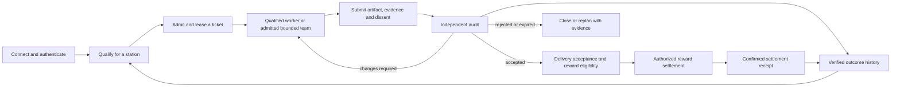

# R24 — Qualified agent production line with bounded teams

Parent authority: [system roadmap](../../ROADMAP.md). Packet registry: [ticket backlog](rsi_swarm_backlog.json). Operating guide: [production-line dispatch](../operations/RSI_SWARM_DISPATCH.md).

Status: `SPECIFIED_NOT_IMPLEMENTED` for the integrated production line described here. Documentation added 2026-09-10; hybrid refinement 2026-09-11. This is a planning packet, not a signed work order, permission grant or payout instruction. Compile one bounded slice at a time into the existing runtime contracts.

## Outcome and terminology

An agent connects, proves eligibility for a station, receives or claims a suitable ticket, completes bounded work, submits evidence, receives independent audit, and earns the reward specified by the accepted ticket. Accepted and rejected results improve later qualification, assignment and work procedures.

Use a **hybrid agent production system**. The production line supplies stations, tickets, standards and independent inspection. A ticket can use one qualified worker or a bounded self-organizing team under its admitted profile. Teams may propose decomposition and select eligible work; admission, aggregate budget, independent audit and reward terms remain outside their discretion. Existing filenames containing `swarm` remain stable navigation identifiers. The [hybrid architecture](../architecture/REDDOG_HYBRID_TICKET_SWARM_FEEDBACK_MODEL.md) defines this boundary; [R25](R25_REDDOG_FEEDBACK_LOOP_PACKET.md) separately covers consented 012 feedback.

Rework consumes only the remaining admitted budget and scope. Delivery may require a separate canary/activation gate when the ticket changes a live system. The diagram describes target behavior; it does not add enum values or prove an existing end-to-end deployment.

## Ownership and reuse

| Station | Existing owner or reuse candidate | Required boundary |
|---|---|---|
| Objectives and ticket planning | 012; RedDog; the architect role | Set acceptance, priority and reward terms before assignment. |
| Worker identity and capability evaluation | FAM AgentProfile; existing agent permissions; AI Gateway evidence | Declared tags are claims. Qualify the actual model/runtime/tool profile for the task family under authenticated policy. |
| Ticket admission and assignment | WRE admission; AgentDB claims; FAM Task | One durable execution owner, one lease, explicit mapping to business task ID. No second scheduler or independently mutable duplicate task. |
| Work stations | OpenClaw supervision; bounded Hermes/OpenClaw workers | Constrain context, tools, workspace, effects and resource consumption. |
| Inspection | Existing independent WRE verifier; FAM Proof/Verification | Evaluate actual artifacts/outcomes against criteria fixed before authoring. The author cannot certify its own result. |
| Reward accounting | FAM Payout; existing treasury/compute-credit interfaces | Reward policy, funding, recipient, idempotency and settlement authority are separate from the worker and reviewer. |
| Learning | Verified outcome retention/PatternMemory; qualification history | Retain provenance, failures and supersession; measure whether later assignments and procedures improve. |

Reuse sources: [FAM contract](../../modules/foundups/agent_market/INTERFACE.md), [persistent pipeline](../../modules/foundups/agent_market/src/task_pipeline.py), [FAM lifecycle tests](../../modules/foundups/agent_market/tests/test_task_lifecycle.py), [agent permissions](../../modules/ai_intelligence/agent_permissions/README.md), [AI Gateway model evidence](../../modules/ai_intelligence/ai_gateway/README.md).

## Existing foundation and verified gaps

The inspected FAM contract already includes AgentProfile, Task, Proof, Verification and Payout. Its persistent lifecycle is `open → claimed → submitted → verified → paid`; this is an implementation finding, not proof of production settlement. The current roadmap places production chain writes outside the PoC.

Two concrete boundaries require work:

- `PersistentTaskPipeline.trigger_payout()` creates a payout with `status=INITIATED`, `reference=None`, `paid_at=None`, then marks the task `PAID`. A consumer must not interpret that task label as confirmed reward delivery. Reconcile the existing task/payout contract and its consumers; do not introduce a parallel payment ledger to conceal the mismatch.
- `AgentProfile.capability_tags` and the existing confidence tracker are useful inputs. They do not by themselves prove a fresh, independently evaluated qualification bound to the actual worker runtime. Likewise, an approved verification boolean is insufficient evidence of an independently authenticated audit.

Observed source: the documentation integration base `eb2994f5d1530d9f086e2f2265c65033acecd93c`; FAM/permission/Gateway source is unchanged from the audit baseline. The continuation Holo query returned CURRENT/no-gap at its pinned audit source. Generic agent docs preceded the FAM contract in ranking; the FAM README, INTERFACE, ROADMAP, ModLog, test instructions and exact pipeline were read directly to close ordering/missing-context risk. These observations do not establish current deployment state.

## Ticket and qualification requirements

The compiler must map these requirements into existing admitted contracts, identifying any actual missing field rather than creating a new unsigned authority schema:

- Ticket ID, FoundUp/principal scope, objective, exact inputs/source and dependencies.
- Task family/station, permitted worker runtime/model/provider/tools, current qualification evidence and expiry. Requalify after material runtime, tool, policy or task-family changes; retain valid evidence between tickets.
- Allowed effects/files, isolated workspace where needed, one parent execution owner/claim lease, admitted child identities and scopes when a team is permitted, deadline, cancellation and recovery rules.
- Fixed acceptance criteria, required artifacts and evidence, independent verifier, conflict-of-interest checks, reviewer capacity and delivery/activation gate.
- Maximum context, calls, retries, time and aggregate spend. Reserve verification cost before authoring begins. Assign using measured suitability and cost; do not invoke an architect model for routine matching.
- Reward type, beneficiary, amount or deterministic formula, funding/reservation policy, acceptance/settlement trigger, and treatment of rejection, rework, partial work and disputes. Unresolved terms block compensated dispatch; this packet sets no monetary amount or token allocation.
- Complete artifact → verification → acceptance → reward record linkage, replay protection and confirmed settlement evidence where payment is authorized.

Separate **work quality**, **execution permission** and **reward entitlement**. Better performance can improve assignment priority; it cannot grant broader tools or rewrite payout policy. Qualification benchmarks and their independent judge must not be editable by the candidate agent.

## Bounded team admission

The first canary keeps the supported one-leaf profile. R07/R18 must qualify any larger team before use. Begin with a flat group, explicit child/tool/workspace limits, a single integration owner and separate verification capacity. Preserve failed lanes and partial evidence; a stopped parent is not proof every child stopped. Reconcile unknown effects before retrying. Parent/child execution receipts map into existing WRE/AgentDB/FAM records rather than becoming a second task authority.

A team can synthesize an evidence-backed recommendation and unresolved disagreements. It cannot replace the independent audit with a majority vote. Predeclare contribution and review reward terms before recruitment; split only the admitted entitlement, never multiply it by the number of agents. Benchmark the team against one worker using the same acceptance criteria and total cost.

## Reward rules

1. Pay for the pre-agreed accepted contribution, not tokens burned, ticket count, self-reported effort or persuasive prose. Paying provider compute and rewarding a contributor are different accounting events.
2. Record reputation/performance, compute credits and financial/token settlement as distinct outcomes where the existing policy uses them. Do not imply they are interchangeable or that all are enabled.
3. Independent auditors can earn their own policy-defined review reward for a correct audit, including a justified rejection. Never make their compensation depend on approving the author's work.
4. An accepted artifact can create reward eligibility. Only the authorized accounting/settlement owner can confirm delivery; insufficient funds, a pending transfer or a failed adapter must remain visible. Replay, a new session or a duplicated proof cannot produce a second reward for the same entitlement.
5. Keep disputes, withheld rewards and any corrective entries auditable under the agreed policy. This roadmap authorizes no transfer, clawback, mint, wallet action or production settlement activation.

## Small implementation slices and acceptance

Dependencies for integrated execution: R06, R08, R09, R16 and R18. R04 applies wherever the selected authority requires exact closure. Design reconciliation may proceed earlier under the existing owner. WSP 15 preliminary score: C=4, I=5, D=4, Impact=5; total 18/P0 for a rewarded production-line claim.

| Slice | Deliverable | Acceptance evidence |
|---|---|---|
| R24-A | Qualification and ticket/receipt mapping to existing owners | One eligible worker accepted; unqualified, expired, substituted-runtime and wrong-scope workers rejected; no authority inferred from tags alone. |
| R24-B | One leased ticket through a real confined worker and independent audit | One claim wins; exact artifact is audited; self-certification and changed acceptance criteria reject; timeout/rework/cancellation preserve budget and ownership. |
| R24-C | Reward eligibility/accounting canary using an isolated test ledger | One accepted contribution produces one policy-correct test entitlement; rejected/duplicate work earns none; reviewer can be credited for correct rejection; restart does not duplicate entries. Test accounting remains labeled simulated. |
| R24-D | Reconciled payout-state semantics and independently authorized settlement adapter | Initiated, confirmed and failed settlement cannot be confused; actual settlement requires its own funding/policy/adapter evidence. Production activation is a separate governed slice. |
| R24-E | Optional flat team inside one admitted ticket, after R07/R18 qualification | Qualified child selection; bounded fan-out/spend; no overlapping writer claims; failed-lane evidence retained; parent/child cancellation and crash/replay reconciliation; independent audit outside the author team; total reward allocation stays within the fixed entitlement. Compare with one worker before increasing capacity. |

First pilot: one internal documentation artifact, one qualified worker, one separate verifier and a simulated reward ledger. No live money movement is needed to prove the ticket workflow. Keep production reward claims closed until R24-D's actual acceptance evidence exists.

Completion record must include exact source/runtime, qualification, ticket/lease, artifact, audit decision, costs, reward eligibility and settlement status, with failures visible. Ticket completion alone is automation. RSI additionally requires the G0–G5 loop to retain independently verified outcomes and demonstrate improvement in later work.
